# Fedora Voice Dictation - Full-Stack Architecture Document

**Version:** v1.0
**Date:** 2025-10-22
**Author:** Winston (Architect)
**Status:** Draft - Awaiting Week 1-2 Validation Prototypes

---

## Introduction

### Overview

Fedora Voice Dictation is a Wayland-native desktop application that solves a critical productivity challenge: enabling fast, privacy-focused speech-to-text conversion for power users without cloud dependencies. The architecture must orchestrate audio capture, Voice Activity Detection, GPU-accelerated Whisper transcription, and Wayland text injection to achieve **<500ms latency** while maintaining UI responsiveness—all within a single-process desktop application.

**The Core Architectural Challenge:**

Achieving sub-500ms end-to-end latency requires careful orchestration of:
- **Audio Pipeline:** sounddevice library capturing 16kHz mono audio with <50ms buffering latency
- **VAD Processing:** silero-vad detecting speech boundaries with <200ms lag and <5% false positive rate
- **GPU Transcription:** Whisper base model with CUDA acceleration processing 5-10s audio clips in 200-500ms
- **Text Injection:** Wayland text-input-unstable-v3 protocol or clipboard fallback with <100ms injection time
- **UI Responsiveness:** Qt event loop remaining responsive throughout, never blocking >16ms (60 FPS)

This architecture document defines how these components integrate while maintaining simplicity, privacy, and performance.

---

### Architectural Principles

All design decisions in this architecture are guided by four core principles:

1. **Privacy-First:** No network calls except initial Whisper model downloads. All audio processing, transcription, and data storage happens locally. No telemetry, no analytics, no cloud dependencies.

2. **Performance-First:** <500ms latency target drives all architectural choices. GPU acceleration is mandatory, not optional. Threading model designed to minimize blocking. Every component has a latency budget.

3. **Single-Process Simplicity:** Avoid distributed system complexity. Single Python process with threaded/async components. No microservices, no separate backend server, no IPC overhead (except D-Bus for system integration).

4. **Wayland-Native:** No X11 dependencies or XWayland compatibility layers. Built specifically for modern Linux desktops (GNOME, KDE, Hyprland, Sway). Embrace Wayland protocols even if unstable—clipboard fallback mitigates risk.

**Critical Design Constraint:** This architecture targets **single-user, local-only operation** on **NVIDIA GPU hardware** with **Fedora 38+ on Wayland**. These constraints enable aggressive simplification.

---

### Architecture Evolution Timeline

This architecture will be validated and refined through prototyping before full implementation:

| Timeframe | Milestone | Key Decisions | Go/No-Go Criteria |
|-----------|-----------|---------------|-------------------|
| **Week 1-2** | Performance Validation Prototype | Python vs whisper.cpp decision | <1s latency achieved = Python GO, >1.5s = whisper.cpp migration |
| **Week 2-3** | Wayland Integration Spike | text-input-unstable-v3 vs clipboard primary method | Protocol works on ≥3/4 DEs = GO, <2/4 = clipboard-first fallback |
| **Week 3** | Architecture Finalization | Lock component design, threading model, interfaces | All prototypes pass = BEGIN Epic 1 implementation |
| **Week 4-20** | Iterative Implementation | Per-epic architecture refinements | Documented in change log below |

**Pending Decisions (Week 1-2 Validation Required):**
- ⚠️ **Python Performance:** If latency >1.5s, architecture migrates to whisper.cpp with Python bindings
- ⚠️ **Threading Model:** Confirm Python asyncio + QThread sufficient, or need multiprocessing
- ⚠️ **Wayland Protocol Reliability:** Validate text-input-unstable-v3 across all target DEs

---

### User Journey → Architecture Mapping

This table maps key user workflows to the architectural components that implement them:

| User Action | Architecture Flow | Components Involved | Latency Budget |
|-------------|-------------------|---------------------|----------------|
| **Press hotkey** | Hotkey listener → State machine → Audio capture start | `HotkeyManager`, `StateMachine`, `AudioCapture` | <50ms |
| **Speak** | Audio buffering → VAD detects speech → Continuous capture | `AudioCapture`, `VADProcessor`, `AudioBuffer` | Real-time |
| **Stop speaking** | VAD detects silence → Audio finalized → Queue for transcription | `VADProcessor`, `AudioBuffer`, `TranscriptionQueue` | <200ms |
| **Transcription** | Whisper processes audio → Streaming word output | `WhisperEngine` (CUDA), `TranscriptionWorker` | <500ms (base model, 5s audio) |
| **Text appears** | Focus target window → Inject via Wayland or clipboard → UI feedback | `WindowFocus`, `TextInjection`, `NotificationManager` | <100ms |
| **Review history** | Open history viewer → Load from JSON → Display table | `HistoryManager`, `HistoryViewer` UI | <200ms |
| **Change settings** | Open settings UI → Update config → Apply changes | `SettingsWindow`, `ConfigManager` | Immediate |

**Total End-to-End Latency Budget:** 850ms (target: <500ms requires optimization in Week 1-2 prototypes)

---

### How to Read This Document

This architecture document serves different audiences:

**For Developers (implementing Epic 1-4 stories):**
- Focus on: **Components**, **Threading Model** (Backend Architecture), **Data Flow** (Core Workflows)
- Key sections: Tech Stack, Database Schema, Project Structure, Coding Standards
- Skip: High-level diagrams, deployment details (until Epic 4)

**For Contributors (understanding codebase to submit PRs):**
- Focus on: **Architectural Patterns**, **Component Diagrams**, **Coding Standards**, **Testing Strategy**
- Key sections: Components, Error Handling, Development Workflow
- Reference: Technical Summary for quick orientation

**For Packagers/Distributors (creating RPM, Flatpak):**
- Focus on: **Deployment Architecture**, **Environment Configuration**, **Prerequisites**
- Key sections: Platform and Infrastructure, Unified Project Structure, Development Workflow
- Note: Epic 4 will finalize packaging specifications

**For Architecture Reviewers (validating design decisions):**
- Read full document linearly
- Pay special attention to: Architectural Principles, Architectural Patterns, Core Workflows, Performance Optimization
- Review decisions against PRD requirements (docs/prd.md)

---

### Testing Philosophy

Architecture designed for testability from the start:

**Unit Testing (60%+ coverage):**
- All components have clear interfaces for mocking
- Audio/Whisper/Wayland dependencies mocked in unit tests
- pytest with pytest-qt for Qt component testing
- CI/CD runs on CPU-only (uses mocked GPU for basic validation)

**Integration Testing (Manual, GPU-required):**
- End-to-end workflows on developer system (RTX 4060 + Wayland)
- Performance benchmarking with fixture audio files
- Cross-DE testing (GNOME, KDE, Hyprland, Sway)

**Performance Testing (Automated Benchmarking):**
- Latency measurement at each pipeline stage
- Statistical analysis (mean, median, p95, p99)
- Regression detection across commits

**Testability Requirements:**
- Components communicate via defined interfaces (not tight coupling)
- State machine enables deterministic testing of transitions
- Configuration injectable (not hardcoded) for test scenarios

---

### Starter Template or Existing Project

**Status:** Greenfield Desktop Application

Fedora Voice Dictation is built from scratch to leverage modern technologies unavailable in legacy Linux voice dictation tools:
- **Modern GPU Acceleration:** CUDA support for Whisper (2020s hardware)
- **Wayland Protocols:** text-input-unstable-v3, native desktop integration (no X11)
- **Contemporary ML Models:** OpenAI Whisper (2022), silero-vad (2021)

**No Starter Templates Used:**
- Standard Python project structure with PyQt5
- No desktop application frameworks (Qt Creator templates, Electron, Tauri)
- No pre-built voice dictation libraries (all integration custom)

**Architectural Constraints from Technology Choices:**
- **PyQt5:** Proven cross-DE system tray support (GNOME, KDE, Hyprland, Sway)
- **openai-whisper:** CUDA acceleration mandatory, model loading strategy critical
- **Wayland Protocols:** text-input-unstable-v3 primary, clipboard fallback required
- **Single-Process:** Simplicity for MVP, may refactor to multi-process in Phase 2 if stability issues emerge

**Decision Point (Week 1-2):** If Python performance insufficient, architecture may migrate to whisper.cpp (C++) with Python bindings while keeping PyQt5 UI.

---

### Documentation Note: Template Adaptation

This architecture document uses the BMAD full-stack template adapted for desktop application context. Where the template references "frontend" and "backend" as separate services, we treat them as **logical layers within a single application process**:

- **"Frontend" layer:** Qt-based UI components (system tray, settings windows, visual indicators)
- **"Backend" layer:** Core processing logic (audio capture, VAD, Whisper transcription, Wayland integration)
- **No separate API layer:** Components communicate via Qt signals/slots and threaded message passing (not HTTP/REST)
- **No cloud deployment:** Application runs entirely on user's local machine with GPU acceleration

This adaptation maintains the template's comprehensive coverage of cross-cutting concerns (performance, security, testing, deployment) while fitting desktop application patterns. Desktop-specific sections added: Threading Model, Desktop Integration, IPC Mechanisms.

---

### Change Log

| Date | Version | Description | Author |
|------|---------|-------------|--------|
| 2025-10-22 | v1.0 | Initial architecture document creation | Winston (Architect) |

---

## High Level Architecture

### Technical Summary

Fedora Voice Dictation is a **single-process, event-driven desktop application** built on Python 3.10+ with PyQt5 UI framework. The architecture orchestrates five primary subsystems—audio capture, voice activity detection, GPU-accelerated speech recognition, Wayland text injection, and Qt-based UI—through a centralized state machine and Qt signal/slot message passing.

**Core Architecture Pattern:** Event-driven state machine with multi-threaded processing. The Qt event loop serves as the main orchestrator, with audio capture running in a dedicated background thread (Python threading), Whisper transcription executing in QThread workers (releasing Python GIL during CUDA operations), and Wayland text injection coordinated through a separate QThread to avoid blocking the UI.

**Performance Strategy:** **Targets** <500ms end-to-end latency (MVP acceptance criteria: <1000ms) through parallel processing (audio capture concurrent with UI), GPU acceleration (3-5x faster than CPU), and optimized buffering (dynamic buffer expanding from 5s to 30s maximum). The architecture is latency-budget-driven with each component allocated specific time targets to be validated through Week 1-2 prototyping.

**Integration Approach:** Native Wayland integration via pywayland bindings for text-input-unstable-v3 protocol. **Text injection method (Wayland vs clipboard) will be determined during Week 2-3 spike testing** across all target desktop environments. If protocol unreliable on ≥2 DEs, architecture pivots to clipboard-primary approach. Desktop integration through D-Bus (StatusNotifierItem for system tray via compositor-specific APIs, org.freedesktop.Notifications for toast messages).

**Privacy and Offline Operation:** Zero network connectivity after initial model download. All audio processing, transcription, and data storage happens locally with no telemetry or analytics. Models stored in `~/.local/share/fedora-voice-dictation/models/`, configuration in `~/.config/fedora-voice-dictation/config.json`, history in `~/.local/share/fedora-voice-dictation/history.json`, ensuring user data ownership and portability.

**Deployment Model:** Distributed as RPM package for Fedora 38+ with clear dependency declarations (PyQt5, torch+CUDA, sounddevice, pywayland). Single-user installation to user's home directory, running as background service with system tray presence. No system services, no root permissions required beyond initial NVIDIA driver/CUDA toolkit setup.

**Critical Architecture Decision Points:**
- ⚠️ **Week 1-2:** If Python latency >1.5s → Migrate to whisper.cpp + Python bindings
- ⚠️ **Week 2-3:** If Wayland protocol fails on ≥2/4 DEs → Clipboard becomes primary injection method
- ⚠️ **Week 1-2:** Confirm threading model (QThread) sufficient vs multiprocessing

---

### Platform and Infrastructure Choice

**Platform:** Fedora Linux 38+ on Wayland Desktop Environment

**Supported Desktop Environments:**
- **GNOME 43+** (primary development/testing environment)
- **KDE Plasma 5.27+** (full support expected)
- **Hyprland 0.30+** (community testing, may have protocol limitations)
- **Sway 1.8+** (community testing, may have protocol limitations)

**Rationale for Fedora + Wayland:**
- **Fedora Default:** Fedora Workstation defaults to Wayland since version 25 (2016), ensuring large compatible user base
- **Bleeding Edge:** Fedora's rapid release cycle (6-month) provides access to latest Wayland protocol implementations and NVIDIA drivers
- **Developer Tools:** Excellent Python ecosystem support (Python 3.11+ available), RPM packaging tools (rpmbuild, mock), CUDA toolkit availability via RPM Fusion
- **Wayland Maturity:** Major desktop environments on Fedora have production-ready Wayland support (GNOME Shell, KWin, wlroots-based compositors)

**Minimum System Requirements:**

| Requirement | Minimum | Recommended | Validation Method |
|-------------|---------|-------------|-------------------|
| **OS** | Fedora 38 | Fedora 40+ | `cat /etc/fedora-release` |
| **Kernel** | 6.0+ | 6.5+ | `uname -r` |
| **Display Server** | Wayland | Wayland | `echo $XDG_SESSION_TYPE` (must show "wayland") |
| **Desktop Environment** | GNOME 43, KDE 5.27, Hyprland 0.30, Sway 1.8 | GNOME 45+, KDE 6+ | DE-specific version check |
| **NVIDIA Driver** | 515+ | 535+ | `nvidia-smi` (CUDA 11.8+ support) |
| **CUDA Toolkit** | 11.8 | 12.0+ | `nvcc --version` |
| **GPU** | GTX 1660+ (6GB VRAM) | RTX 4060+ (8GB+ VRAM) | Diagnostic tool in app |
| **System RAM** | 16GB | 32GB | `free -h` |
| **CPU** | 4 cores | 8+ cores | `nproc` |
| **Python** | 3.10 | 3.11+ | `python3 --version` |

**Alternative Platforms Considered:**

| Platform | Decision | Rationale |
|----------|----------|-----------|
| **Ubuntu 22.04+ LTS** | Deferred to Phase 2 | Slower Wayland adoption, defaults to X11 on some configs. PPA distribution option attractive for broader reach. |
| **Arch Linux** | Community-driven post-MVP | Rolling release, latest packages. No official binary distribution (AUR only). Higher support burden. Will support via community AUR package. |
| **AMD GPU (ROCm)** | Deferred to Phase 2 | Large market share but ROCm integration complexity high. Focus NVIDIA for MVP, add AMD support once Wayland integration validated. |

---

**Key Services and Components:**

| Service/Component | Technology | Purpose | Installation Method |
|-------------------|------------|---------|---------------------|
| **GPU Compute** | NVIDIA CUDA 11.8+ | Whisper model acceleration (3-5x speedup) | System dependency: `dnf install cuda-toolkit nvidia-driver` (RPM Fusion) |
| **Audio System** | PulseAudio 15+ / PipeWire 0.3+ | Microphone input via sounddevice library | Pre-installed on Fedora (PipeWire default since Fedora 34) |
| **Display Server** | Wayland Compositor | Text injection, window focus tracking, system tray | Core desktop component |
| **D-Bus Session Bus** | D-Bus 1.12+ | Toast notifications, system tray StatusNotifierItem | Standard Linux desktop (systemd dependency) |
| **Python Runtime** | CPython 3.10+ | Application execution | Fedora base installation (`python3` package) |

**Deployment Regions:** Local user machine only (no cloud infrastructure, no servers, no CDN)

---

### Repository Structure

**Structure:** Monorepo (single repository containing application code, packaging specifications, documentation, and tests)

**Rationale:**
- **Simplicity:** Single-user, local-only application has no need for distributed repositories or microservice coordination
- **Atomic Versioning:** Application code, packaging specs, and documentation versioned together—no cross-repo version skew
- **Development Efficiency:** All code accessible in single checkout, IDE workspace covers entire project
- **Clear Ownership:** Single repository = single source of truth for all project artifacts
- **Contributor Convenience:** Clone once, build anywhere, submit single PR

**Monorepo Tool:** None (standard Git workflow sufficient for single-developer project)

**Package Organization:**

```
fedora-voice-dictation/              # Root repository
├── src/                              # Application source (Python package)
│   ├── __init__.py                   # Package initialization, version constant
│   ├── __main__.py                   # CLI entry point: python -m fedora_voice_dictation
│   │
│   ├── audio/                        # Audio capture and Voice Activity Detection
│   │   ├── __init__.py
│   │   ├── capture.py                # sounddevice audio stream (background thread)
│   │   ├── vad.py                    # silero-vad integration
│   │   ├── buffer.py                 # Dynamic audio buffer (5s-30s)
│   │   └── device_manager.py         # Enumerate/select audio devices
│   │
│   ├── transcription/                # Whisper integration and model management
│   │   ├── __init__.py
│   │   ├── whisper_engine.py         # Whisper model wrapper (QThread worker)
│   │   ├── model_downloader.py       # Model download with progress reporting
│   │   └── model_manager.py          # Load/unload/switch models
│   │
│   ├── wayland/                      # Wayland protocol integration
│   │   ├── __init__.py
│   │   ├── text_injection.py         # Text injection orchestrator
│   │   ├── text_input_protocol.py    # text-input-unstable-v3 implementation
│   │   ├── clipboard_fallback.py     # Clipboard injection (pyperclip/pyclip)
│   │   └── window_focus.py           # Focus tracking via Wayland compositor
│   │
│   ├── ui/                           # PyQt5 UI components
│   │   ├── __init__.py
│   │   ├── system_tray.py            # QSystemTrayIcon + StatusNotifierItem
│   │   ├── settings_window.py        # Non-modal settings dialog
│   │   ├── history_viewer.py         # History browser table
│   │   ├── audio_indicator.py        # Frameless level overlay
│   │   ├── diagnostics.py            # GPU/audio/Wayland diagnostic tools
│   │   └── model_manager_dialog.py   # Model download/delete UI
│   │
│   ├── core/                         # Core application logic and state management
│   │   ├── __init__.py
│   │   ├── state_machine.py          # Finite state machine (QStateMachine)
│   │   ├── config.py                 # Configuration manager (JSON)
│   │   ├── history.py                # Session history manager (JSON → SQLite Phase 2)
│   │   ├── hotkey.py                 # Global hotkey via compositor D-Bus APIs
│   │   └── main_loop.py              # Application initialization and Qt event loop
│   │
│   └── utils/                        # Shared utilities
│       ├── __init__.py
│       ├── logger.py                 # Logging configuration (rotating file handler)
│       ├── audio_feedback.py         # Beep generation (start/complete/error tones)
│       ├── error_handler.py          # Exception hierarchy and error recovery
│       └── notifications.py          # D-Bus notification wrapper
│
├── packaging/                        # Distribution packaging
│   ├── fedora/                       # RPM packaging for Fedora
│   │   ├── fedora-voice-dictation.spec  # RPM spec file
│   │   ├── build.sh                  # rpmbuild wrapper script
│   │   ├── install.sh                # Local development install
│   │   └── README.md                 # Packaging documentation
│   └── flatpak/                      # Future: Flatpak manifest (Phase 2)
│       └── com.example.FedoraVoiceDictation.yaml
│
├── docs/                             # Documentation
│   ├── prd.md                        # Product requirements document
│   ├── architecture.md               # This document
│   ├── installation.md               # User installation guide
│   ├── configuration.md              # Configuration file reference
│   ├── troubleshooting.md            # Common issues and solutions
│   ├── compatibility.md              # DE/application compatibility matrix
│   ├── development.md                # Developer setup guide
│   └── api/                          # Component API documentation (autogenerated)
│
├── tests/                            # Test suite
│   ├── unit/                         # Unit tests (pytest)
│   │   ├── test_audio/
│   │   ├── test_transcription/
│   │   ├── test_wayland/
│   │   └── test_core/
│   ├── integration/                  # Integration tests (manual, GPU-required)
│   │   ├── test_end_to_end.py
│   │   ├── benchmark_latency.py
│   │   └── test_cross_de.py
│   └── fixtures/                     # Test data (audio files, mock configs)
│       ├── audio/
│       └── configs/
│
├── examples/                         # Example configurations
│   ├── config.example.json           # Sample configuration with comments
│   └── config.minimal.json           # Minimal working config
│
├── .github/                          # GitHub workflows and templates
│   ├── workflows/
│   │   ├── ci.yaml                   # CI: unit tests, linting, type checking
│   │   └── release.yaml              # Release: build RPM, create GitHub release
│   └── ISSUE_TEMPLATE/
│       ├── bug_report.md
│       └── feature_request.md
│
├── requirements.txt                  # Python runtime dependencies (pinned versions)
├── requirements-dev.txt              # Development dependencies (pytest, mypy, black)
├── setup.py                          # Python package metadata (setuptools)
├── pyproject.toml                    # Modern Python packaging (PEP 517/518)
├── README.md                         # Project overview, quick start, links
├── LICENSE                           # MIT or GPL v3 (TBD with user)
├── .gitignore                        # Git exclusions (*.pyc, __pycache__, venv/, etc.)
└── CHANGELOG.md                      # Version history (semantic versioning)
```

**Shared Code Strategy:**
- All shared types, constants, and utilities live in `src/utils/`
- No code duplication between UI and backend logic—single source of truth
- Type hints throughout for mypy static type checking
- Interfaces defined in `__init__.py` for each module for clear contracts

---

### High Level Architecture Diagrams

#### Layer Architecture Diagram

```mermaid
graph TB
    subgraph "User Interaction Layer"
        User[👤 User]
        Hotkey[⌨️ Global Hotkey<br/>Compositor D-Bus]
        Tray[🔔 System Tray<br/>StatusNotifierItem]
    end

    subgraph "UI Layer (Qt Main Thread)"
        EventLoop[Qt Event Loop]
        StateMachine[State Machine FSM]
        TrayIcon[System Tray Icon]
        SettingsUI[Settings Window]
        HistoryUI[History Viewer]
    end

    subgraph "Processing Layer (Worker Threads)"
        AudioThread[Audio Capture Thread<br/>Python threading]
        TranscriptionThread[Transcription Workers<br/>QThread pool]
        InjectionThread[Text Injection Thread<br/>QThread]
    end

    subgraph "Core Services"
        AudioCapture[Audio Capture<br/>sounddevice]
        VAD[Voice Activity Detection<br/>silero-vad]
        WhisperEngine[Whisper Engine<br/>CUDA accelerated]
        TextInjection[Text Injection<br/>Wayland + Clipboard]
    end

    subgraph "Persistence Layer"
        ConfigMgr[Config Manager<br/>JSON]
        HistoryMgr[History Manager<br/>JSON]
    end

    subgraph "System Integration"
        Wayland[Wayland Compositor]
        DBus[D-Bus Notifications]
        GPU[NVIDIA GPU / CUDA]
        Filesystem[XDG Directories]
    end

    User -->|Activate| Hotkey
    User -->|Control| Tray
    Hotkey --> EventLoop
    Tray --> EventLoop

    EventLoop --> StateMachine
    StateMachine --> TrayIcon
    StateMachine --> SettingsUI
    EventLoop --> HistoryUI

    StateMachine -->|Qt Signals| AudioThread
    StateMachine -->|Qt Signals| TranscriptionThread
    StateMachine -->|Qt Signals| InjectionThread

    AudioThread --> AudioCapture
    AudioCapture --> VAD
    TranscriptionThread --> WhisperEngine
    InjectionThread --> TextInjection

    WhisperEngine --> GPU
    TextInjection --> Wayland
    EventLoop --> DBus

    ConfigMgr --> Filesystem
    HistoryMgr --> Filesystem

    style User fill:#e1f5ff
    style GPU fill:#76ff03
    style Wayland fill:#ff9800
    style StateMachine fill:#ffeb3b
```



#### Dictation Session Sequence Diagram


---

### Threading Architecture

The application uses a **multi-threaded architecture** to achieve low latency while maintaining UI responsiveness:

**Thread Model:**

| Thread | Technology | Responsibility | Lifetime | Communication |
|--------|-----------|----------------|----------|---------------|
| **Main Thread** | Qt Event Loop | UI rendering, state machine coordination, event handling | Application lifetime | Qt signals/slots (direct connection) |
| **Audio Capture Thread** | Python `threading.Thread` | Continuous microphone capture via sounddevice, VAD processing | Started on app launch, stopped on quit | Qt signals (queued connection to main thread) |
| **Transcription Workers** | PyQt5 `QThread` (pool of 2) | Whisper model inference (CUDA), audio preprocessing | Created on-demand, reused | Qt signals (queued connection) |
| **Text Injection Thread** | PyQt5 `QThread` | Wayland protocol calls, clipboard operations | Created on first dictation, persistent | Qt signals (queued connection) |

**Thread Communication:**

All inter-thread communication uses **Qt signals/slots with queued connections** for thread safety:

```python
# Example: Audio thread notifies main thread of speech detection
class AudioCapture(QObject):  # Inherits QObject for signal support
    speechDetected = pyqtSignal(bytes)  # Signal carries audio data

    def run(self):
        """Runs in audio capture thread"""
        while self.capturing:
            audio_chunk = self.stream.read()
            if self.vad.is_speech(audio_chunk):
                self.speechDetected.emit(audio_chunk)  # Thread-safe emission

# In main thread initialization:
audio_capture = AudioCapture()
audio_thread = threading.Thread(target=audio_capture.run)
audio_thread.start()

# Connect signal to state machine slot (queued connection = thread-safe)
audio_capture.speechDetected.connect(
    state_machine.on_speech_detected,
    Qt.QueuedConnection  # Explicit queued connection for cross-thread
)
```

**Python GIL (Global Interpreter Lock) Considerations:**

- **Audio Capture Thread:** sounddevice library releases GIL during PortAudio C library calls—no blocking of other threads
- **Whisper Transcription:** PyTorch CUDA operations release GIL during GPU computation—main thread remains responsive
- **VAD Processing:** silero-vad (PyTorch-based) releases GIL during inference
- **Main Thread:** Qt event loop processes GUI events while worker threads run CUDA/audio operations in parallel

**Thread Safety Mechanisms:**

- **No shared mutable state:** Components communicate exclusively via Qt signals (message passing, not shared memory)
- **Atomic configuration access:** `ConfigManager` uses file locking for concurrent access protection
- **Bounded queues:** Audio buffer has fixed maximum size to prevent unbounded memory growth
- **State machine serialization:** All state transitions happen on main thread, preventing race conditions

**Why QThread vs Python multiprocessing:**

| Consideration | QThread (Chosen) | multiprocessing (Rejected) |
|---------------|------------------|----------------------------|
| **Communication** | Qt signals/slots (low overhead) | IPC overhead (pickling, pipes) |
| **Memory Sharing** | Shared Python process memory | Separate process memory (copying overhead) |
| **Model Loading** | Whisper model loaded once, shared | Each process loads model (VRAM duplication) |
| **Debugging** | Single process tree, unified logging | Multiple processes, harder debugging |
| **Simplicity** | Fits Qt event-driven model | Adds complexity for minimal benefit |

**Decision:** QThread sufficient because GPU operations release GIL, providing parallelism where it matters (CUDA inference).

---

### Latency Budget and Performance Targets

End-to-end latency breakdown with budgeted time per component:

| Pipeline Stage | Component | Budgeted Latency | Optimization Strategy | Validation |
|----------------|-----------|------------------|----------------------|------------|
| **Hotkey Detection** | HotkeyManager | <20ms | Compositor D-Bus API (async) | Week 1 prototype |
| **State Transition** | StateMachine | <10ms | Qt signal emission (direct) | Unit tests |
| **Window Focus Capture** | WindowFocus | <20ms | Wayland compositor query (cached) | Week 2 spike |
| **Audio Buffering Start** | AudioCapture | <10ms | Pre-allocated circular buffer | Unit tests |
| **VAD Speech Detection** | VAD (silero-vad) | 50-200ms | Neural network inference, batch processing | Week 1 prototype |
| **VAD Silence Detection** | VAD (end-of-speech) | 500ms | Configurable timeout (user adjustable) | User testing |
| **Audio Finalization** | AudioCapture | <10ms | Memory copy to transcription queue | Unit tests |
| **Whisper Preprocessing** | WhisperEngine | 50-100ms | Audio normalization, resampling | Week 1 benchmark |
| **Whisper Inference** | WhisperEngine (CUDA) | 200-500ms | GPU acceleration, base model, fp16 | **Week 1 critical** |
| **Text Injection (Wayland)** | TextInjection (protocol) | 50-100ms | Async protocol call, timeout 500ms | Week 2 spike |
| **Text Injection (Clipboard)** | TextInjection (fallback) | 20-50ms | Direct clipboard API | Week 2 spike |
| **UI Notification** | NotificationManager | <10ms | D-Bus async call | Integration test |
| | | | | |
| **Total (Optimistic)** | All components | **~850ms** | If all optimizations succeed | **Week 1-2 validation** |
| **MVP Acceptance** | All components | **<1000ms** | Minimum viable performance | Go/No-Go gate |
| **Target (Post-MVP)** | All components | **<500ms** | Requires whisper.cpp migration OR optimization | Phase 2 goal |

**Week 1-2 Validation Criteria:**

- ✅ **Python GO:** If p95 latency <1000ms with base model on RTX 4060 → Proceed with Python architecture
- ⚠️ **Python CONDITIONAL:** If p95 latency 1000-1500ms → Implement optimizations (streaming transcription, model caching), re-test
- ❌ **Python NO-GO:** If p95 latency >1500ms → **Pivot to whisper.cpp** with Python bindings, keep PyQt5 UI

**Performance Optimization Strategies (if needed):**

1. **Whisper Streaming:** Process audio incrementally (word-by-word) rather than waiting for complete transcription
2. **Model Quantization:** Use int8 quantized models (smaller VRAM, faster inference)
3. **Batch Size Tuning:** Optimize Whisper batch_size parameter for RTX 4060
4. **VAD Sensitivity:** Reduce false positives (wasted transcriptions) through tuning
5. **Audio Preprocessing:** Optimize resampling and normalization pipeline

---

### Error Handling Architecture

Comprehensive error handling strategy across all architectural layers:

**Exception Hierarchy:**

```python
class VoiceDictationError(Exception):
    """Base exception for all application errors"""
    pass

class AudioCaptureError(VoiceDictationError):
    """Audio device or capture errors"""
    # Examples: Device not found, permission denied, device disconnected

class VADError(VoiceDictationError):
    """Voice Activity Detection errors"""
    # Examples: Model loading failed, inference error

class TranscriptionError(VoiceDictationError):
    """Whisper transcription errors"""
    # Examples: CUDA OOM, model not loaded, inference timeout

class CUDAInitializationError(TranscriptionError):
    """CUDA/GPU initialization failed"""
    # Triggers CPU fallback mode

class TextInjectionError(VoiceDictationError):
    """Text injection errors"""
    # Examples: Wayland protocol failure, clipboard access denied

class WaylandProtocolError(TextInjectionError):
    """Wayland protocol communication failed"""
    # Triggers clipboard fallback

class ConfigurationError(VoiceDictationError):
    """Configuration file errors"""
    # Examples: Invalid JSON, missing required fields, corrupted file

class ModelDownloadError(VoiceDictationError):
    """Model download/verification errors"""
    # Examples: Network timeout, checksum mismatch, disk full
```

**Error Recovery Mechanisms:**

| Error Scenario | Detection | Recovery Strategy | User Notification |
|----------------|-----------|-------------------|-------------------|
| **CUDA Initialization Failure** | WhisperEngine init | Enable CPU fallback mode permanently, log warning | Persistent notification: "GPU unavailable, using CPU (slower)" + diagnostic link |
| **Audio Device Disconnected** | sounddevice exception | Pause capture, show device selector, auto-retry every 5s | Toast: "Microphone disconnected, select new device" |
| **Wayland Protocol Timeout** | 500ms timeout on protocol call | Fallback to clipboard injection | Toast: "Text copied to clipboard (Ctrl+V to paste)" |
| **Model Download Failed** | HTTP error, checksum mismatch | Retry up to 3 times with exponential backoff | Modal dialog with Retry/Cancel buttons |
| **Config File Corrupted** | JSON parse error | Backup current file (.bak), restore defaults | Notification: "Config restored to defaults (backup saved)" |
| **Disk Space Exhausted** | OSError on file write | Stop history logging, warn user | Error notification: "Disk full, history disabled" |
| **State Machine Invalid Transition** | FSM validation | Log error, force return to IDLE | System tray icon shows ERROR state |
| **Transcription Timeout** | Whisper >10s processing | Cancel transcription, return to IDLE | Toast: "Transcription timed out, please retry" |

**Circuit Breaker Pattern (CUDA):**

```python
class WhisperEngine:
    def __init__(self, config):
        self.use_cpu = False  # Circuit breaker state

        try:
            import torch
            if torch.cuda.is_available():
                self.device = "cuda"
            else:
                raise CUDAInitializationError("CUDA not available")
        except Exception as e:
            logger.error(f"CUDA initialization failed: {e}")
            self.use_cpu = True  # Open circuit breaker
            self.device = "cpu"
            # Show persistent notification to user
            notify_user("GPU acceleration unavailable. Running in CPU mode (slower).")
```

**Logging Strategy:**

- **ERROR level:** All exceptions logged with full stack trace
- **WARNING level:** Recoverable errors (e.g., Wayland fallback to clipboard)
- **INFO level:** State transitions, configuration changes, model loading
- **DEBUG level:** Detailed performance metrics, audio buffer states

**User Feedback Strategy:**

1. **Critical Errors:** Modal dialog blocking further operation (e.g., no audio device found)
2. **Recoverable Errors:** Toast notification with action buttons (e.g., "Retry", "View Diagnostics")
3. **Degraded Mode:** Persistent system tray icon state change (e.g., yellow warning icon for CPU fallback)
4. **Silent Recovery:** Log only, no user notification (e.g., temporary Wayland connection loss, auto-reconnect)

---

### Configuration Schema

Application configuration stored in `~/.config/fedora-voice-dictation/config.json`:

```json
{
  "_comment": "Fedora Voice Dictation Configuration File v1.0",
  "_schema_version": "1.0",

  "model": {
    "size": "base",
    "_options": ["tiny", "base", "small", "medium", "large"],
    "_comment": "Whisper model size (base recommended for RTX 4060)"
  },

  "audio": {
    "device_id": "default",
    "_comment": "Audio input device ID from sounddevice.query_devices()",
    "sample_rate": 16000,
    "channels": 1,
    "buffer_duration_ms": 5000,
    "buffer_max_duration_ms": 30000
  },

  "vad": {
    "sensitivity": 0.5,
    "_range": "0.1-1.0 (higher = more sensitive)",
    "end_of_speech_timeout_ms": 500,
    "_comment": "Silence duration before considering speech ended"
  },

  "hotkey": {
    "enabled": true,
    "combination": "<Super>Space",
    "_comment": "Global hotkey (format: <Modifier>Key, e.g., <Ctrl><Alt>V)"
  },

  "text_injection": {
    "method": "auto",
    "_options": ["auto", "protocol_only", "clipboard_only"],
    "_comment": "auto = try Wayland protocol, fallback to clipboard"
  },

  "ui": {
    "show_audio_indicator": true,
    "audio_indicator_position": "bottom-right",
    "_options": ["bottom-right", "bottom-left", "top-right", "top-left"],
    "audio_feedback": {
      "beep_on_start": true,
      "beep_on_complete": true,
      "beep_on_error": true
    },
    "notification_level": "all",
    "_options": ["all", "errors_only", "none"]
  },

  "history": {
    "enabled": true,
    "retention_max_sessions": 500,
    "retention_max_days": 90,
    "excluded_applications": []
  },

  "advanced": {
    "log_level": "INFO",
    "_options": ["DEBUG", "INFO", "WARNING", "ERROR"],
    "enable_cpu_fallback": true,
    "whisper_fp16": true,
    "whisper_beam_size": 5
  },

  "_internal": {
    "setup_complete": true,
    "first_run_date": "2025-10-22",
    "config_version": "1.0"
  }
}
```

**Validation Rules:**

- `model.size` must be one of: ["tiny", "base", "small", "medium", "large"]
- `vad.sensitivity` must be float between 0.1 and 1.0
- `hotkey.combination` must match regex: `^(<\w+>)*\w+$`
- `history.retention_max_sessions` must be integer ≥ 0
- `history.retention_max_days` must be integer ≥ 0

**ConfigManager Atomicity:**

- All writes use temp file + atomic rename pattern:
  ```python
  def save(self):
      temp_path = self.config_path + ".tmp"
      with open(temp_path, 'w') as f:
          json.dump(self.config, f, indent=2)
      os.replace(temp_path, self.config_path)  # Atomic on POSIX
  ```

---

### Dependency Injection and Component Wiring

Components are wired together during application initialization using explicit dependency injection:

**Initialization Sequence:**

```python
# In src/core/main_loop.py

class Application(QApplication):
    def __init__(self, argv):
        super().__init__(argv)

        # 1. Load configuration (no dependencies)
        self.config = ConfigManager()
        self.config.load()

        # 2. Setup logging (depends on config)
        setup_logging(self.config.get('advanced.log_level'))

        # 3. Initialize model downloader (depends on config, logger)
        self.model_downloader = ModelDownloader(self.config)

        # 4. Initialize Whisper engine (depends on config, model_downloader)
        self.whisper_engine = WhisperEngine(self.config, self.model_downloader)

        # 5. Initialize VAD (depends on config)
        self.vad = VADProcessor(self.config)

        # 6. Initialize audio capture (depends on config, vad)
        self.audio_capture = AudioCapture(self.config, self.vad)

        # 7. Initialize state machine (depends on config)
        self.state_machine = StateMachine(self.config)

        # 8. Initialize Wayland integration (depends on config)
        self.window_focus = WindowFocus()
        self.text_injection = TextInjection(self.config, self.window_focus)

        # 9. Initialize UI components (depend on state_machine, config)
        self.system_tray = SystemTray(self.state_machine, self.config)
        self.settings_window = SettingsWindow(self.config)

        # 10. Initialize persistence (depend on config)
        self.history_manager = HistoryManager(self.config)

        # 11. Wire components via Qt signals/slots (NO direct coupling)
        self._wire_signals()

    def _wire_signals(self):
        """Connect components via Qt signals (dependency injection via events)"""

        # Hotkey → State Machine
        self.hotkey_manager.activated.connect(
            self.state_machine.on_hotkey_activated,
            Qt.QueuedConnection
        )

        # State Machine → Audio Capture
        self.state_machine.enterListeningState.connect(
            self.audio_capture.start_capture,
            Qt.QueuedConnection
        )
        self.state_machine.exitListeningState.connect(
            self.audio_capture.stop_capture,
            Qt.QueuedConnection
        )

        # Audio Capture → State Machine
        self.audio_capture.speechDetected.connect(
            self.state_machine.on_speech_detected,
            Qt.QueuedConnection  # Cross-thread signal
        )

        # State Machine → Whisper Engine
        self.state_machine.enterProcessingState.connect(
            lambda audio: self.whisper_engine.transcribe_async(audio),
            Qt.QueuedConnection
        )

        # Whisper Engine → State Machine
        self.whisper_engine.transcriptionComplete.connect(
            self.state_machine.on_transcription_complete,
            Qt.QueuedConnection  # Cross-thread signal
        )

        # State Machine → Text Injection
        self.state_machine.enterInjectingState.connect(
            lambda text, target: self.text_injection.inject_async(text, target),
            Qt.QueuedConnection
        )

        # Text Injection → State Machine
        self.text_injection.injectionComplete.connect(
            self.state_machine.on_injection_complete,
            Qt.QueuedConnection  # Cross-thread signal
        )

        # State Machine → UI Updates
        self.state_machine.stateChanged.connect(
            self.system_tray.on_state_changed,
            Qt.DirectConnection  # Same thread (main)
        )

        # State Machine → History
        self.state_machine.dictationCompleted.connect(
            self.history_manager.add_session,
            Qt.QueuedConnection
        )
```

**Benefits of Signal-Based Dependency Injection:**

- ✅ **Loose Coupling:** Components don't hold references to each other
- ✅ **Testability:** Mock signals in unit tests, inject test doubles
- ✅ **Thread Safety:** Qt's queued connections handle thread safety automatically
- ✅ **Clear Dependencies:** All wiring visible in single initialization method
- ✅ **No Circular Dependencies:** Signals break circular reference cycles

---

### Decision Gates and Migration Paths

Critical architectural decisions pending prototype validation:

**Decision Gate 1: Python vs whisper.cpp (Week 1-2)**

| Criterion | Python (openai-whisper) | whisper.cpp + Python Bindings | Decision Rule |
|-----------|-------------------------|-------------------------------|---------------|
| **Latency (p95)** | Measured in prototype | Measured in prototype | <1s = Python, >1.5s = whisper.cpp |
| **VRAM Usage** | ~1.5GB (base model) | ~1.2GB (optimized) | Not a deciding factor (both acceptable) |
| **Development Velocity** | Fast (pure Python) | Slower (C++ bindings) | Tiebreaker if latency similar |
| **GIL Limitations** | Releases during CUDA | No GIL (C++) | Only relevant if Python shows GIL contention |

**Migration Path if whisper.cpp chosen:**
1. Keep PyQt5 UI layer unchanged
2. Replace `src/transcription/whisper_engine.py` implementation
3. Use whisper.cpp Python bindings (e.g., pywhispercpp)
4. Maintain same interface: `transcribe_async(audio: bytes) -> Future[str]`
5. Timeline impact: +1 week for integration and testing

---

**Decision Gate 2: Wayland Protocol vs Clipboard Primary (Week 2-3)**

| Desktop Environment | text-input-unstable-v3 Test Result | Decision Impact |
|---------------------|-------------------------------------|-----------------|
| **GNOME 43+** | Test in Week 2 | Must work (primary dev environment) |
| **KDE Plasma 5.27+** | Test in Week 2 | Must work (secondary target) |
| **Hyprland 0.30+** | Test in Week 3 | Can fallback to clipboard |
| **Sway 1.8+** | Test in Week 3 | Can fallback to clipboard |

**Decision Rule:**
- If protocol works on GNOME + KDE (2/2 primary DEs) → Protocol is PRIMARY, clipboard is fallback
- If protocol fails on ≥1 primary DE → Clipboard is PRIMARY, protocol is experimental opt-in

**Architectural Impact:**
- Clipboard-primary: Change default `text_injection.method` to `"clipboard_only"`
- Update user expectations in documentation (clipboard is norm, not degraded mode)
- Less emphasis on Wayland-native messaging

---

**Decision Gate 3: Threading Model Sufficiency (Week 1-2)**

| Observation | QThread (Current Plan) | multiprocessing (Alternative) |
|-------------|------------------------|-------------------------------|
| **GIL Contention Detected** | No change needed (CUDA releases GIL) | Migrate Whisper to subprocess |
| **Whisper Crashes Observed** | Isolate in subprocess | Migrate Whisper to subprocess |
| **Memory Sharing Issues** | No change needed | Not a factor |

**Migration Path if multiprocessing needed:**
1. Refactor `WhisperEngine` to run in separate process
2. Use Python `multiprocessing.Queue` for audio data transfer
3. Trade-off: IPC overhead vs crash isolation
4. Timeline impact: +1 week

---

### Architectural Patterns

This architecture employs the following patterns to achieve performance, maintainability, and reliability goals:

**Pattern: Event-Driven Architecture with Finite State Machine**

**Description:** Centralized finite state machine (QStateMachine) coordinates all application behavior through well-defined state transitions triggered by Qt signals.

**States:** IDLE, LISTENING, PROCESSING, INJECTING, ERROR

**Rationale:**
- Prevents race conditions from concurrent operations
- Makes behavior deterministic and testable
- Simplifies edge case handling (e.g., hotkey pressed while transcribing)

**Implementation:** `src/core/state_machine.py` using PyQt5 QStateMachine with Qt signals for transitions

---

**Pattern: Producer-Consumer with Bounded Queue**

**Description:** Audio capture thread produces audio chunks; Whisper worker consumes from queue. Dynamic buffer prevents memory exhaustion while accommodating variable speech durations.

**Rationale:**
- Decouples audio capture (real-time) from transcription (variable duration)
- Backpressure handling (expand buffer to 30s max, then drop oldest)

**Implementation:** `src/audio/buffer.py` with circular buffer expanding from 5s to 30s

---

**Pattern: Strategy Pattern (Text Injection)**

**Description:** Text injection orchestrator tries multiple strategies (Wayland protocol → Clipboard) based on configuration and runtime success/failure.

**Rationale:**
- Abstracts Wayland protocol fragmentation across compositors
- Enables graceful degradation
- Centralizes retry logic and error handling

**Implementation:** `src/wayland/text_injection.py` orchestrator with pluggable injection strategies

---

**Pattern: Repository Pattern (Configuration and History)**

**Description:** Configuration and history accessed through repository interfaces that abstract storage backend (JSON, future SQLite).

**Rationale:**
- Decouples application from storage format
- Enables atomic writes (crash safety)
- Simplifies migration (e.g., history to SQLite without changing callers)

**Implementation:** `src/core/config.py` and `src/core/history.py` with `get()`, `set()`, `save()`, `load()` methods

---

**Pattern: Observer Pattern (UI Updates)**

**Description:** UI components subscribe to state machine events via Qt signals/slots. State changes automatically propagate to all observers.

**Rationale:**
- Loose coupling between core logic and UI
- Multiple UI views of same state (tray + indicator + settings)
- Testable without UI (mock signal handlers)

**Implementation:** PyQt5 signals/slots throughout

---

**Pattern: Circuit Breaker (CUDA Failure)**

**Description:** If CUDA initialization fails, circuit breaker opens and app runs in CPU mode permanently for session.

**Rationale:**
- Avoids repeated GPU init attempts
- Provides clear user feedback once
- Enables graceful degradation

**Implementation:** `src/transcription/whisper_engine.py` with `use_cpu` flag

---

**Pattern: Asynchronous Processing (Whisper Transcription)**

**Description:** Transcription requests return immediately. Whisper processing happens in QThread, emitting signal on completion.

**Rationale:**
- Prevents UI blocking during multi-second transcription
- Enables parallel processing (audio continues during transcription)
- Familiar async pattern

**Implementation:** `WhisperEngine.transcribe_async()` returns immediately, emits `transcriptionComplete` signal

---

## Tech Stack

The technology stack for Fedora Voice Dictation is carefully selected to achieve **<500ms latency**, **100% offline operation**, and **cross-DE compatibility** while maintaining development velocity and code quality.

**⚠️ CRITICAL DISK SPACE REQUIREMENT: ~6GB+**
- PyTorch + CUDA: ~2GB
- Whisper models: 150MB - 3GB (depending on model size)
- Dependencies: ~1GB
- Application + cache: ~500MB

**Version Pinning Strategy:**
- **Major.minor pinning** for critical dependencies (PyQt5 ~=5.15.0, torch ~=2.0.0) allows patch updates
- **Exact versions** in requirements.txt lock file for reproducible builds
- **Quarterly dependency audits** to update pinned versions and address CVEs
- **CI/CD enforcement** of linting, type checking, formatting (see CI/CD Enforcement below)

---

### Technology Stack Table

| Category | Technology | Version | Purpose | Rationale |
|----------|-----------|---------|---------|-----------|
| **Language** | Python (CPython) | 3.10-3.12 (developed on 3.11) | Application runtime, all application logic | Rapid development, rich ecosystem (PyTorch, PyQt5), official Whisper support. GIL releases during CUDA/audio operations enable parallelism. 3.10+ required for match statements and better type hints. Tested on 3.10, 3.11, 3.12. |
| **UI Framework** | PyQt5 | 5.15.9+ (or system python3-qt5) | GUI toolkit (system tray, settings, dialogs) | Most mature Qt bindings for Python. Proven StatusNotifierItem support across DEs. Better documentation than PyQt6/PySide. Thread-safe signals/slots critical for architecture. **Hybrid install:** System package preferred, pip fallback. |
| **GPU Acceleration** | NVIDIA CUDA Toolkit | 12.1+ (11.8 minimum) | GPU compute for Whisper inference | Required for PyTorch GPU support. 12.x recommended for RTX 4060 Ada Lovelace architecture. See CUDA Compatibility Matrix below. |
| **ML Framework** | PyTorch | 2.0+ with CUDA 12.x | Whisper model execution, tensor operations | Whisper's native framework. Releases GIL during CUDA operations (critical for threading). Extensive CUDA optimization. Version 2.0+ required for better compilation. **Use cu121 wheel for CUDA 12.x** (see installation). |
| **Speech Recognition** | openai-whisper | 20231117 (exact) | Whisper model integration, transcription | Official OpenAI implementation. CUDA-optimized. **NOTE:** Last updated Nov 2023. **Decision gate Week 1-2:** Migrate to whisper.cpp or faster-whisper if latency insufficient or bugs found. |
| **Audio Capture** | sounddevice | 0.4.6+ | Real-time microphone input via PortAudio | Wayland-compatible. Releases GIL during audio callbacks. Simple API. Supports device enumeration. **Requires system portaudio library.** |
| **Audio Backend** | PortAudio | 19.7.1+ (Fedora system package) | Cross-platform audio I/O (sounddevice dependency) | PulseAudio and PipeWire support. Low-latency capture. **System dependency:** `dnf install portaudio-devel` required before pip install sounddevice. |
| **Voice Activity Detection** | silero-vad | 4.0+ | Neural network-based speech detection | More accurate than webrtcvad (95% vs 85%). PyTorch-based (shares CUDA context). Model auto-downloaded (~10MB) to ~/.cache/torch/hub/. |
| **Wayland Protocols** | pywayland | 0.4.14+ | Python bindings for Wayland client protocol | Native text-input-unstable-v3 support. Window focus tracking. No X11 dependencies. **Requires system wayland-devel for compilation.** |
| **Clipboard Access** | pyperclip | 1.8.2+ | Clipboard read/write fallback | Cross-platform clipboard API. Wayland via wl-clipboard. Used when Wayland text injection fails. |
| **D-Bus Integration** | dbus-python | 1.3.2+ (Fedora python3-dbus preferred) | System notifications, system tray, hotkeys | Native D-Bus bindings. **Use system package** to avoid compilation: `dnf install python3-dbus`. |
| **Configuration Storage** | Python stdlib json | Stdlib (3.10+) | JSON config file read/write | No external dependency. Human-readable. Atomic writes via temp+rename. Stored in ~/.config/fedora-voice-dictation/config.json. |
| **History Storage (MVP)** | Python stdlib json | Stdlib (3.10+) | Session history persistence | Simple JSON array in ~/.local/share/fedora-voice-dictation/history.json. **Phase 2:** Migrate to SQLite for queries/analytics. |
| **Logging** | Python stdlib logging | Stdlib (3.10+) | Application logging with rotation | RotatingFileHandler (7-day retention, 10MB max). Configurable log levels. No external dependency. |
| **Whisper Models** | OpenAI Whisper models | base: 150MB, medium: 1.5GB, large: 3GB | Pre-trained speech models | **Downloaded on first run** to ~/.local/share/fedora-voice-dictation/models/ (overrides openai-whisper default ~/.cache/whisper/). Auto-download with progress UI. |
| **VAD Model** | silero-vad model | ~10MB | Pre-trained VAD model | Auto-downloaded to ~/.cache/torch/hub/snakers4_silero-vad/ on first use. |
| **FFmpeg** | ffmpeg (system package) | Latest stable | Audio preprocessing (openai-whisper dependency) | **System dependency:** `dnf install ffmpeg` (from RPM Fusion free). Required for openai-whisper audio decoding. |
| **Testing Framework** | pytest | 7.4+ | Unit and integration testing | Industry standard. pytest-qt plugin for PyQt5 testing. pytest-mock for mocking. Parameterized tests. **CI/CD enforced:** All tests must pass. |
| **Qt Testing** | pytest-qt | 4.2+ | PyQt5 component testing | QTest integration. Signal/slot testing. Event simulation. |
| **Type Checking** | mypy | 1.5+ | Static type analysis | Catches type errors before runtime. **CI/CD enforced:** Strict mode, all type hints required. |
| **Code Formatting** | black | 23.7+ | Automatic code formatting | Opinionated formatter. **CI/CD enforced:** Code must be formatted (check-only in CI, no auto-format). |
| **Linting** | ruff | 0.0.285+ | Fast Python linter (replaces flake8, isort) | 10-100x faster than alternatives. **CI/CD enforced:** All rules must pass. |
| **Build Tool** | pip + setuptools | Latest stable | Python package building | Standard Python packaging. Produces wheel for RPM. pyproject.toml (PEP 517/518). |
| **Package Manager** | pip | Latest stable | Dependency installation | Fedora default. Works with requirements.txt. |
| **Packaging (Fedora)** | rpmbuild + mock | Latest stable | RPM package creation | Fedora-native packaging. Mock provides clean build environment. |
| **CI/CD** | GitHub Actions | N/A (SaaS) | Automated testing, linting, releases | Free for public repos. Ubuntu runners for CI. **No GPU testing** (manual on dev system). |
| **Version Control** | Git | 2.40+ | Source code management | Industry standard. GitHub integration. |
| **Documentation** | Markdown | N/A | All documentation | Simple, readable, GitHub-native. No Sphinx overhead for MVP. |

---

### CUDA + PyTorch Compatibility Matrix

**CRITICAL:** PyTorch CUDA wheel MUST match your installed CUDA version.

| NVIDIA Driver | CUDA Toolkit | PyTorch Wheel | Fedora Version | Status |
|---------------|--------------|---------------|----------------|--------|
| 515+ | 11.8 | `torch==2.0.1+cu118` | Fedora 38 | ✅ Minimum supported |
| 520+ | 12.0 | `torch==2.0.1+cu118` OR `+cu121` | Fedora 39 | ✅ Either wheel works |
| 535+ | 12.1 | `torch==2.0.1+cu121` | Fedora 40 | ✅ **Recommended** |
| 550+ | 12.3 | `torch==2.0.1+cu121` | Fedora 41 | ✅ Use cu121 wheel |

**How to Detect Your CUDA Version:**

```bash
# Check installed CUDA toolkit version
nvcc --version
# Example output: "Cuda compilation tools, release 12.1, V12.1.105"

# Check NVIDIA driver version and supported CUDA
nvidia-smi
# Look for "CUDA Version: 12.1" in top right

# Determine correct PyTorch wheel
python3 -c "import subprocess; v = subprocess.check_output(['nvcc', '--version']).decode(); print('Use: torch+cu121' if '12.' in v else 'Use: torch+cu118')"
```

**Installation Based on CUDA Version:**

```bash
# For CUDA 12.x (Fedora 40+):
pip install torch==2.0.1+cu121 -f https://download.pytorch.org/whl/torch_stable.html

# For CUDA 11.8 (Fedora 38-39):
pip install torch==2.0.1+cu118 -f https://download.pytorch.org/whl/torch_stable.html
```

**⚠️ WARNING:** Using wrong wheel causes runtime error:
```
RuntimeError: CUDA mismatch: PyTorch compiled with CUDA 11.8 but system has CUDA 12.1
```

---

### Critical Dependencies Detail

**1. PyQt5 vs PyQt6 vs PySide6 - Decision: PyQt5 5.15.x**

| Consideration | PyQt5 (Chosen) | PyQt6 | PySide6 |
|---------------|----------------|-------|---------|
| **StatusNotifierItem Support** | Excellent | Limited | Limited |
| **Cross-DE Compatibility** | Proven (GNOME, KDE, Hyprland, Sway) | Untested on tiling WMs | Untested on tiling WMs |
| **Documentation** | Extensive | Moderate | Moderate |
| **License** | GPL or Commercial | GPL or Commercial | LGPL (more permissive) |
| **Fedora System Package** | ✅ python3-qt5 available | ❌ Not in repos | ❌ Not in repos |
| **Signal/Slot Performance** | Mature | Slightly improved | Similar to PyQt6 |

**Rationale:** PyQt5 is battle-tested for system tray across all target DEs. PyQt6/PySide6 improvements don't justify migration risk for MVP. **Recommended:** Use Fedora system package when possible.

---

**2. openai-whisper vs whisper.cpp vs faster-whisper**

**Decision: openai-whisper for MVP, with STRONG fallback plan**

| Consideration | openai-whisper (MVP) | whisper.cpp (Fallback) | faster-whisper (Alternative) |
|---------------|----------------------|------------------------|------------------------------|
| **Language** | Pure Python | C++ with Python bindings | Python (ctranslate2 backend) |
| **Latency (base model, RTX 4060)** | 500-800ms (estimated) | 300-500ms (benchmarked) | 400-600ms (benchmarked) |
| **Development Speed** | Fast (pip install) | Slower (build dependencies) | Fast (pip install) |
| **CUDA Support** | Via PyTorch | Via cuBLAS, cuDNN | Via ctranslate2 (CUDA) |
| **Maintenance Status** | ⚠️ **Last update Nov 2023** | ✅ **Active (weekly updates)** | ✅ **Active (monthly updates)** |
| **Model Compatibility** | Official models | Same models | Same models |

**⚠️ CRITICAL CONCERN:** openai-whisper hasn't been updated in 2 years (as of Oct 2025). Project may be abandoned.

**Decision Gate (Week 1-2):**
- ✅ **openai-whisper GO:** If p95 latency <1000ms AND no critical bugs → Proceed
- ⚠️ **faster-whisper PIVOT:** If openai-whisper has bugs but latency OK → Use faster-whisper (drop-in replacement, 2x faster)
- ❌ **whisper.cpp PIVOT:** If p95 latency >1500ms → Migrate to whisper.cpp

**Migration Path (faster-whisper):** Easiest, replace `import whisper` with `from faster_whisper import WhisperModel`, minimal code changes.

**Migration Path (whisper.cpp):** Replace `src/transcription/whisper_engine.py`, use `pywhispercpp` bindings, ~1 week integration.

---

**3. silero-vad vs webrtcvad - Decision: silero-vad 4.0+**

| Consideration | silero-vad (Chosen) | webrtcvad |
|---------------|---------------------|-----------|
| **Accuracy** | ~95% (neural network) | ~85% (heuristic) |
| **False Positive Rate** | 5% | 15% |
| **Latency** | ~50ms (PyTorch inference) | ~10ms (C code) |
| **CUDA Sharing** | ✅ Yes (PyTorch model, shares context) | ❌ No (CPU only) |
| **Sample Rate** | 8kHz, 16kHz | 8kHz, 16kHz, 32kHz, 48kHz |
| **Model Size** | ~10MB (auto-download) | None (algorithm-based) |

**Rationale:** 10% accuracy improvement worth 40ms latency increase. False transcriptions waste GPU cycles (more costly than VAD latency). Shares CUDA context with Whisper (no context switch overhead).

---

**4. System Packages vs pip (Hybrid Approach) - RECOMMENDED**

**Best Practice:** Use Fedora system packages where available, pip for the rest.

| Package | System Package | pip Install | Recommendation |
|---------|----------------|-------------|----------------|
| **PyQt5** | `python3-qt5` | `pip install PyQt5` | ✅ **Use system package** (no compilation, version-tested) |
| **dbus-python** | `python3-dbus` | `pip install dbus-python` | ✅ **Use system package** (avoids dbus-devel compilation) |
| **pytest** | `python3-pytest` | `pip install pytest` | ⚠️ **Either** (system version may lag) |
| **PyTorch** | ❌ Not available with CUDA | `pip install torch+cu121` | ❌ **Must use pip** (CUDA wheels not in Fedora repos) |
| **openai-whisper** | ❌ Not packaged | `pip install openai-whisper` | ❌ **Must use pip** |
| **sounddevice** | ❌ Not packaged | `pip install sounddevice` | ❌ **Must use pip** |
| **pywayland** | `python3-pywayland` | `pip install pywayland` | ✅ **Use system package** (avoids wayland-devel compilation) |

**Hybrid Installation (Recommended for Development):**

```bash
# 1. Install system packages first
sudo dnf install python3-qt5 python3-dbus python3-pywayland

# 2. Create venv with system site-packages access
python3 -m venv --system-site-packages venv
source venv/bin/activate

# 3. Install pip-only dependencies
pip install torch==2.0.1+cu121 openai-whisper==20231117 sounddevice
```

---

### Dependency Installation (Correct Order)

**⚠️ CRITICAL: Install system dependencies BEFORE Python packages to avoid compilation errors.**

**Step 1: System Dependencies (Fedora)**

```bash
# NVIDIA driver + CUDA toolkit (RPM Fusion)
sudo dnf install nvidia-driver cuda-toolkit

# Audio system (usually pre-installed on Fedora)
sudo dnf install pipewire pipewire-pulseaudio  # Or pulseaudio

# Compilation dependencies for pip packages
sudo dnf install portaudio-devel  # For sounddevice
sudo dnf install wayland-devel wayland-protocols-devel  # For pywayland
sudo dnf install python3-devel  # Python headers

# FFmpeg (openai-whisper dependency, from RPM Fusion Free)
sudo dnf install ffmpeg

# Python system packages (optional but recommended)
sudo dnf install python3-qt5 python3-dbus python3-pywayland python3-pytest
```

**Step 2: Python Virtual Environment**

```bash
# Create venv with system site-packages (accesses system PyQt5, dbus-python)
python3 -m venv --system-site-packages venv
source venv/bin/activate

# Verify Python version
python --version  # Should be 3.10+
```

**Step 3: Detect CUDA Version and Install PyTorch**

```bash
# Detect CUDA version
nvcc --version | grep release

# For CUDA 12.x (Fedora 40+):
pip install torch==2.0.1+cu121 -f https://download.pytorch.org/whl/torch_stable.html

# For CUDA 11.8 (Fedora 38-39):
pip install torch==2.0.1+cu118 -f https://download.pytorch.org/whl/torch_stable.html

# Verify PyTorch GPU support
python -c "import torch; print(f'CUDA available: {torch.cuda.is_available()}')"
# Should print: CUDA available: True
```

**Step 4: Install Application Dependencies**

```bash
# Install from requirements.txt (excludes torch, installed above)
pip install -r requirements.txt

# Or install individually:
pip install openai-whisper==20231117
pip install sounddevice==0.4.6
pip install silero-vad==4.0.1
pip install pyperclip==1.8.2
# (Skip PyQt5, dbus-python, pywayland if using system packages)
```

**Step 5: Verify Installation**

```bash
# Check all critical imports
python3 << 'EOF'
import torch
print(f"PyTorch: {torch.__version__}, CUDA: {torch.cuda.is_available()}")

import whisper
print(f"Whisper: {whisper.__version__}")

import sounddevice as sd
print(f"Sounddevice: {sd.__version__}, Devices: {len(sd.query_devices())}")

from PyQt5.QtWidgets import QApplication
print("PyQt5: OK")

import dbus
print("D-Bus: OK")

print("\n✅ All dependencies installed successfully!")
EOF
```

---

### Runtime Dependencies (requirements.txt)

```txt
# Core Application - UI & Event Loop
PyQt5==5.15.9  # Omit if using system python3-qt5
PyQt5-sip==12.12.2  # Required by PyQt5

# Audio Processing
sounddevice==0.4.6
numpy==1.24.3  # sounddevice + audio preprocessing dependency

# Speech Recognition & ML
# NOTE: torch installed separately (see installation instructions above)
# torch==2.0.1+cu121  # CUDA 12.x - installed via separate command
# torch==2.0.1+cu118  # CUDA 11.8 - alternative
openai-whisper==20231117  # Exact version (date-based)
tiktoken==0.5.1  # openai-whisper dependency (Rust compilation)
numba==0.58.0  # openai-whisper dependency (LLVM, large package)

# Voice Activity Detection
silero-vad==4.0.1

# Wayland Integration
pywayland==0.4.14  # Omit if using system python3-pywayland
pyperclip==1.8.2  # Clipboard fallback

# D-Bus Integration
dbus-python==1.3.2  # Omit if using system python3-dbus

# No dependencies for: json, logging (stdlib)
```

---

### Development Dependencies (requirements-dev.txt)

```txt
# Testing
pytest==7.4.2
pytest-qt==4.2.0  # PyQt5 testing
pytest-mock==3.11.1  # Mocking
pytest-cov==4.1.0  # Coverage reporting

# Type Checking & Linting
mypy==1.5.1  # Static type checking (strict mode in CI/CD)
ruff==0.0.285  # Fast linter (replaces flake8, isort)

# Code Formatting
black==23.7.0  # Automatic formatting (enforced in CI/CD)

# Development Tools
ipython==8.14.0  # Interactive debugging
```

---

### CI/CD Enforcement

**GitHub Actions Pipeline (`.github/workflows/ci.yaml`):**

| Tool | Enforcement | Failure = Block Merge | Configuration |
|------|-------------|----------------------|---------------|
| **pytest** | ✅ All tests must pass | ✅ Yes | 60%+ code coverage required |
| **mypy** | ✅ Strict type checking | ✅ Yes | `--strict` mode, all files |
| **ruff** | ✅ All linting rules | ✅ Yes | Default rules + import sorting |
| **black** | ✅ Code formatting check | ✅ Yes | `--check` (no auto-format in CI) |

**Local Development Workflow:**

```bash
# Before committing:
black .                          # Auto-format code
ruff check --fix .               # Auto-fix linting issues
mypy src/                        # Type check
pytest tests/ --cov=src --cov-report=term-missing  # Run tests with coverage

# Or use pre-commit hook (optional):
pip install pre-commit
pre-commit install
# Runs black, ruff, mypy on git commit
```

---

### Technology Alternatives Considered

| Technology | Alternative | Why Rejected |
|------------|-------------|--------------|
| **PyQt5** | Tkinter | No system tray support on Wayland, looks outdated, limited theming |
| **PyQt5** | GTK3 via PyGObject | GNOME-specific, poor KDE integration, weaker signal/slot equivalents |
| **Python** | Rust | Steep learning curve, longer dev time, Whisper integration harder, no GPU performance benefit (both use CUDA) |
| **Python** | C++ | No official Whisper bindings, complex build, slower iteration. Consider for Phase 2 if performance insufficient. |
| **openai-whisper** | Vosk | Lower accuracy (~20% WER vs 10%), no GPU acceleration, smaller models |
| **openai-whisper** | Coqui STT | Discontinued project (2023), no active maintenance |
| **sounddevice** | PyAudio | Unmaintained since 2017, poor Wayland support, lacks device hotplug detection |
| **JSON config** | TOML | Requires external library (tomli for Python <3.11), JSON stdlib sufficient, atomicity easier with JSON |
| **JSON history (MVP)** | SQLite from start | Over-engineering for MVP append-only log. SQLite in Phase 2 when queries needed. |
| **pytest** | unittest (stdlib) | Less readable, more verbose, weaker parametrization. pytest is industry standard. |
| **Fedora** | Ubuntu 22.04 LTS | Slower Wayland adoption, X11 default on some configs. Deferred to Phase 2 (PPA distribution). |
| **NVIDIA CUDA** | AMD ROCm | Higher integration complexity, less mature PyTorch support. Deferred to Phase 2. |

---

### Dependency Update Strategy

**Quarterly Dependency Review (Every 3 months):**

1. **Security Audit:**
   ```bash
   pip install pip-audit
   pip-audit  # Check for CVEs in dependencies
   ```

2. **Check for Updates:**
   ```bash
   pip list --outdated  # Show available updates
   ```

3. **Update and Test:**
   ```bash
   # Update specific package
   pip install --upgrade openai-whisper

   # Run full test suite
   pytest tests/

   # Benchmark performance (ensure no regressions)
   pytest tests/integration/benchmark_latency.py

   # Update requirements.txt
   pip freeze > requirements.txt
   ```

4. **Review Changelogs:**
   - PyQt5: Check for Qt upstream changes
   - PyTorch: Check CUDA compatibility matrix
   - openai-whisper: Check if project resumed development (currently stale)

**Dependabot Configuration (`.github/dependabot.yml`):**

```yaml
version: 2
updates:
  - package-ecosystem: "pip"
    directory: "/"
    schedule:
      interval: "monthly"
    open-pull-requests-limit: 5
    reviewers:
      - "project-maintainer"
```

---

### RPM Packaging Dependencies

**RPM Spec File (`packaging/fedora/fedora-voice-dictation.spec`):**

```spec
# Runtime requirements (system packages)
Requires: python3 >= 3.10
Requires: python3-qt5
Requires: python3-dbus
Requires: python3-pywayland
Requires: portaudio
Requires: pipewire-pulseaudio
Requires: ffmpeg

# NVIDIA dependencies (recommended, not required - CPU fallback exists)
Recommends: nvidia-driver >= 535
Recommends: cuda-toolkit >= 12.0

# Build requirements
BuildRequires: python3-devel
BuildRequires: python3-setuptools
BuildRequires: python3-wheel

# Python dependencies bundled in RPM site-packages
# (PyTorch, openai-whisper, sounddevice, etc. installed via pip during build)
```

**Note:** RPM bundles all pip dependencies in `/usr/lib/python3.11/site-packages/`. No venv used in system-wide RPM installation.

---

### Future: Flatpak Distribution (Phase 2)

**Benefits:**
- Broader distribution (works on any Linux distro, not just Fedora)
- Bundled CUDA runtime (no system NVIDIA driver dependency confusion)
- Sandboxed environment (security)
- Automatic updates via Flathub

**Challenges:**
- GPU passthrough requires special permissions
- Larger download size (~2GB with all dependencies)
- Flatpak portal integration for Wayland text injection

**Target Timeline:** Post-MVP, after Fedora RPM validation complete.

---

## Data Models

This section defines all data structures, schemas, and data flow patterns used throughout the application.

---

### Configuration Data Model

**File Location:** `~/.config/fedora-voice-dictation/config.json`

**Schema Definition (JSON Schema):**

```json
{
  "$schema": "http://json-schema.org/draft-07/schema#",
  "title": "Fedora Voice Dictation Configuration",
  "type": "object",
  "required": ["model", "audio", "vad", "hotkey", "text_injection", "ui", "history", "advanced"],
  "properties": {
    "_schema_version": {
      "type": "string",
      "const": "1.0",
      "description": "Configuration schema version for migration tracking"
    },

    "model": {
      "type": "object",
      "required": ["size"],
      "properties": {
        "size": {
          "type": "string",
          "enum": ["tiny", "base", "small", "medium", "large"],
          "default": "base",
          "description": "Whisper model size (base recommended for RTX 4060)"
        }
      }
    },

    "audio": {
      "type": "object",
      "required": ["device_id", "sample_rate", "channels", "buffer_duration_ms", "buffer_max_duration_ms"],
      "properties": {
        "device_id": {
          "type": ["string", "integer"],
          "default": "default",
          "description": "Audio input device ID from sounddevice.query_devices()"
        },
        "sample_rate": {
          "type": "integer",
          "enum": [8000, 16000, 22050, 44100, 48000],
          "default": 16000,
          "description": "Audio sample rate in Hz (16kHz required for Whisper)"
        },
        "channels": {
          "type": "integer",
          "enum": [1, 2],
          "default": 1,
          "description": "Audio channels (1=mono, 2=stereo; mono recommended)"
        },
        "buffer_duration_ms": {
          "type": "integer",
          "minimum": 1000,
          "maximum": 10000,
          "default": 5000,
          "description": "Initial audio buffer duration in milliseconds"
        },
        "buffer_max_duration_ms": {
          "type": "integer",
          "minimum": 10000,
          "maximum": 60000,
          "default": 30000,
          "description": "Maximum audio buffer duration before dropping oldest chunks"
        }
      }
    },

    "vad": {
      "type": "object",
      "required": ["sensitivity", "end_of_speech_timeout_ms"],
      "properties": {
        "sensitivity": {
          "type": "number",
          "minimum": 0.1,
          "maximum": 1.0,
          "default": 0.5,
          "description": "VAD sensitivity (higher = more sensitive, more false positives)"
        },
        "end_of_speech_timeout_ms": {
          "type": "integer",
          "minimum": 100,
          "maximum": 2000,
          "default": 500,
          "description": "Silence duration before considering speech ended"
        }
      }
    },

    "hotkey": {
      "type": "object",
      "required": ["enabled", "combination"],
      "properties": {
        "enabled": {
          "type": "boolean",
          "default": true,
          "description": "Enable global hotkey (may not work on all DEs)"
        },
        "combination": {
          "type": "string",
          "pattern": "^(<\\w+>)*\\w+$",
          "default": "<Super>Space",
          "description": "Global hotkey combination (format: <Modifier>Key)"
        }
      }
    },

    "text_injection": {
      "type": "object",
      "required": ["method"],
      "properties": {
        "method": {
          "type": "string",
          "enum": ["auto", "protocol_only", "clipboard_only"],
          "default": "auto",
          "description": "auto = try Wayland protocol, fallback to clipboard"
        }
      }
    },

    "ui": {
      "type": "object",
      "required": ["show_audio_indicator", "audio_indicator_position", "audio_feedback", "notification_level"],
      "properties": {
        "show_audio_indicator": {
          "type": "boolean",
          "default": true,
          "description": "Show audio level indicator overlay"
        },
        "audio_indicator_position": {
          "type": "string",
          "enum": ["bottom-right", "bottom-left", "top-right", "top-left"],
          "default": "bottom-right",
          "description": "Screen position for audio indicator"
        },
        "audio_feedback": {
          "type": "object",
          "properties": {
            "beep_on_start": {
              "type": "boolean",
              "default": true,
              "description": "Play beep when listening starts"
            },
            "beep_on_complete": {
              "type": "boolean",
              "default": true,
              "description": "Play beep when transcription completes"
            },
            "beep_on_error": {
              "type": "boolean",
              "default": true,
              "description": "Play beep on error"
            }
          }
        },
        "notification_level": {
          "type": "string",
          "enum": ["all", "errors_only", "none"],
          "default": "all",
          "description": "Desktop notification verbosity"
        }
      }
    },

    "history": {
      "type": "object",
      "required": ["enabled", "retention_max_sessions", "retention_max_days", "excluded_applications"],
      "properties": {
        "enabled": {
          "type": "boolean",
          "default": true,
          "description": "Enable session history logging"
        },
        "retention_max_sessions": {
          "type": "integer",
          "minimum": 0,
          "maximum": 10000,
          "default": 500,
          "description": "Maximum sessions to keep (0 = unlimited)"
        },
        "retention_max_days": {
          "type": "integer",
          "minimum": 0,
          "maximum": 365,
          "default": 90,
          "description": "Maximum age of sessions in days (0 = unlimited)"
        },
        "excluded_applications": {
          "type": "array",
          "items": {
            "type": "string"
          },
          "default": [],
          "description": "Application names to exclude from history (e.g., password managers)"
        }
      }
    },

    "advanced": {
      "type": "object",
      "required": ["log_level", "enable_cpu_fallback", "whisper_fp16", "whisper_beam_size"],
      "properties": {
        "log_level": {
          "type": "string",
          "enum": ["DEBUG", "INFO", "WARNING", "ERROR"],
          "default": "INFO",
          "description": "Logging verbosity"
        },
        "enable_cpu_fallback": {
          "type": "boolean",
          "default": true,
          "description": "Fall back to CPU if CUDA initialization fails"
        },
        "whisper_fp16": {
          "type": "boolean",
          "default": true,
          "description": "Use fp16 precision for faster inference (requires GPU)"
        },
        "whisper_beam_size": {
          "type": "integer",
          "minimum": 1,
          "maximum": 10,
          "default": 5,
          "description": "Whisper beam search size (higher = more accurate, slower)"
        }
      }
    },

    "_internal": {
      "type": "object",
      "description": "Internal metadata, not user-editable",
      "properties": {
        "setup_complete": {
          "type": "boolean",
          "default": false
        },
        "first_run_date": {
          "type": "string",
          "format": "date"
        },
        "config_version": {
          "type": "string"
        }
      }
    }
  }
}
```

**Python Type Definitions (src/core/config.py):**

```python
from typing import TypedDict, Literal, List
from dataclasses import dataclass

class ModelConfig(TypedDict):
    size: Literal["tiny", "base", "small", "medium", "large"]

class AudioConfig(TypedDict):
    device_id: str | int
    sample_rate: int
    channels: int
    buffer_duration_ms: int
    buffer_max_duration_ms: int

class VADConfig(TypedDict):
    sensitivity: float
    end_of_speech_timeout_ms: int

class HotkeyConfig(TypedDict):
    enabled: bool
    combination: str

class TextInjectionConfig(TypedDict):
    method: Literal["auto", "protocol_only", "clipboard_only"]

class AudioFeedbackConfig(TypedDict):
    beep_on_start: bool
    beep_on_complete: bool
    beep_on_error: bool

class UIConfig(TypedDict):
    show_audio_indicator: bool
    audio_indicator_position: Literal["bottom-right", "bottom-left", "top-right", "top-left"]
    audio_feedback: AudioFeedbackConfig
    notification_level: Literal["all", "errors_only", "none"]

class HistoryConfig(TypedDict):
    enabled: bool
    retention_max_sessions: int
    retention_max_days: int
    excluded_applications: List[str]

class AdvancedConfig(TypedDict):
    log_level: Literal["DEBUG", "INFO", "WARNING", "ERROR"]
    enable_cpu_fallback: bool
    whisper_fp16: bool
    whisper_beam_size: int

class InternalMetadata(TypedDict):
    setup_complete: bool
    first_run_date: str
    config_version: str

class AppConfig(TypedDict):
    _schema_version: str
    model: ModelConfig
    audio: AudioConfig
    vad: VADConfig
    hotkey: HotkeyConfig
    text_injection: TextInjectionConfig
    ui: UIConfig
    history: HistoryConfig
    advanced: AdvancedConfig
    _internal: InternalMetadata
```

**Default Configuration (loaded on first run):**

```python
DEFAULT_CONFIG: AppConfig = {
    "_schema_version": "1.0",
    "model": {
        "size": "base"
    },
    "audio": {
        "device_id": "default",
        "sample_rate": 16000,
        "channels": 1,
        "buffer_duration_ms": 5000,
        "buffer_max_duration_ms": 30000
    },
    "vad": {
        "sensitivity": 0.5,
        "end_of_speech_timeout_ms": 500
    },
    "hotkey": {
        "enabled": True,
        "combination": "<Super>Space"
    },
    "text_injection": {
        "method": "auto"
    },
    "ui": {
        "show_audio_indicator": True,
        "audio_indicator_position": "bottom-right",
        "audio_feedback": {
            "beep_on_start": True,
            "beep_on_complete": True,
            "beep_on_error": True
        },
        "notification_level": "all"
    },
    "history": {
        "enabled": True,
        "retention_max_sessions": 500,
        "retention_max_days": 90,
        "excluded_applications": []
    },
    "advanced": {
        "log_level": "INFO",
        "enable_cpu_fallback": True,
        "whisper_fp16": True,
        "whisper_beam_size": 5
    },
    "_internal": {
        "setup_complete": False,
        "first_run_date": "",
        "config_version": "1.0"
    }
}
```

**Configuration Migration Strategy:**

When schema version changes (future updates):

```python
def migrate_config(old_config: dict, old_version: str, new_version: str) -> AppConfig:
    """Migrate configuration from old version to new version."""
    if old_version == "1.0" and new_version == "1.1":
        # Example migration: Add new field with default
        old_config.setdefault("new_feature", {"enabled": False})

    # Update schema version
    old_config["_schema_version"] = new_version
    return old_config
```

---

### History/Session Data Model

**File Location:** `~/.local/share/fedora-voice-dictation/history.json`

**Schema Definition:**

```json
{
  "$schema": "http://json-schema.org/draft-07/schema#",
  "title": "Fedora Voice Dictation Session History",
  "type": "object",
  "required": ["version", "sessions"],
  "properties": {
    "version": {
      "type": "string",
      "const": "1.0"
    },
    "sessions": {
      "type": "array",
      "items": {
        "$ref": "#/definitions/session"
      }
    }
  },
  "definitions": {
    "session": {
      "type": "object",
      "required": ["id", "timestamp", "transcribed_text", "target_application", "model_used", "latency_ms", "injection_method"],
      "properties": {
        "id": {
          "type": "string",
          "format": "uuid",
          "description": "Unique session identifier"
        },
        "timestamp": {
          "type": "string",
          "format": "date-time",
          "description": "ISO 8601 timestamp (e.g., 2025-10-22T14:30:00Z)"
        },
        "transcribed_text": {
          "type": "string",
          "description": "Final transcribed text"
        },
        "target_application": {
          "type": "string",
          "description": "Application name where text was injected (e.g., 'Claude Code', 'GNOME Terminal')"
        },
        "target_window_title": {
          "type": "string",
          "description": "Window title at time of dictation"
        },
        "model_used": {
          "type": "string",
          "enum": ["tiny", "base", "small", "medium", "large"],
          "description": "Whisper model size used"
        },
        "audio_duration_ms": {
          "type": "integer",
          "minimum": 0,
          "description": "Duration of captured audio in milliseconds"
        },
        "latency_ms": {
          "type": "integer",
          "minimum": 0,
          "description": "Total end-to-end latency (speech end → text injected)"
        },
        "latency_breakdown": {
          "type": "object",
          "properties": {
            "vad_detection_ms": {
              "type": "integer",
              "description": "Time for VAD to detect speech end"
            },
            "whisper_inference_ms": {
              "type": "integer",
              "description": "Whisper model inference time"
            },
            "text_injection_ms": {
              "type": "integer",
              "description": "Time to inject text into application"
            }
          }
        },
        "injection_method": {
          "type": "string",
          "enum": ["wayland_protocol", "clipboard"],
          "description": "Method used to inject text"
        },
        "word_count": {
          "type": "integer",
          "minimum": 0,
          "description": "Number of words in transcription"
        },
        "error": {
          "type": ["string", "null"],
          "description": "Error message if session failed (null if successful)"
        }
      }
    }
  }
}
```

**Python Type Definitions (src/core/history.py):**

```python
from dataclasses import dataclass
from datetime import datetime
from typing import Optional, Literal
from uuid import UUID

@dataclass
class LatencyBreakdown:
    vad_detection_ms: int
    whisper_inference_ms: int
    text_injection_ms: int

    def total_ms(self) -> int:
        return self.vad_detection_ms + self.whisper_inference_ms + self.text_injection_ms

@dataclass
class DictationSession:
    id: UUID
    timestamp: datetime
    transcribed_text: str
    target_application: str
    target_window_title: str
    model_used: Literal["tiny", "base", "small", "medium", "large"]
    audio_duration_ms: int
    latency_ms: int
    latency_breakdown: LatencyBreakdown
    injection_method: Literal["wayland_protocol", "clipboard"]
    word_count: int
    error: Optional[str] = None

    def was_successful(self) -> bool:
        return self.error is None

    def to_dict(self) -> dict:
        """Convert to JSON-serializable dictionary."""
        return {
            "id": str(self.id),
            "timestamp": self.timestamp.isoformat(),
            "transcribed_text": self.transcribed_text,
            "target_application": self.target_application,
            "target_window_title": self.target_window_title,
            "model_used": self.model_used,
            "audio_duration_ms": self.audio_duration_ms,
            "latency_ms": self.latency_ms,
            "latency_breakdown": {
                "vad_detection_ms": self.latency_breakdown.vad_detection_ms,
                "whisper_inference_ms": self.latency_breakdown.whisper_inference_ms,
                "text_injection_ms": self.latency_breakdown.text_injection_ms
            },
            "injection_method": self.injection_method,
            "word_count": self.word_count,
            "error": self.error
        }

@dataclass
class SessionHistory:
    version: str
    sessions: list[DictationSession]

    def add_session(self, session: DictationSession):
        self.sessions.append(session)

    def get_recent(self, count: int) -> list[DictationSession]:
        """Get N most recent sessions."""
        return sorted(self.sessions, key=lambda s: s.timestamp, reverse=True)[:count]

    def get_average_latency(self) -> float:
        """Calculate average latency across all successful sessions."""
        successful = [s for s in self.sessions if s.was_successful()]
        if not successful:
            return 0.0
        return sum(s.latency_ms for s in successful) / len(successful)

    def prune(self, max_sessions: int, max_days: int):
        """Remove old sessions based on retention policy."""
        from datetime import timedelta

        # Remove sessions older than max_days
        if max_days > 0:
            cutoff = datetime.now() - timedelta(days=max_days)
            self.sessions = [s for s in self.sessions if s.timestamp > cutoff]

        # Keep only max_sessions most recent
        if max_sessions > 0 and len(self.sessions) > max_sessions:
            self.sessions = sorted(self.sessions, key=lambda s: s.timestamp, reverse=True)[:max_sessions]
```

**History File Example:**

```json
{
  "version": "1.0",
  "sessions": [
    {
      "id": "550e8400-e29b-41d4-a716-446655440000",
      "timestamp": "2025-10-22T14:30:15.123Z",
      "transcribed_text": "Please refactor the authentication module to use async await instead of callbacks.",
      "target_application": "Claude Code",
      "target_window_title": "src/auth.ts - Claude Code",
      "model_used": "base",
      "audio_duration_ms": 4500,
      "latency_ms": 780,
      "latency_breakdown": {
        "vad_detection_ms": 120,
        "whisper_inference_ms": 550,
        "text_injection_ms": 110
      },
      "injection_method": "wayland_protocol",
      "word_count": 13,
      "error": null
    },
    {
      "id": "660e8400-e29b-41d4-a716-446655440001",
      "timestamp": "2025-10-22T14:25:00.456Z",
      "transcribed_text": "git commit -m \"Fix authentication bug in login handler\"",
      "target_application": "GNOME Terminal",
      "target_window_title": "Terminal - ~/projects/myapp",
      "model_used": "base",
      "audio_duration_ms": 3200,
      "latency_ms": 650,
      "latency_breakdown": {
        "vad_detection_ms": 100,
        "whisper_inference_ms": 480,
        "text_injection_ms": 70
      },
      "injection_method": "clipboard",
      "word_count": 9,
      "error": null
    }
  ]
}
```

**Phase 2: SQLite Migration**

When history grows large (>1000 sessions), migrate to SQLite:

```sql
-- Phase 2 schema (for reference)
CREATE TABLE sessions (
    id TEXT PRIMARY KEY,
    timestamp DATETIME NOT NULL,
    transcribed_text TEXT NOT NULL,
    target_application TEXT,
    target_window_title TEXT,
    model_used TEXT,
    audio_duration_ms INTEGER,
    latency_ms INTEGER,
    vad_detection_ms INTEGER,
    whisper_inference_ms INTEGER,
    text_injection_ms INTEGER,
    injection_method TEXT,
    word_count INTEGER,
    error TEXT,
    created_at DATETIME DEFAULT CURRENT_TIMESTAMP
);

CREATE INDEX idx_timestamp ON sessions(timestamp DESC);
CREATE INDEX idx_target_application ON sessions(target_application);
CREATE INDEX idx_error ON sessions(error) WHERE error IS NOT NULL;

-- Enable full-text search on transcriptions
CREATE VIRTUAL TABLE sessions_fts USING fts5(transcribed_text, content='sessions', content_rowid='rowid');
```

---

### Internal Data Structures

**1. Audio Buffer (src/audio/buffer.py):**

```python
from collections import deque
from dataclasses import dataclass
import numpy as np

@dataclass
class AudioChunk:
    """Single audio chunk with metadata."""
    data: np.ndarray  # Audio samples (float32, shape: [samples])
    timestamp: float  # Capture timestamp (seconds since epoch)
    sample_rate: int  # Sample rate in Hz
    is_speech: bool  # VAD classification result

    def duration_ms(self) -> float:
        return (len(self.data) / self.sample_rate) * 1000

class CircularAudioBuffer:
    """Dynamic circular buffer for audio chunks."""

    def __init__(self, initial_duration_ms: int, max_duration_ms: int, sample_rate: int):
        self.sample_rate = sample_rate
        self.initial_capacity = self._ms_to_samples(initial_duration_ms)
        self.max_capacity = self._ms_to_samples(max_duration_ms)
        self.chunks: deque[AudioChunk] = deque(maxlen=None)  # Unbounded initially
        self._current_size_samples = 0

    def append(self, chunk: AudioChunk):
        """Add audio chunk, dropping oldest if buffer full."""
        self.chunks.append(chunk)
        self._current_size_samples += len(chunk.data)

        # Drop oldest chunks if exceeded max capacity
        while self._current_size_samples > self.max_capacity:
            dropped = self.chunks.popleft()
            self._current_size_samples -= len(dropped.data)

    def get_all_audio(self) -> np.ndarray:
        """Concatenate all chunks into single numpy array."""
        if not self.chunks:
            return np.array([], dtype=np.float32)
        return np.concatenate([chunk.data for chunk in self.chunks])

    def get_speech_only(self) -> np.ndarray:
        """Get only chunks marked as speech by VAD."""
        speech_chunks = [chunk.data for chunk in self.chunks if chunk.is_speech]
        if not speech_chunks:
            return np.array([], dtype=np.float32)
        return np.concatenate(speech_chunks)

    def clear(self):
        """Clear all buffered audio."""
        self.chunks.clear()
        self._current_size_samples = 0

    def duration_ms(self) -> float:
        """Total buffered audio duration in milliseconds."""
        return (self._current_size_samples / self.sample_rate) * 1000

    def _ms_to_samples(self, ms: int) -> int:
        return int((ms / 1000) * self.sample_rate)
```

**2. Transcription Result (src/transcription/whisper_engine.py):**

```python
from dataclasses import dataclass
from typing import List, Optional

@dataclass
class TranscriptionSegment:
    """Single segment of transcribed text with timing."""
    text: str
    start_time: float  # Seconds from audio start
    end_time: float    # Seconds from audio start
    confidence: float  # 0.0 - 1.0

    def duration(self) -> float:
        return self.end_time - self.start_time

@dataclass
class TranscriptionResult:
    """Complete transcription with metadata."""
    text: str  # Full transcribed text
    segments: List[TranscriptionSegment]  # Word/phrase segments
    language: str  # Detected language code (e.g., "en")
    model_used: str  # Model size (e.g., "base")
    inference_time_ms: int  # Whisper inference duration
    audio_duration_ms: int  # Input audio duration
    real_time_factor: float  # inference_time / audio_duration (< 1.0 = faster than real-time)
    error: Optional[str] = None

    def was_successful(self) -> bool:
        return self.error is None

    def word_count(self) -> int:
        return len(self.text.split())

    def average_confidence(self) -> float:
        if not self.segments:
            return 0.0
        return sum(seg.confidence for seg in self.segments) / len(self.segments)
```

**3. State Machine States (src/core/state_machine.py):**

```python
from enum import Enum, auto

class ApplicationState(Enum):
    """Application finite state machine states."""
    IDLE = auto()           # No active dictation, waiting for hotkey
    LISTENING = auto()      # Audio capture active, VAD detecting speech
    PROCESSING = auto()     # Speech ended, Whisper transcribing
    INJECTING = auto()      # Transcription complete, injecting text
    ERROR = auto()          # Recoverable error occurred

    def is_active(self) -> bool:
        """Check if dictation is in progress."""
        return self in {ApplicationState.LISTENING, ApplicationState.PROCESSING, ApplicationState.INJECTING}

@dataclass
class StateTransition:
    """State machine transition with metadata."""
    from_state: ApplicationState
    to_state: ApplicationState
    timestamp: datetime
    trigger: str  # What caused transition (e.g., "hotkey_pressed", "speech_detected")
    metadata: dict  # Additional context

    def duration_in_from_state_ms(self, previous_transition: Optional['StateTransition']) -> int:
        """Calculate how long we were in from_state."""
        if not previous_transition:
            return 0
        delta = self.timestamp - previous_transition.timestamp
        return int(delta.total_seconds() * 1000)

class StateMachineContext:
    """Context data carried through state machine."""
    audio_buffer: Optional[np.ndarray] = None
    transcription_result: Optional[TranscriptionResult] = None
    target_window: Optional[str] = None
    target_application: Optional[str] = None
    session_start_time: Optional[datetime] = None
    error_message: Optional[str] = None
```

**4. Window Focus Information (src/wayland/window_focus.py):**

```python
@dataclass
class WindowInfo:
    """Information about focused window."""
    application_name: str  # e.g., "Claude Code", "GNOME Terminal"
    window_title: str      # e.g., "src/main.py - Claude Code"
    app_id: str           # Wayland app_id (e.g., "org.gnome.Terminal")
    pid: Optional[int]    # Process ID if available
    timestamp: datetime   # When focus was captured

    def is_excluded(self, excluded_apps: List[str]) -> bool:
        """Check if this application is in exclusion list."""
        return self.application_name in excluded_apps or self.app_id in excluded_apps
```

**5. Text Injection Result (src/wayland/text_injection.py):**

```python
@dataclass
class InjectionResult:
    """Result of text injection attempt."""
    success: bool
    method_used: Literal["wayland_protocol", "clipboard"]
    latency_ms: int
    error: Optional[str] = None
    fallback_used: bool = False  # True if clipboard was fallback

    def __post_init__(self):
        if not self.success and not self.error:
            self.error = "Unknown injection failure"
```

---

### Data Flow Diagrams

**Dictation Session Data Flow:**


**Configuration Load Flow:**


**History Pruning Flow:**


---

### Data Validation and Integrity

**Configuration Validation (src/core/config.py):**

```python
import jsonschema

class ConfigManager:
    def __init__(self, config_path: str):
        self.config_path = config_path
        self.config: AppConfig = {}
        self.schema = self._load_schema()

    def validate(self, config: dict) -> tuple[bool, Optional[str]]:
        """Validate configuration against JSON schema."""
        try:
            jsonschema.validate(instance=config, schema=self.schema)
            return True, None
        except jsonschema.ValidationError as e:
            return False, str(e)

    def load(self) -> AppConfig:
        """Load configuration from disk with validation."""
        if not os.path.exists(self.config_path):
            self.config = DEFAULT_CONFIG.copy()
            self.save()
            return self.config

        try:
            with open(self.config_path, 'r') as f:
                loaded = json.load(f)

            # Validate
            is_valid, error = self.validate(loaded)
            if not is_valid:
                logger.error(f"Config validation failed: {error}")
                # Backup corrupted config
                backup_path = f"{self.config_path}.corrupted.{int(time.time())}"
                shutil.copy(self.config_path, backup_path)
                logger.info(f"Corrupted config backed up to {backup_path}")
                # Load defaults
                self.config = DEFAULT_CONFIG.copy()
                self.save()
            else:
                self.config = loaded

            return self.config

        except json.JSONDecodeError as e:
            logger.error(f"Config JSON parse error: {e}")
            # Same backup and default recovery as above
            return DEFAULT_CONFIG.copy()

    def save(self):
        """Atomically save configuration to disk."""
        temp_path = f"{self.config_path}.tmp"
        try:
            # Validate before saving
            is_valid, error = self.validate(self.config)
            if not is_valid:
                raise ValueError(f"Cannot save invalid config: {error}")

            # Write to temp file
            with open(temp_path, 'w') as f:
                json.dump(self.config, f, indent=2, sort_keys=True)

            # Atomic rename (POSIX guarantees atomicity)
            os.replace(temp_path, self.config_path)

        except Exception as e:
            logger.error(f"Failed to save config: {e}")
            # Clean up temp file
            if os.path.exists(temp_path):
                os.remove(temp_path)
            raise
```

**History Validation:**

- Sessions must have valid UUID
- Timestamps must be valid ISO 8601 format
- Latency values must be non-negative integers
- Model names must be in allowed set
- Injection method must be valid enum value
- Corrupted history files trigger full rebuild from valid sessions

---

### Data Persistence Strategy

| Data Type | Storage Format | Location | Atomicity | Backup | Retention |
|-----------|---------------|----------|-----------|--------|-----------|
| **Configuration** | JSON | `~/.config/fedora-voice-dictation/config.json` | Temp + rename | `.corrupted.*` on error | Permanent |
| **History (MVP)** | JSON | `~/.local/share/fedora-voice-dictation/history.json` | Append-only, periodic prune | `.bak` on migration | Configurable (90 days default) |
| **History (Phase 2)** | SQLite | `~/.local/share/fedora-voice-dictation/history.db` | Transaction-based | SQLite journal | Same as MVP |
| **Logs** | Text (rotating) | `~/.local/share/fedora-voice-dictation/logs/*.log` | Buffered writes | N/A | 7 days (10MB max per file) |
| **Whisper Models** | Binary (PyTorch) | `~/.local/share/fedora-voice-dictation/models/*.pt` | Direct write | N/A | Permanent (user deletable) |
| **VAD Model** | Binary (PyTorch) | `~/.cache/torch/hub/snakers4_silero-vad/*.jit` | PyTorch Hub manages | N/A | Permanent (cache) |

**Crash Recovery:**

- Configuration: Atomic writes prevent partial writes. Corrupted files backed up, defaults loaded.
- History: Append-only minimizes corruption risk. Partial entries at end discarded on load.
- Logs: Rotating handler flushes on ERROR level, minimizing data loss.
- Models: Checksum validation on download. Re-download on corruption.

---

## Components

This section provides detailed breakdown of all application components, their responsibilities, interfaces, and interactions.

---

### Component Catalog

**Overview:** The application is organized into six primary component groups:

| Component Group | Location | Responsibility | Key Classes | Thread Context |
|----------------|----------|----------------|-------------|----------------|
| **Audio** | `src/audio/` | Audio capture, VAD, buffering | `AudioCapture`, `VADProcessor`, `CircularAudioBuffer` | Audio Thread |
| **Transcription** | `src/transcription/` | Whisper integration, model management | `WhisperEngine`, `ModelManager`, `ModelDownloader` | QThread Workers |
| **Wayland** | `src/wayland/` | Text injection, window focus tracking | `TextInjection`, `WindowFocus`, `TextInputProtocol`, `ClipboardFallback` | QThread (Injection) |
| **UI** | `src/ui/` | System tray, settings, history viewer | `SystemTray`, `SettingsWindow`, `HistoryViewer`, `AudioIndicator` | Qt Main Thread |
| **Core** | `src/core/` | State machine, configuration, history | `StateMachine`, `ConfigManager`, `HistoryManager`, `HotkeyManager` | Qt Main Thread |
| **Utils** | `src/utils/` | Logging, notifications, error handling | `Logger`, `NotificationManager`, `ErrorHandler`, `AudioFeedback` | Various |

**Component Dependency Graph:**


---

### Audio Components

#### 1. AudioCapture (src/audio/capture.py)

**Responsibility:** Continuous microphone audio capture in background thread.

**Interface:**

```python
class AudioCapture(QObject):
    # Signals
    speechDetected = pyqtSignal(bytes)  # Emitted when VAD detects speech
    speechEnded = pyqtSignal(bytes)     # Emitted when VAD detects silence (with full audio)
    audioLevelChanged = pyqtSignal(float)  # Current audio level (0.0-1.0) for UI indicator
    deviceDisconnected = pyqtSignal()   # Audio device unplugged
    error = pyqtSignal(str)             # Capture error occurred

    def __init__(self, config: ConfigManager, vad: VADProcessor):
        """Initialize audio capture with configuration and VAD processor."""

    def start_capture(self):
        """Start capturing audio in background thread."""

    def stop_capture(self):
        """Stop audio capture and finalize buffer."""

    def list_devices(self) -> List[AudioDevice]:
        """Enumerate available audio input devices."""

    def set_device(self, device_id: str | int):
        """Switch to different audio input device."""

    def get_current_level(self) -> float:
        """Get current audio input level (0.0-1.0)."""
```

**Key Behaviors:**

- Runs in dedicated Python `threading.Thread` (not Qt main thread)
- Captures audio continuously using `sounddevice.InputStream` (non-blocking callback mode)
- Feeds audio chunks to VAD processor in real-time
- Maintains circular buffer of recent audio (5-30 seconds configurable)
- Emits Qt signals (thread-safe queued connections) to notify main thread
- Handles device hotplug (reconnection on device disconnect)
- Releases Python GIL during PortAudio callbacks (no main thread blocking)

**Threading Model:**

```python
def run(self):
    """Audio capture thread main loop."""
    with sounddevice.InputStream(
        device=self.device_id,
        channels=self.channels,
        samplerate=self.sample_rate,
        callback=self._audio_callback,  # Called from PortAudio thread
        blocksize=self.block_size
    ) as stream:
        while self.capturing:
            time.sleep(0.1)  # Keep thread alive, callbacks run in parallel

def _audio_callback(self, indata: np.ndarray, frames: int, time_info, status):
    """Called by PortAudio from audio thread (not main Python thread)."""
    # This runs with GIL released during PortAudio native code
    audio_chunk = AudioChunk(
        data=indata.copy(),
        timestamp=time.time(),
        sample_rate=self.sample_rate,
        is_speech=False  # VAD classifies below
    )

    # Process through VAD
    is_speech = self.vad.process_chunk(audio_chunk)
    audio_chunk.is_speech = is_speech

    # Buffer the chunk
    self.buffer.append(audio_chunk)

    # Emit level for UI (thread-safe Qt signal)
    level = np.abs(indata).mean()
    self.audioLevelChanged.emit(float(level))

    # Emit speech detection (thread-safe)
    if is_speech and not self.was_speaking:
        self.was_speaking = True
        self.speechDetected.emit(b'')  # Placeholder, actual audio in buffer
    elif not is_speech and self.was_speaking:
        # Silence detected after speech
        if self.silence_duration > self.vad_timeout:
            self.was_speaking = False
            audio_data = self.buffer.get_all_audio().tobytes()
            self.speechEnded.emit(audio_data)
            self.buffer.clear()
```

**Error Handling:**

- Device not found → Emit `deviceDisconnected` signal, attempt auto-reconnect every 5s
- Permission denied → Emit `error` signal, transition to ERROR state
- Buffer overflow → Drop oldest chunks (already handled by CircularAudioBuffer)
- PortAudio errors → Log error, attempt stream restart once

**Configuration Dependencies:**

- `audio.device_id` - Which microphone to use
- `audio.sample_rate` - 16kHz required for Whisper
- `audio.channels` - Mono (1) recommended
- `audio.buffer_duration_ms` - Initial buffer size
- `audio.buffer_max_duration_ms` - Maximum before dropping

---

#### 2. VADProcessor (src/audio/vad.py)

**Responsibility:** Voice Activity Detection using silero-vad neural network.

**Interface:**

```python
class VADProcessor:
    def __init__(self, config: ConfigManager):
        """Initialize VAD with sensitivity from config."""

    def process_chunk(self, chunk: AudioChunk) -> bool:
        """
        Classify audio chunk as speech or non-speech.
        Returns True if speech detected, False otherwise.
        """

    def get_speech_probability(self, chunk: AudioChunk) -> float:
        """Get speech probability (0.0-1.0) for audio chunk."""

    def reset(self):
        """Reset VAD internal state (call between sessions)."""

    def set_sensitivity(self, sensitivity: float):
        """Update VAD sensitivity threshold (0.1-1.0)."""
```

**Key Behaviors:**

- Loads silero-vad PyTorch model on initialization (~10MB, auto-downloaded to cache)
- Runs model inference on GPU if available, CPU otherwise
- Processes audio in 512-sample chunks (32ms at 16kHz)
- Maintains internal state for temporal smoothing (reduces false positives)
- Configurable sensitivity threshold (default 0.5)
- Thread-safe (can be called from audio thread)

**Performance Characteristics:**

- Inference time: ~5-10ms per chunk (GPU), ~20-30ms (CPU)
- Accuracy: ~95% true positive rate, ~5% false positive rate (vs webrtcvad ~85%/15%)
- GPU: Shares CUDA context with Whisper (no context switch overhead)
- Memory: ~50MB GPU VRAM, ~10MB CPU RAM

**Sensitivity Tuning:**

```python
# Lower sensitivity = fewer false positives, may miss quiet speech
vad.set_sensitivity(0.3)  # Conservative (quiet environments)

# Higher sensitivity = catches all speech, more false positives
vad.set_sensitivity(0.8)  # Aggressive (noisy environments, accents)

# Default balanced
vad.set_sensitivity(0.5)  # Recommended starting point
```

---

#### 3. CircularAudioBuffer (src/audio/buffer.py)

**Responsibility:** Dynamic circular buffer for audio chunks with automatic pruning.

**Interface:**

```python
class CircularAudioBuffer:
    def __init__(self, initial_duration_ms: int, max_duration_ms: int, sample_rate: int):
        """Create buffer with initial and maximum capacity."""

    def append(self, chunk: AudioChunk):
        """Add audio chunk, dropping oldest if buffer full."""

    def get_all_audio(self) -> np.ndarray:
        """Concatenate all buffered audio into single array."""

    def get_speech_only(self) -> np.ndarray:
        """Get only chunks marked as speech by VAD."""

    def clear(self):
        """Clear all buffered audio."""

    def duration_ms(self) -> float:
        """Total buffered audio duration in milliseconds."""

    def is_full(self) -> bool:
        """Check if buffer reached maximum capacity."""
```

**Key Behaviors:**

- Starts at 5 seconds capacity, grows to 30 seconds maximum
- Drops oldest chunks when maximum reached (prevents unbounded growth)
- Efficient numpy array operations (no repeated allocations)
- Tracks speech vs non-speech chunks (VAD results)
- Thread-safe append (called from audio thread)

**Memory Management:**

```python
# Example: 30 seconds at 16kHz mono = 480,000 samples
# At float32 = 480,000 * 4 bytes = 1.92 MB maximum per buffer
# Acceptable memory overhead for desktop application
```

---

### Transcription Components

#### 4. WhisperEngine (src/transcription/whisper_engine.py)

**Responsibility:** Whisper model inference with GPU acceleration.

**Interface:**

```python
class WhisperEngine(QObject):
    # Signals
    transcriptionComplete = pyqtSignal(TranscriptionResult)  # Transcription finished
    transcriptionProgress = pyqtSignal(str)  # Partial transcription (streaming)
    modelLoadStarted = pyqtSignal(str)  # Model loading began
    modelLoadComplete = pyqtSignal(str)  # Model loaded successfully
    error = pyqtSignal(str)  # Transcription error

    def __init__(self, config: ConfigManager, model_manager: ModelManager):
        """Initialize Whisper engine with configuration."""

    def transcribe_async(self, audio: np.ndarray) -> None:
        """
        Transcribe audio asynchronously in QThread.
        Emits transcriptionComplete when done.
        """

    def transcribe_sync(self, audio: np.ndarray) -> TranscriptionResult:
        """Synchronous transcription (blocks caller, for testing)."""

    def is_cuda_available(self) -> bool:
        """Check if CUDA GPU is available."""

    def get_loaded_model(self) -> str:
        """Get currently loaded model size (e.g., 'base')."""

    def change_model(self, model_size: str):
        """Switch to different model size (triggers reload)."""
```

**Key Behaviors:**

- Runs in QThread worker (never blocks main thread)
- Loads Whisper model once on startup (base model ~150MB)
- Uses CUDA if available (torch.cuda.is_available()), CPU fallback otherwise
- FP16 precision on GPU for 2x speedup (configurable)
- Beam search size configurable (5 default, balance speed/accuracy)
- Releases Python GIL during CUDA operations
- Caches model in GPU VRAM between transcriptions (no reload overhead)

**Threading Implementation:**

```python
class TranscriptionWorker(QThread):
    """Worker thread for Whisper transcription."""

    transcriptionComplete = pyqtSignal(TranscriptionResult)

    def __init__(self, whisper_model, audio: np.ndarray, config: dict):
        super().__init__()
        self.model = whisper_model
        self.audio = audio
        self.config = config

    def run(self):
        """Execute transcription in QThread (off main thread)."""
        start_time = time.time()

        try:
            # This releases GIL during CUDA operations
            result = self.model.transcribe(
                self.audio,
                language="en",
                fp16=self.config["whisper_fp16"],
                beam_size=self.config["whisper_beam_size"],
                temperature=0.0  # Deterministic
            )

            inference_time_ms = int((time.time() - start_time) * 1000)

            transcription_result = TranscriptionResult(
                text=result["text"].strip(),
                segments=[...],  # Parse segments from result
                language=result["language"],
                model_used=self.config["model_size"],
                inference_time_ms=inference_time_ms,
                audio_duration_ms=int(len(self.audio) / 16000 * 1000),
                real_time_factor=inference_time_ms / (len(self.audio) / 16),
                error=None
            )

            self.transcriptionComplete.emit(transcription_result)

        except Exception as e:
            error_result = TranscriptionResult(
                text="",
                segments=[],
                language="",
                model_used=self.config["model_size"],
                inference_time_ms=0,
                audio_duration_ms=0,
                real_time_factor=0.0,
                error=str(e)
            )
            self.transcriptionComplete.emit(error_result)

# In WhisperEngine.transcribe_async():
def transcribe_async(self, audio: np.ndarray):
    worker = TranscriptionWorker(self.model, audio, self.config)
    worker.transcriptionComplete.connect(self._on_transcription_complete)
    self.workers.append(worker)  # Keep reference so it's not GC'd
    worker.start()  # Start QThread
```

**Performance Optimization:**

- Model loaded once and cached in GPU VRAM (no reload per transcription)
- FP16 reduces VRAM usage and increases speed (2x faster)
- Beam size 5 balances accuracy and speed (10 = more accurate but 2x slower)
- Temperature 0.0 for deterministic results (no randomness)
- Language forced to "en" (no language detection overhead)

**CUDA Fallback:**

```python
def __init__(self, config: ConfigManager, model_manager: ModelManager):
    self.use_cpu = False

    try:
        import torch
        if torch.cuda.is_available():
            self.device = "cuda"
            self.model = whisper.load_model(
                config.get("model.size"),
                device="cuda"
            )
        else:
            raise CUDAInitializationError("CUDA not available")
    except Exception as e:
        logger.warning(f"CUDA initialization failed: {e}")
        if config.get("advanced.enable_cpu_fallback"):
            self.use_cpu = True
            self.device = "cpu"
            self.model = whisper.load_model(
                config.get("model.size"),
                device="cpu"
            )
            notify_user("GPU unavailable, using CPU (slower)")
        else:
            raise  # No fallback, fail hard
```

---

#### 5. ModelManager (src/transcription/model_manager.py)

**Responsibility:** Whisper model lifecycle management (download, load, cache, switch).

**Interface:**

```python
class ModelManager:
    def __init__(self, config: ConfigManager, model_downloader: ModelDownloader):
        """Initialize model manager with configuration."""

    def get_model_path(self, model_size: str) -> Path:
        """Get local path to model file (download if not exists)."""

    def is_model_downloaded(self, model_size: str) -> bool:
        """Check if model exists locally."""

    def list_available_models(self) -> List[str]:
        """List all Whisper model sizes."""

    def get_model_info(self, model_size: str) -> ModelInfo:
        """Get model metadata (size, parameters, VRAM requirements)."""

    def delete_model(self, model_size: str):
        """Delete model from disk (free space)."""
```

**Model Information:**

```python
@dataclass
class ModelInfo:
    size: str  # "tiny", "base", "small", "medium", "large"
    parameters: str  # "39M", "74M", "244M", "769M", "1550M"
    file_size_mb: int  # Disk space
    vram_gb: float  # GPU VRAM required (FP16)
    relative_speed: float  # 1.0 = base, 2.0 = 2x slower
    english_only: bool

MODEL_INFO = {
    "tiny": ModelInfo("tiny", "39M", 75, 1.0, 4.0, True),
    "base": ModelInfo("base", "74M", 150, 1.5, 1.0, True),
    "small": ModelInfo("small", "244M", 488, 2.0, 0.5, True),
    "medium": ModelInfo("medium", "769M", 1540, 5.0, 0.3, True),
    "large": ModelInfo("large", "1550M", 3100, 10.0, 0.15, False)
}
```

**Key Behaviors:**

- Checks `~/.local/share/fedora-voice-dictation/models/` for existing models
- Delegates download to ModelDownloader if model missing
- Validates model checksums (prevents corruption)
- Provides size/VRAM information for UI model selector
- Handles model deletion (user can free disk space)

---

#### 6. ModelDownloader (src/transcription/model_downloader.py)

**Responsibility:** Download Whisper models from OpenAI with progress reporting.

**Interface:**

```python
class ModelDownloader(QObject):
    # Signals
    downloadStarted = pyqtSignal(str, int)  # model_size, total_bytes
    downloadProgress = pyqtSignal(int)  # bytes_downloaded
    downloadComplete = pyqtSignal(str)  # model_size
    downloadFailed = pyqtSignal(str, str)  # model_size, error_message

    def download_model(self, model_size: str) -> Path:
        """Download model, return path when complete."""

    def cancel_download(self):
        """Cancel in-progress download."""
```

**Key Behaviors:**

- Downloads from OpenAI CDN (https://openaipublic.azureedge.net/...)
- Shows progress UI (download dialog with progress bar)
- Validates checksum after download (SHA256)
- Atomic download (temp file + rename on success)
- Retry on failure (3 attempts with exponential backoff)
- Emits Qt signals for progress UI updates

**Download Flow:**

```python
def download_model(self, model_size: str) -> Path:
    url = f"https://openaipublic.azureedge.net/whisper/{model_size}.pt"
    dest_path = self.models_dir / f"{model_size}.pt"
    temp_path = dest_path.with_suffix(".pt.tmp")

    # Emit started signal
    response = requests.get(url, stream=True)
    total_size = int(response.headers.get('content-length', 0))
    self.downloadStarted.emit(model_size, total_size)

    # Download with progress
    downloaded = 0
    with open(temp_path, 'wb') as f:
        for chunk in response.iter_content(chunk_size=8192):
            if self.cancelled:
                temp_path.unlink()
                return None
            f.write(chunk)
            downloaded += len(chunk)
            self.downloadProgress.emit(downloaded)

    # Validate checksum
    if not self._validate_checksum(temp_path, model_size):
        temp_path.unlink()
        self.downloadFailed.emit(model_size, "Checksum mismatch")
        return None

    # Atomic rename
    temp_path.rename(dest_path)
    self.downloadComplete.emit(model_size)
    return dest_path
```

---

### Wayland Integration Components

#### 7. TextInjection (src/wayland/text_injection.py)

**Responsibility:** Orchestrate text injection via Wayland protocol or clipboard fallback.

**Interface:**

```python
class TextInjection(QObject):
    # Signals
    injectionComplete = pyqtSignal(InjectionResult)
    injectionFailed = pyqtSignal(str)

    def __init__(self, config: ConfigManager, window_focus: WindowFocus):
        """Initialize text injection orchestrator."""

    def inject_async(self, text: str, target_window: WindowInfo) -> None:
        """
        Inject text asynchronously (runs in QThread to avoid blocking).
        Emits injectionComplete when done.
        """

    def inject_sync(self, text: str, target_window: WindowInfo) -> InjectionResult:
        """Synchronous injection (for testing)."""
```

**Strategy Pattern Implementation:**

```python
class TextInjection(QObject):
    def __init__(self, config: ConfigManager, window_focus: WindowFocus):
        self.config = config
        self.window_focus = window_focus

        # Initialize strategies
        self.strategies = {
            "wayland_protocol": TextInputProtocol(),
            "clipboard": ClipboardFallback()
        }

    def inject_async(self, text: str, target_window: WindowInfo):
        """Try strategies based on config."""
        method = self.config.get("text_injection.method")

        worker = InjectionWorker(
            text,
            target_window,
            self.strategies,
            method
        )
        worker.injectionComplete.connect(self._on_injection_complete)
        worker.start()

class InjectionWorker(QThread):
    injectionComplete = pyqtSignal(InjectionResult)

    def run(self):
        if self.method == "auto":
            # Try protocol first
            result = self.strategies["wayland_protocol"].inject(
                self.text,
                self.target_window
            )
            if not result.success:
                # Fallback to clipboard
                result = self.strategies["clipboard"].inject(
                    self.text,
                    self.target_window
                )
                result.fallback_used = True
        elif self.method == "protocol_only":
            result = self.strategies["wayland_protocol"].inject(...)
        elif self.method == "clipboard_only":
            result = self.strategies["clipboard"].inject(...)

        self.injectionComplete.emit(result)
```

---

#### 8. TextInputProtocol (src/wayland/text_input_protocol.py)

**Responsibility:** Wayland text-input-unstable-v3 protocol implementation.

**Interface:**

```python
class TextInputProtocol:
    def inject(self, text: str, target_window: WindowInfo) -> InjectionResult:
        """Inject text using Wayland text input protocol."""

    def is_available(self) -> bool:
        """Check if protocol is supported by compositor."""
```

**Key Behaviors:**

- Uses `pywayland` bindings for text-input-unstable-v3
- Requires compositor support (works on GNOME/KDE, may fail on Hyprland/Sway)
- Directly inserts text into focused application's text input
- No clipboard pollution (text doesn't appear in clipboard history)
- Timeout after 500ms if protocol doesn't respond
- Emits Qt signal on completion or failure

**Protocol Details:**

```python
def inject(self, text: str, target_window: WindowInfo) -> InjectionResult:
    start_time = time.time()

    try:
        # Connect to Wayland display
        display = Display()
        display.connect()

        # Get text input manager
        registry = display.get_registry()
        text_input_manager = registry.bind(ZwpTextInputManagerV3)

        # Create text input for focused surface
        text_input = text_input_manager.get_text_input(seat)

        # Send text commit
        text_input.commit_string(text)
        text_input.commit()

        # Roundtrip to ensure processed
        display.roundtrip()

        latency_ms = int((time.time() - start_time) * 1000)

        return InjectionResult(
            success=True,
            method_used="wayland_protocol",
            latency_ms=latency_ms,
            error=None,
            fallback_used=False
        )

    except Exception as e:
        logger.warning(f"Wayland protocol injection failed: {e}")
        return InjectionResult(
            success=False,
            method_used="wayland_protocol",
            latency_ms=0,
            error=str(e),
            fallback_used=False
        )
```

---

#### 9. ClipboardFallback (src/wayland/clipboard_fallback.py)

**Responsibility:** Clipboard-based text injection as fallback.

**Interface:**

```python
class ClipboardFallback:
    def inject(self, text: str, target_window: WindowInfo) -> InjectionResult:
        """Copy text to clipboard (user must paste with Ctrl+V)."""
```

**Key Behaviors:**

- Uses `pyperclip` library for cross-platform clipboard access
- Copies text to clipboard
- Optionally sends D-Bus notification: "Text copied to clipboard (Ctrl+V to paste)"
- Fast (<20ms typically)
- Works on all compositors (universal fallback)
- Pollutes clipboard history (downside vs protocol)

**Implementation:**

```python
def inject(self, text: str, target_window: WindowInfo) -> InjectionResult:
    start_time = time.time()

    try:
        # Copy to clipboard
        pyperclip.copy(text)

        latency_ms = int((time.time() - start_time) * 1000)

        # Notify user (clipboard requires manual paste)
        notify_user(
            "Text copied to clipboard",
            "Press Ctrl+V to paste",
            urgency="low"
        )

        return InjectionResult(
            success=True,
            method_used="clipboard",
            latency_ms=latency_ms,
            error=None,
            fallback_used=False  # It's the method used, not a fallback from this strategy's POV
        )

    except Exception as e:
        return InjectionResult(
            success=False,
            method_used="clipboard",
            latency_ms=0,
            error=str(e),
            fallback_used=False
        )
```

---

#### 10. WindowFocus (src/wayland/window_focus.py)

**Responsibility:** Track focused window for text injection targeting.

**Interface:**

```python
class WindowFocus:
    def get_focused_window(self) -> WindowInfo:
        """Get currently focused window information."""

    def wait_for_focus_change(self, timeout_ms: int) -> Optional[WindowInfo]:
        """Wait for window focus to change (for testing)."""
```

**Key Behaviors:**

- Queries Wayland compositor for focused surface
- Extracts application name, window title, app_id
- Caches result (valid for current dictation session)
- Called when hotkey pressed (captures focus at dictation start, not injection time)

---

### UI Components (PyQt5)

#### 11. SystemTray (src/ui/system_tray.py)

**Responsibility:** System tray icon with menu and status indication.

**Interface:**

```python
class SystemTray(QSystemTrayIcon):
    def __init__(self, state_machine: StateMachine, config: ConfigManager):
        """Initialize system tray with state machine connection."""

    def on_state_changed(self, new_state: ApplicationState):
        """Update icon/tooltip when state changes."""

    def show_notification(self, title: str, message: str, urgency: str):
        """Show desktop notification via tray."""
```

**Key Behaviors:**

- Shows status icon: 🎤 (idle), 🔴 (listening), ⚙️ (processing), ❌ (error)
- Tooltip shows current state and model info
- Context menu: Start/Stop Dictation, Settings, History, About, Quit
- Listens to state machine signals (icon updates automatically)
- Uses StatusNotifierItem on KDE/GNOME (better Wayland support)
- Fallback to QSystemTrayIcon on other DEs

**Menu Structure:**

```
🎤 Fedora Voice Dictation
─────────────────────
▶ Start Dictation (Ctrl+Space)
🔴 Stop Dictation
─────────────────────
⚙ Settings
📜 History
ℹ About
─────────────────────
🚪 Quit
```

---

#### 12. SettingsWindow (src/ui/settings_window.py)

**Responsibility:** Settings dialog for configuration changes.

**Interface:**

```python
class SettingsWindow(QDialog):
    def __init__(self, config: ConfigManager):
        """Initialize settings UI with current config."""

    def save_settings(self):
        """Validate and save settings to config."""

    def reset_to_defaults(self):
        """Reset all settings to DEFAULT_CONFIG."""
```

**UI Layout:**

```
[Tabs: General | Audio | Advanced | About]

General Tab:
  Model Size: ( ) tiny  (•) base  ( ) small  ( ) medium  ( ) large
  Hotkey: [<Super>Space    ] [Record Hotkey]
  Text Injection: (•) Auto  ( ) Protocol Only  ( ) Clipboard Only

Audio Tab:
  Input Device: [Default Microphone          ▼]
  VAD Sensitivity: [========|===========] 0.5 (Lower = fewer false positives)
  End-of-Speech Timeout: [500] ms

Advanced Tab:
  Log Level: [INFO ▼]
  CPU Fallback: [✓] Enable CPU fallback if GPU unavailable
  Whisper FP16: [✓] Use FP16 precision (faster, GPU only)
  Beam Size: [5] (Higher = more accurate, slower)

[Reset to Defaults]  [Cancel] [Save]
```

**Validation:**

- Hotkey format regex: `^(<\w+>)*\w+$`
- VAD sensitivity range: 0.1-1.0
- Beam size range: 1-10
- Warns if changing model requires download
- Shows current disk space for models

---

#### 13. HistoryViewer (src/ui/history_viewer.py)

**Responsibility:** Browse and search dictation history.

**Interface:**

```python
class HistoryViewer(QDialog):
    def __init__(self, history_manager: HistoryManager):
        """Initialize history viewer with history data."""

    def filter_by_date(self, start_date: QDate, end_date: QDate):
        """Filter sessions by date range."""

    def filter_by_application(self, app_name: str):
        """Filter sessions by target application."""

    def search_text(self, query: str):
        """Full-text search in transcriptions."""

    def export_to_csv(self, filepath: str):
        """Export history to CSV file."""
```

**UI Layout:**

```
[Search: ____________] [Date: Last 7 Days ▼] [App: All ▼] [Export CSV]

┌─────────────────────────────────────────────────────────────────────────┐
│ Timestamp          │ Text Preview              │ App         │ Latency │
├─────────────────────────────────────────────────────────────────────────┤
│ 2025-10-22 14:30   │ "Please refactor the..."  │ Claude Code │ 780ms   │
│ 2025-10-22 14:25   │ "git commit -m Fix..."    │ Terminal    │ 650ms   │
│ 2025-10-22 14:20   │ "Add error handling to"   │ VSCode      │ 720ms   │
└─────────────────────────────────────────────────────────────────────────┘

[Selected session details]
Full Text: "Please refactor the authentication module to use async await..."
Model: base | Audio Duration: 4.5s | Latency Breakdown: VAD 120ms | Whisper 550ms | Injection 110ms
Method: Wayland Protocol | Window: src/auth.ts - Claude Code

[Copy Text] [Delete Session] [Close]
```

---

#### 14. AudioIndicator (src/ui/audio_indicator.py)

**Responsibility:** Floating overlay showing audio level and state.

**Interface:**

```python
class AudioIndicator(QWidget):
    def __init__(self):
        """Create frameless overlay widget."""

    def update_level(self, level: float):
        """Update audio level visualization (0.0-1.0)."""

    def set_state(self, state: ApplicationState):
        """Update visual state (idle/listening/processing)."""

    def set_position(self, position: str):
        """Set screen position (bottom-right, top-left, etc)."""
```

**Visual Design:**

```
[Bottom-right overlay, always on top]

┌──────────────┐
│  🎤 IDLE     │  ← Gray when idle
└──────────────┘

┌──────────────┐
│  🔴 ████████ │  ← Red bar shows audio level when listening
└──────────────┘

┌──────────────┐
│  ⚙ PROCESSING│  ← Orange + spinner when transcribing
└──────────────┘
```

---

### Core Components

#### 15. StateMachine (src/core/state_machine.py)

**Responsibility:** Central FSM coordinating all application behavior.

**Interface:**

```python
class StateMachine(QStateMachine):
    # Signals
    stateChanged = pyqtSignal(ApplicationState, ApplicationState)  # old, new
    dictationStarted = pyqtSignal()
    dictationCompleted = pyqtSignal(DictationSession)
    errorOccurred = pyqtSignal(str)

    def __init__(self, config: ConfigManager):
        """Initialize state machine with states and transitions."""

    def trigger_hotkey(self):
        """External trigger: hotkey pressed."""

    def on_speech_detected(self, audio: bytes):
        """External trigger: VAD detected speech."""

    def on_speech_ended(self, audio: bytes):
        """External trigger: VAD detected silence after speech."""

    def on_transcription_complete(self, result: TranscriptionResult):
        """External trigger: Whisper finished transcription."""

    def on_injection_complete(self, result: InjectionResult):
        """External trigger: Text injection finished."""
```

**State Transition Diagram:**


**QStateMachine Implementation:**

```python
class StateMachine(QStateMachine):
    def __init__(self, config: ConfigManager):
        super().__init__()

        # Create states
        self.idle_state = QState(self)
        self.listening_state = QState(self)
        self.processing_state = QState(self)
        self.injecting_state = QState(self)
        self.error_state = QState(self)

        # Set initial state
        self.setInitialState(self.idle_state)

        # Define transitions
        self.idle_state.addTransition(
            self.hotkey_triggered,  # Signal
            self.listening_state
        )

        self.listening_state.addTransition(
            self.speech_ended_signal,
            self.processing_state
        )

        self.processing_state.addTransition(
            self.transcription_complete_signal,
            self.injecting_state
        )

        self.injecting_state.addTransition(
            self.injection_complete_signal,
            self.idle_state
        )

        # Error transitions from any state
        for state in [self.listening_state, self.processing_state, self.injecting_state]:
            state.addTransition(
                self.error_signal,
                self.error_state
            )

        # Error recovery
        self.error_state.addTransition(
            self.error_acknowledged_signal,
            self.idle_state
        )

        # Connect state entry/exit actions
        self.listening_state.entered.connect(self._on_enter_listening)
        self.processing_state.entered.connect(self._on_enter_processing)
        self.injecting_state.entered.connect(self._on_enter_injecting)
        self.idle_state.entered.connect(self._on_enter_idle)

        # Start machine
        self.start()
```

---

#### 16. ConfigManager (src/core/config.py)

**Covered in Data Models section** - Repository pattern for configuration with validation.

---

#### 17. HistoryManager (src/core/history.py)

**Covered in Data Models section** - Repository pattern for session history with pruning.

---

#### 18. HotkeyManager (src/core/hotkey.py)

**Responsibility:** Register and handle global hotkeys via compositor D-Bus APIs.

**Interface:**

```python
class HotkeyManager(QObject):
    # Signals
    activated = pyqtSignal()  # Hotkey pressed
    registrationFailed = pyqtSignal(str)  # Hotkey registration failed

    def __init__(self, config: ConfigManager):
        """Initialize hotkey manager."""

    def register(self, combination: str) -> bool:
        """Register global hotkey with compositor."""

    def unregister(self):
        """Unregister current hotkey."""

    def is_supported(self) -> bool:
        """Check if compositor supports global hotkeys."""
```

**Compositor-Specific Registration:**

```python
def register(self, combination: str) -> bool:
    desktop = os.environ.get("XDG_CURRENT_DESKTOP", "").lower()

    if "gnome" in desktop:
        return self._register_gnome(combination)
    elif "kde" in desktop or "plasma" in desktop:
        return self._register_kde(combination)
    else:
        # Hyprland, Sway don't support global hotkeys via D-Bus
        logger.warning(f"Global hotkeys not supported on {desktop}")
        return False

def _register_gnome(self, combination: str) -> bool:
    """Register hotkey via org.gnome.Shell D-Bus interface."""
    try:
        bus = dbus.SessionBus()
        shell = bus.get_object('org.gnome.Shell', '/org/gnome/Shell')

        # Add keybinding
        shell.Eval(f"""
            Main.wm.addKeybinding(
                'fedora-voice-dictation',
                new Gio.Settings(),
                Meta.KeyBindingFlags.NONE,
                Shell.ActionMode.NORMAL,
                () => {{ /* callback handled via D-Bus signal */ }}
            );
        """)

        # Listen for activation signal
        shell.connect_to_signal('Accelerator', self._on_hotkey_activated)

        return True

    except Exception as e:
        logger.error(f"GNOME hotkey registration failed: {e}")
        return False

def _register_kde(self, combination: str) -> bool:
    """Register hotkey via org.kde.KGlobalAccel."""
    try:
        bus = dbus.SessionBus()
        kglobalaccel = bus.get_object(
            'org.kde.kglobalaccel',
            '/kglobalaccel'
        )

        # Register shortcut
        kglobalaccel.registerShortcut(
            'fedora-voice-dictation',
            'FedoraVoiceDictation',
            'Activate Dictation',
            combination
        )

        # Connect signal
        kglobalaccel.connect_to_signal(
            'yourShortcutGotActivated',
            self._on_hotkey_activated
        )

        return True

    except Exception as e:
        logger.error(f"KDE hotkey registration failed: {e}")
        return False
```

---

### Utility Components

#### 19. Logger (src/utils/logger.py)

**Responsibility:** Centralized logging with rotation and filtering.

**Key Behaviors:**

- Rotating file handler (10MB max per file, 7-day retention)
- Writes to `~/.local/share/fedora-voice-dictation/logs/app.log`
- Configurable log level (DEBUG/INFO/WARNING/ERROR)
- Flushes immediately on ERROR level (minimize data loss on crash)
- Structured logging with timestamps, thread names, component names

---

#### 20. NotificationManager (src/utils/notifications.py)

**Responsibility:** D-Bus desktop notifications.

**Interface:**

```python
class NotificationManager:
    def show(self, title: str, message: str, urgency: str = "normal"):
        """Show desktop notification via org.freedesktop.Notifications."""

    def show_error(self, message: str):
        """Show error notification (critical urgency, persists)."""
```

---

#### 21. ErrorHandler (src/utils/error_handler.py)

**Responsibility:** Global exception handling and recovery.

**Key Behaviors:**

- Catches unhandled exceptions
- Logs full stack trace
- Shows user-friendly error dialog
- Attempts graceful recovery (return to IDLE state)
- Circuit breaker for repeated errors (prevent infinite loops)

---

### Component Lifecycle

**Application Startup Sequence:**

```python
def main():
    # 1. Initialize Qt application
    app = QApplication(sys.argv)

    # 2. Load configuration
    config = ConfigManager()
    config.load()

    # 3. Setup logging
    setup_logging(config.get("advanced.log_level"))

    # 4. Initialize error handler
    error_handler = ErrorHandler()
    sys.excepthook = error_handler.handle_exception

    # 5. Download models if needed
    model_downloader = ModelDownloader(config)
    model_manager = ModelManager(config, model_downloader)

    # Check if base model exists
    if not model_manager.is_model_downloaded("base"):
        # Show download dialog
        download_dialog = ModelDownloadDialog("base")
        model_downloader.download_model("base")
        download_dialog.exec_()

    # 6. Initialize Whisper engine (loads model)
    whisper_engine = WhisperEngine(config, model_manager)

    # 7. Initialize VAD
    vad = VADProcessor(config)

    # 8. Initialize audio capture
    audio_capture = AudioCapture(config, vad)

    # 9. Initialize state machine
    state_machine = StateMachine(config)

    # 10. Initialize Wayland integration
    window_focus = WindowFocus()
    text_injection = TextInjection(config, window_focus)

    # 11. Initialize UI
    system_tray = SystemTray(state_machine, config)
    system_tray.show()

    # 12. Initialize hotkey (may fail on some DEs)
    hotkey_manager = HotkeyManager(config)
    hotkey_supported = hotkey_manager.register(config.get("hotkey.combination"))
    if not hotkey_supported:
        system_tray.showMessage(
            "Hotkey Not Supported",
            "Use system tray menu to activate dictation",
            QSystemTrayIcon.Warning
        )

    # 13. Wire signals/slots
    wire_components(
        state_machine,
        audio_capture,
        whisper_engine,
        text_injection,
        system_tray,
        hotkey_manager
    )

    # 14. Run Qt event loop
    sys.exit(app.exec_())
```

---

### Component Communication Patterns

**All inter-component communication uses Qt signals/slots:**

```python
# Example: Full dictation flow signal connections

# Hotkey → State Machine
hotkey_manager.activated.connect(state_machine.trigger_hotkey)

# State Machine → Audio Capture
state_machine.listening_state.entered.connect(audio_capture.start_capture)
state_machine.listening_state.exited.connect(audio_capture.stop_capture)

# Audio Capture → State Machine
audio_capture.speechEnded.connect(state_machine.on_speech_ended)

# State Machine → Whisper Engine
state_machine.processing_state.entered.connect(
    lambda: whisper_engine.transcribe_async(state_machine.context.audio_buffer)
)

# Whisper Engine → State Machine
whisper_engine.transcriptionComplete.connect(state_machine.on_transcription_complete)

# State Machine → Text Injection
state_machine.injecting_state.entered.connect(
    lambda: text_injection.inject_async(
        state_machine.context.transcription_result.text,
        state_machine.context.target_window
    )
)

# Text Injection → State Machine
text_injection.injectionComplete.connect(state_machine.on_injection_complete)

# State Machine → History Manager
state_machine.dictationCompleted.connect(history_manager.add_session)

# State Machine → System Tray (UI updates)
state_machine.stateChanged.connect(system_tray.on_state_changed)

# Audio Capture → Audio Indicator (level visualization)
audio_capture.audioLevelChanged.connect(audio_indicator.update_level)
```

**Benefits of Signal/Slot Architecture:**

✅ **Loose Coupling:** Components don't know about each other, only signals
✅ **Thread Safety:** Qt handles thread-safe signal delivery automatically
✅ **Testability:** Mock signals in unit tests
✅ **Flexibility:** Add/remove connections without changing component code
✅ **Debuggability:** Can trace signal flow with Qt's signal spy

---

## Testing Strategy

This section defines the comprehensive testing approach covering unit tests, integration tests, performance benchmarks, and quality assurance processes.

---

### Testing Philosophy

**Core Principles:**

1. **Test Pyramid:** 60% unit tests, 30% integration tests, 10% end-to-end tests
2. **Test-Driven Development:** Write tests before implementation where feasible (especially for Core/Utils components)
3. **Continuous Testing:** All tests run on every commit via CI/CD
4. **Performance Regression Prevention:** Automated latency benchmarks track performance over time
5. **GPU-Independent CI:** Unit tests run on CPU-only CI runners; GPU tests manual on dev systems

**Testing Goals:**

- ✅ **60%+ code coverage** across all modules (measured by pytest-cov)
- ✅ **Zero failing tests** in main branch at all times
- ✅ **<1000ms p95 latency** verified by automated benchmarks
- ✅ **All components mockable** for isolated testing
- ✅ **Type safety** enforced by mypy strict mode

---

### Test Categories

| Category | Coverage Target | Tools | Execution Context | Frequency |
|----------|----------------|-------|-------------------|-----------|
| **Unit Tests** | 70%+ | pytest, pytest-qt, pytest-mock | CI (CPU only) | Every commit |
| **Integration Tests** | Key workflows | pytest, pytest-qt | Manual (GPU required) | Before merge to main |
| **Performance Benchmarks** | Latency targets | pytest-benchmark, custom scripts | Manual (GPU required) | Weekly, before releases |
| **Type Checking** | 100% coverage | mypy --strict | CI | Every commit |
| **Linting** | All rules pass | ruff | CI | Every commit |
| **Code Formatting** | 100% formatted | black --check | CI | Every commit |

---

### Unit Testing

**Scope:** Test individual components in isolation with mocked dependencies.

**Framework:** pytest 7.4+ with pytest-qt 4.2+ for PyQt5 components

**Mocking Strategy:** Use pytest-mock (wrapper around unittest.mock) for all external dependencies

---

#### Unit Test Structure

**Directory Layout:**

```
tests/unit/
├── test_audio/
│   ├── test_audio_capture.py        # AudioCapture unit tests
│   ├── test_vad_processor.py        # VAD unit tests
│   └── test_circular_buffer.py      # CircularAudioBuffer tests
├── test_transcription/
│   ├── test_whisper_engine.py       # WhisperEngine with mocked model
│   ├── test_model_manager.py        # ModelManager tests
│   └── test_model_downloader.py     # ModelDownloader with mocked requests
├── test_wayland/
│   ├── test_text_injection.py       # TextInjection orchestrator
│   ├── test_text_input_protocol.py  # Protocol with mocked Wayland
│   └── test_clipboard_fallback.py   # Clipboard with mocked pyperclip
├── test_ui/
│   ├── test_system_tray.py          # SystemTray with qtbot
│   ├── test_settings_window.py      # SettingsWindow with qtbot
│   └── test_history_viewer.py       # HistoryViewer with qtbot
├── test_core/
│   ├── test_state_machine.py        # StateMachine with signal spy
│   ├── test_config_manager.py       # ConfigManager with temp files
│   ├── test_history_manager.py      # HistoryManager with temp files
│   └── test_hotkey_manager.py       # HotkeyManager with mocked D-Bus
└── test_utils/
    ├── test_logger.py               # Logger with temp log files
    ├── test_notifications.py        # NotificationManager with mocked D-Bus
    └── test_error_handler.py        # ErrorHandler with simulated exceptions
```

---

#### Example Unit Test: AudioCapture

```python
# tests/unit/test_audio/test_audio_capture.py

import pytest
from unittest.mock import Mock, patch, MagicMock
import numpy as np
from PyQt5.QtTest import QSignalSpy

from src.audio.capture import AudioCapture
from src.audio.vad import VADProcessor
from src.core.config import ConfigManager


@pytest.fixture
def mock_config():
    """Mock configuration manager."""
    config = Mock(spec=ConfigManager)
    config.get.side_effect = lambda key: {
        "audio.device_id": "default",
        "audio.sample_rate": 16000,
        "audio.channels": 1,
        "audio.buffer_duration_ms": 5000,
        "audio.buffer_max_duration_ms": 30000,
    }[key]
    return config


@pytest.fixture
def mock_vad():
    """Mock VAD processor."""
    vad = Mock(spec=VADProcessor)
    vad.process_chunk.return_value = True  # Always detect speech
    return vad


@pytest.fixture
def audio_capture(mock_config, mock_vad):
    """Create AudioCapture with mocked dependencies."""
    return AudioCapture(mock_config, mock_vad)


def test_audio_capture_initialization(audio_capture, mock_config):
    """Test AudioCapture initializes with correct configuration."""
    assert audio_capture.device_id == "default"
    assert audio_capture.sample_rate == 16000
    assert audio_capture.channels == 1
    assert not audio_capture.capturing  # Not capturing initially


@patch('src.audio.capture.sounddevice.InputStream')
def test_start_capture_creates_stream(mock_stream_class, audio_capture):
    """Test start_capture creates sounddevice InputStream."""
    # Arrange
    mock_stream = MagicMock()
    mock_stream_class.return_value.__enter__.return_value = mock_stream

    # Act
    audio_capture.start_capture()

    # Assert
    mock_stream_class.assert_called_once_with(
        device="default",
        channels=1,
        samplerate=16000,
        callback=audio_capture._audio_callback,
        blocksize=audio_capture.block_size
    )
    assert audio_capture.capturing


def test_audio_callback_emits_level_signal(audio_capture, qtbot):
    """Test _audio_callback emits audioLevelChanged signal."""
    # Arrange
    spy = QSignalSpy(audio_capture.audioLevelChanged)
    audio_data = np.random.rand(1024).astype(np.float32) * 0.5  # 50% level

    # Act
    audio_capture._audio_callback(audio_data, 1024, None, None)

    # Assert
    assert len(spy) == 1
    emitted_level = spy[0][0]
    assert 0.0 <= emitted_level <= 1.0


def test_audio_callback_detects_speech(audio_capture, mock_vad, qtbot):
    """Test _audio_callback detects speech via VAD and emits signal."""
    # Arrange
    spy = QSignalSpy(audio_capture.speechDetected)
    audio_data = np.random.rand(1024).astype(np.float32)
    mock_vad.process_chunk.return_value = True  # Speech detected

    # Act
    audio_capture._audio_callback(audio_data, 1024, None, None)

    # Assert
    assert len(spy) == 1  # speechDetected emitted


def test_audio_callback_detects_silence_after_speech(audio_capture, mock_vad, qtbot):
    """Test _audio_callback emits speechEnded after silence following speech."""
    # Arrange
    spy = QSignalSpy(audio_capture.speechEnded)

    # Simulate speech
    audio_capture.was_speaking = True
    audio_capture.silence_duration = 600  # > vad_timeout (500ms)

    # Mock VAD to return non-speech
    mock_vad.process_chunk.return_value = False

    audio_data = np.random.rand(1024).astype(np.float32) * 0.01  # Low level (silence)

    # Act
    audio_capture._audio_callback(audio_data, 1024, None, None)

    # Assert
    assert len(spy) == 1  # speechEnded emitted
    assert not audio_capture.was_speaking  # Reset after speech end


def test_stop_capture_finalizes_buffer(audio_capture):
    """Test stop_capture sets capturing flag to False."""
    # Arrange
    audio_capture.capturing = True

    # Act
    audio_capture.stop_capture()

    # Assert
    assert not audio_capture.capturing


def test_list_devices_returns_device_list(audio_capture):
    """Test list_devices returns available audio devices."""
    with patch('src.audio.capture.sounddevice.query_devices') as mock_query:
        # Arrange
        mock_query.return_value = [
            {'name': 'Default Microphone', 'max_input_channels': 1},
            {'name': 'USB Mic', 'max_input_channels': 2}
        ]

        # Act
        devices = audio_capture.list_devices()

        # Assert
        assert len(devices) == 2
        assert devices[0]['name'] == 'Default Microphone'


def test_get_current_level_returns_float(audio_capture):
    """Test get_current_level returns audio level as float."""
    # Arrange
    audio_capture._current_level = 0.75

    # Act
    level = audio_capture.get_current_level()

    # Assert
    assert isinstance(level, float)
    assert level == 0.75
```

---

#### Example Unit Test: StateMachine

```python
# tests/unit/test_core/test_state_machine.py

import pytest
from unittest.mock import Mock
from PyQt5.QtCore import QStateMachine
from PyQt5.QtTest import QSignalSpy

from src.core.state_machine import StateMachine, ApplicationState
from src.core.config import ConfigManager


@pytest.fixture
def mock_config():
    config = Mock(spec=ConfigManager)
    return config


@pytest.fixture
def state_machine(mock_config, qtbot):
    """Create StateMachine instance."""
    sm = StateMachine(mock_config)
    sm.start()  # Start state machine
    qtbot.waitUntil(sm.started, timeout=1000)
    return sm


def test_state_machine_starts_in_idle(state_machine):
    """Test state machine initializes in IDLE state."""
    assert state_machine.idle_state.active()


def test_hotkey_triggers_transition_to_listening(state_machine, qtbot):
    """Test hotkey press transitions from IDLE to LISTENING."""
    # Arrange
    spy = QSignalSpy(state_machine.stateChanged)

    # Act
    state_machine.trigger_hotkey()

    # Wait for transition
    qtbot.waitUntil(lambda: state_machine.listening_state.active(), timeout=1000)

    # Assert
    assert state_machine.listening_state.active()
    assert len(spy) >= 1  # State changed at least once


def test_speech_ended_transitions_to_processing(state_machine, qtbot):
    """Test speech end transitions from LISTENING to PROCESSING."""
    # Arrange: Move to LISTENING state first
    state_machine.trigger_hotkey()
    qtbot.waitUntil(lambda: state_machine.listening_state.active(), timeout=1000)

    spy = QSignalSpy(state_machine.stateChanged)

    # Act
    audio_data = b'\x00' * 1024  # Dummy audio data
    state_machine.on_speech_ended(audio_data)

    # Wait for transition
    qtbot.waitUntil(lambda: state_machine.processing_state.active(), timeout=1000)

    # Assert
    assert state_machine.processing_state.active()


def test_transcription_complete_transitions_to_injecting(state_machine, qtbot):
    """Test transcription completion transitions PROCESSING to INJECTING."""
    # Arrange: Move to PROCESSING state
    state_machine.trigger_hotkey()
    qtbot.waitUntil(lambda: state_machine.listening_state.active(), timeout=1000)
    state_machine.on_speech_ended(b'\x00' * 1024)
    qtbot.waitUntil(lambda: state_machine.processing_state.active(), timeout=1000)

    # Create mock transcription result
    from src.transcription.whisper_engine import TranscriptionResult
    result = TranscriptionResult(
        text="Test transcription",
        segments=[],
        language="en",
        model_used="base",
        inference_time_ms=500,
        audio_duration_ms=2000,
        real_time_factor=0.25,
        error=None
    )

    # Act
    state_machine.on_transcription_complete(result)

    # Wait for transition
    qtbot.waitUntil(lambda: state_machine.injecting_state.active(), timeout=1000)

    # Assert
    assert state_machine.injecting_state.active()
    assert state_machine.context.transcription_result == result


def test_injection_complete_returns_to_idle(state_machine, qtbot):
    """Test injection completion returns state machine to IDLE."""
    # Arrange: Move through full flow
    state_machine.trigger_hotkey()
    qtbot.waitUntil(lambda: state_machine.listening_state.active(), timeout=1000)

    state_machine.on_speech_ended(b'\x00' * 1024)
    qtbot.waitUntil(lambda: state_machine.processing_state.active(), timeout=1000)

    from src.transcription.whisper_engine import TranscriptionResult
    result = TranscriptionResult(
        text="Test", segments=[], language="en", model_used="base",
        inference_time_ms=500, audio_duration_ms=2000, real_time_factor=0.25
    )
    state_machine.on_transcription_complete(result)
    qtbot.waitUntil(lambda: state_machine.injecting_state.active(), timeout=1000)

    from src.wayland.text_injection import InjectionResult
    injection_result = InjectionResult(
        success=True,
        method_used="clipboard",
        latency_ms=50,
        error=None
    )

    # Act
    state_machine.on_injection_complete(injection_result)

    # Wait for transition back to IDLE
    qtbot.waitUntil(lambda: state_machine.idle_state.active(), timeout=1000)

    # Assert
    assert state_machine.idle_state.active()


def test_error_transitions_to_error_state(state_machine, qtbot):
    """Test error during processing transitions to ERROR state."""
    # Arrange: Move to PROCESSING state
    state_machine.trigger_hotkey()
    qtbot.waitUntil(lambda: state_machine.listening_state.active(), timeout=1000)
    state_machine.on_speech_ended(b'\x00' * 1024)
    qtbot.waitUntil(lambda: state_machine.processing_state.active(), timeout=1000)

    # Create error result
    from src.transcription.whisper_engine import TranscriptionResult
    error_result = TranscriptionResult(
        text="", segments=[], language="", model_used="base",
        inference_time_ms=0, audio_duration_ms=0, real_time_factor=0.0,
        error="CUDA out of memory"
    )

    # Act
    state_machine.on_transcription_complete(error_result)

    # Wait for transition to ERROR
    qtbot.waitUntil(lambda: state_machine.error_state.active(), timeout=1000)

    # Assert
    assert state_machine.error_state.active()
```

---

#### Mocking Guidelines

**Mock External Dependencies:**

```python
# Mock sounddevice (audio capture)
@patch('src.audio.capture.sounddevice.InputStream')
def test_with_mocked_audio(mock_stream):
    # Test code here
    pass

# Mock PyTorch Whisper
@patch('src.transcription.whisper_engine.whisper.load_model')
def test_with_mocked_whisper(mock_load_model):
    mock_model = Mock()
    mock_model.transcribe.return_value = {
        "text": "Test transcription",
        "segments": [],
        "language": "en"
    }
    mock_load_model.return_value = mock_model
    # Test code here

# Mock Wayland display
@patch('src.wayland.text_input_protocol.Display')
def test_with_mocked_wayland(mock_display):
    # Test code here
    pass

# Mock D-Bus
@patch('src.utils.notifications.dbus.SessionBus')
def test_with_mocked_dbus(mock_session_bus):
    # Test code here
    pass

# Mock filesystem operations
@patch('builtins.open', new_callable=mock_open, read_data='{"config": "data"}')
def test_with_mocked_file(mock_file):
    # Test code here
    pass
```

**Mock PyQt5 Signals for Testing:**

```python
from PyQt5.QtTest import QSignalSpy

def test_signal_emission(component, qtbot):
    """Test that component emits expected signal."""
    spy = QSignalSpy(component.someSignal)

    # Trigger action
    component.do_something()

    # Wait for signal (optional)
    qtbot.waitUntil(lambda: len(spy) > 0, timeout=1000)

    # Assert signal emitted
    assert len(spy) == 1
    assert spy[0][0] == expected_value  # Check signal arguments
```

---

### Integration Testing

**Scope:** Test component interactions and workflows with real dependencies where feasible.

**Execution:** Manual on developer system with GPU (cannot run in CPU-only CI)

---

#### Integration Test Categories

**1. End-to-End Dictation Flow:**

```python
# tests/integration/test_end_to_end.py

import pytest
import numpy as np
from PyQt5.QtWidgets import QApplication

from src.core.main_loop import Application


@pytest.fixture(scope="module")
def app():
    """Create full application instance."""
    import sys
    app = Application(sys.argv)
    yield app
    app.quit()


def test_full_dictation_workflow(app, qtbot):
    """
    Test complete dictation workflow from hotkey to text injection.

    Prerequisites:
    - GPU with CUDA available
    - Microphone connected
    - Wayland session active
    """
    # Arrange
    state_machine = app.state_machine
    history_manager = app.history_manager

    initial_history_count = len(history_manager.sessions)

    # Act: Simulate hotkey press
    app.hotkey_manager.activated.emit()

    # Wait for LISTENING state
    qtbot.waitUntil(
        lambda: state_machine.listening_state.active(),
        timeout=2000
    )

    # Simulate speech (play fixture audio file or use real mic)
    # ... audio capture happens automatically ...

    # Wait for dictation to complete (back to IDLE)
    qtbot.waitUntil(
        lambda: state_machine.idle_state.active(),
        timeout=10000  # Allow up to 10s for full cycle
    )

    # Assert
    assert len(history_manager.sessions) == initial_history_count + 1

    last_session = history_manager.get_recent(1)[0]
    assert last_session.was_successful()
    assert last_session.transcribed_text != ""
    assert last_session.latency_ms < 2000  # Reasonable upper bound
```

**2. Audio Pipeline Integration:**

```python
# tests/integration/test_audio_pipeline.py

import pytest
import numpy as np
from src.audio.capture import AudioCapture
from src.audio.vad import VADProcessor
from src.core.config import ConfigManager


@pytest.fixture
def real_config():
    """Load real configuration."""
    config = ConfigManager()
    config.load()
    return config


@pytest.fixture
def real_vad(real_config):
    """Create real VAD processor (downloads model if needed)."""
    return VADProcessor(real_config)


@pytest.fixture
def real_audio_capture(real_config, real_vad):
    """Create real audio capture."""
    return AudioCapture(real_config, real_vad)


def test_audio_capture_with_real_vad(real_audio_capture, qtbot):
    """
    Test audio capture with real VAD model.

    Prerequisites:
    - Microphone connected
    - silero-vad model downloaded
    """
    # Arrange
    from PyQt5.QtTest import QSignalSpy
    spy = QSignalSpy(real_audio_capture.speechDetected)

    # Act: Start capture
    real_audio_capture.start_capture()

    # Wait for at least one audio level update (proves capture working)
    qtbot.wait(1000)  # Capture for 1 second

    # Stop capture
    real_audio_capture.stop_capture()

    # Assert: Capture was active
    assert real_audio_capture.buffer.duration_ms() > 0

    # Note: speechDetected may or may not emit depending on ambient sound
    # Just verify no crashes occurred
```

**3. Whisper Transcription Integration:**

```python
# tests/integration/test_whisper_transcription.py

import pytest
import numpy as np
from src.transcription.whisper_engine import WhisperEngine
from src.transcription.model_manager import ModelManager
from src.transcription.model_downloader import ModelDownloader
from src.core.config import ConfigManager


@pytest.fixture
def real_whisper_engine(real_config):
    """Create real Whisper engine with GPU."""
    downloader = ModelDownloader(real_config)
    manager = ModelManager(real_config, downloader)
    return WhisperEngine(real_config, manager)


def test_whisper_transcription_with_gpu(real_whisper_engine, qtbot):
    """
    Test Whisper transcription with real CUDA GPU.

    Prerequisites:
    - NVIDIA GPU with CUDA
    - base model downloaded
    - torch with CUDA installed
    """
    # Assert GPU available
    assert real_whisper_engine.is_cuda_available()

    # Arrange: Load fixture audio (5 seconds of speech)
    fixture_audio = np.load("tests/fixtures/audio/test_speech_5s.npy")

    from PyQt5.QtTest import QSignalSpy
    spy = QSignalSpy(real_whisper_engine.transcriptionComplete)

    # Act: Transcribe
    real_whisper_engine.transcribe_async(fixture_audio)

    # Wait for completion (should be <1000ms for base model)
    qtbot.waitUntil(lambda: len(spy) > 0, timeout=3000)

    # Assert
    assert len(spy) == 1
    result = spy[0][0]

    assert result.was_successful()
    assert result.text != ""
    assert result.inference_time_ms < 1000  # MVP target
    assert result.language == "en"
    assert result.model_used == "base"


def test_whisper_transcription_with_cpu_fallback(real_config, qtbot):
    """
    Test Whisper transcription with CPU fallback.

    Can run on CI (no GPU required).
    """
    # Force CPU mode
    real_config.config["advanced"]["enable_cpu_fallback"] = True

    # Mock CUDA as unavailable
    with patch('torch.cuda.is_available', return_value=False):
        downloader = ModelDownloader(real_config)
        manager = ModelManager(real_config, downloader)
        engine = WhisperEngine(real_config, manager)

        # Assert CPU mode active
        assert engine.use_cpu
        assert engine.device == "cpu"

        # Transcribe (will be slower)
        fixture_audio = np.load("tests/fixtures/audio/test_speech_5s.npy")
        result = engine.transcribe_sync(fixture_audio)

        # Assert works (but slower)
        assert result.was_successful()
        assert result.inference_time_ms > 1000  # CPU is slower
```

**4. Wayland Text Injection Integration:**

```python
# tests/integration/test_wayland_injection.py

import pytest
from src.wayland.text_injection import TextInjection
from src.wayland.window_focus import WindowFocus
from src.core.config import ConfigManager


@pytest.fixture
def real_text_injection(real_config):
    """Create real text injection with Wayland."""
    window_focus = WindowFocus()
    return TextInjection(real_config, window_focus)


def test_wayland_protocol_injection(real_text_injection, qtbot):
    """
    Test Wayland text-input-unstable-v3 protocol injection.

    Prerequisites:
    - Wayland session active
    - GNOME or KDE compositor
    - Text editor open and focused

    Manual verification: Check that "Test injection" appears in focused app.
    """
    # Arrange
    from src.wayland.window_focus import WindowInfo
    from datetime import datetime

    target_window = WindowInfo(
        application_name="Test Editor",
        window_title="Untitled - Text Editor",
        app_id="org.gnome.TextEditor",
        pid=12345,
        timestamp=datetime.now()
    )

    from PyQt5.QtTest import QSignalSpy
    spy = QSignalSpy(real_text_injection.injectionComplete)

    # Act
    real_text_injection.inject_async("Test injection via Wayland protocol", target_window)

    # Wait for completion
    qtbot.waitUntil(lambda: len(spy) > 0, timeout=2000)

    # Assert
    assert len(spy) == 1
    result = spy[0][0]

    # May succeed or fail depending on compositor support
    if result.success:
        assert result.method_used == "wayland_protocol"
        assert result.latency_ms < 500
    else:
        # Fallback to clipboard expected
        assert result.method_used == "clipboard"


def test_clipboard_fallback_injection(real_text_injection, qtbot):
    """
    Test clipboard fallback injection.

    Can run on any compositor.
    Manual verification: Check clipboard contains "Test clipboard"
    """
    # Force clipboard mode
    real_text_injection.config.config["text_injection"]["method"] = "clipboard_only"

    from src.wayland.window_focus import WindowInfo
    from datetime import datetime

    target_window = WindowInfo(
        application_name="Test",
        window_title="Test",
        app_id="test",
        pid=1,
        timestamp=datetime.now()
    )

    from PyQt5.QtTest import QSignalSpy
    spy = QSignalSpy(real_text_injection.injectionComplete)

    # Act
    real_text_injection.inject_async("Test clipboard fallback", target_window)

    # Wait for completion
    qtbot.waitUntil(lambda: len(spy) > 0, timeout=1000)

    # Assert
    assert len(spy) == 1
    result = spy[0][0]

    assert result.success
    assert result.method_used == "clipboard"
    assert result.latency_ms < 100  # Clipboard is fast
```

---

### Performance Benchmarking

**Objective:** Measure and track latency at each pipeline stage to ensure <500ms target.

**Framework:** pytest-benchmark + custom latency measurement

---

#### Benchmark Suite

```python
# tests/integration/benchmark_latency.py

import pytest
import numpy as np
import time
from src.transcription.whisper_engine import WhisperEngine
from src.audio.vad import VADProcessor


@pytest.fixture
def benchmark_audio_fixtures():
    """Load audio fixtures of varying lengths."""
    return {
        "2s": np.load("tests/fixtures/audio/speech_2s.npy"),
        "5s": np.load("tests/fixtures/audio/speech_5s.npy"),
        "10s": np.load("tests/fixtures/audio/speech_10s.npy"),
    }


def test_benchmark_vad_inference(real_vad, benchmark):
    """Benchmark VAD inference latency."""
    from src.audio.buffer import AudioChunk

    chunk = AudioChunk(
        data=np.random.rand(512).astype(np.float32),  # 32ms at 16kHz
        timestamp=time.time(),
        sample_rate=16000,
        is_speech=False
    )

    # Benchmark
    result = benchmark(real_vad.process_chunk, chunk)

    # Assert: VAD should be <50ms per chunk (GPU) or <100ms (CPU)
    stats = benchmark.stats
    assert stats['mean'] < 0.05  # 50ms


def test_benchmark_whisper_inference_2s_audio(real_whisper_engine, benchmark_audio_fixtures, benchmark):
    """Benchmark Whisper inference on 2s audio."""
    audio = benchmark_audio_fixtures["2s"]

    # Benchmark
    result = benchmark(real_whisper_engine.transcribe_sync, audio)

    # Assert: Should complete in <500ms for 2s audio
    stats = benchmark.stats
    assert stats['mean'] < 0.5  # 500ms
    assert result.was_successful()


def test_benchmark_whisper_inference_5s_audio(real_whisper_engine, benchmark_audio_fixtures, benchmark):
    """Benchmark Whisper inference on 5s audio (typical use case)."""
    audio = benchmark_audio_fixtures["5s"]

    # Benchmark
    result = benchmark(real_whisper_engine.transcribe_sync, audio)

    # Assert: Should complete in <1000ms for 5s audio (MVP target)
    stats = benchmark.stats
    assert stats['mean'] < 1.0  # 1000ms
    print(f"\nWhisper 5s audio latency: {stats['mean']*1000:.0f}ms (target: <1000ms)")


def test_benchmark_whisper_inference_10s_audio(real_whisper_engine, benchmark_audio_fixtures, benchmark):
    """Benchmark Whisper inference on 10s audio (edge case)."""
    audio = benchmark_audio_fixtures["10s"]

    # Benchmark
    result = benchmark(real_whisper_engine.transcribe_sync, audio)

    # Log results (no strict assertion, just tracking)
    stats = benchmark.stats
    print(f"\nWhisper 10s audio latency: {stats['mean']*1000:.0f}ms")


def test_benchmark_end_to_end_latency(app, benchmark_audio_fixtures, qtbot):
    """
    Benchmark full end-to-end latency (hotkey → text injected).

    Prerequisites:
    - Full app initialized with GPU
    - Fixture audio used instead of real mic
    """
    audio_5s = benchmark_audio_fixtures["5s"]

    def run_dictation_cycle():
        """Execute one complete dictation cycle."""
        start_time = time.time()

        # Trigger hotkey
        app.hotkey_manager.activated.emit()

        # Wait for LISTENING
        qtbot.waitUntil(lambda: app.state_machine.listening_state.active(), timeout=1000)

        # Simulate speech end (inject fixture audio directly)
        app.state_machine.on_speech_ended(audio_5s.tobytes())

        # Wait for return to IDLE (full cycle complete)
        qtbot.waitUntil(lambda: app.state_machine.idle_state.active(), timeout=5000)

        end_time = time.time()
        return (end_time - start_time) * 1000  # Convert to ms

    # Run benchmark
    latencies = [run_dictation_cycle() for _ in range(5)]  # 5 samples

    # Calculate statistics
    mean_latency = np.mean(latencies)
    p95_latency = np.percentile(latencies, 95)
    p99_latency = np.percentile(latencies, 99)

    print(f"\n=== End-to-End Latency Benchmark ===")
    print(f"Mean: {mean_latency:.0f}ms")
    print(f"P95:  {p95_latency:.0f}ms")
    print(f"P99:  {p99_latency:.0f}ms")
    print(f"Target: <1000ms (MVP), <500ms (goal)")

    # Assert MVP target
    assert p95_latency < 1000, f"P95 latency {p95_latency:.0f}ms exceeds MVP target 1000ms"
```

**Running Benchmarks:**

```bash
# Run benchmarks with detailed statistics
pytest tests/integration/benchmark_latency.py -v --benchmark-only

# Generate benchmark report
pytest tests/integration/benchmark_latency.py --benchmark-json=benchmark_results.json

# Compare with previous run
pytest-benchmark compare benchmark_results.json
```

---

### Test Fixtures and Data

**Audio Fixtures:**

```
tests/fixtures/audio/
├── speech_2s.npy          # 2-second speech sample (16kHz mono)
├── speech_5s.npy          # 5-second speech sample (typical)
├── speech_10s.npy         # 10-second speech sample (edge case)
├── silence_2s.npy         # 2 seconds of silence (for VAD testing)
├── noise_2s.npy           # 2 seconds of background noise
└── accented_speech_5s.npy # Non-US accent (diversity testing)
```

**Configuration Fixtures:**

```
tests/fixtures/configs/
├── minimal_config.json    # Minimum required config
├── full_config.json       # All options specified
├── invalid_config.json    # For validation testing
└── gpu_disabled.json      # CPU fallback mode
```

**Creating Fixtures:**

```python
# tests/fixtures/create_audio_fixtures.py

import numpy as np
import sounddevice as sd

def record_fixture_audio(duration_seconds: int, output_path: str):
    """Record audio fixture from microphone."""
    print(f"Recording {duration_seconds}s... Speak now!")

    sample_rate = 16000
    audio = sd.rec(
        int(duration_seconds * sample_rate),
        samplerate=sample_rate,
        channels=1,
        dtype='float32'
    )
    sd.wait()

    np.save(output_path, audio)
    print(f"Saved to {output_path}")


if __name__ == "__main__":
    record_fixture_audio(5, "tests/fixtures/audio/speech_5s.npy")
```

---

### CI/CD Pipeline

**GitHub Actions Workflow (`.github/workflows/ci.yaml`):**

```yaml
name: CI

on:
  push:
    branches: [main, develop]
  pull_request:
    branches: [main]

jobs:
  test:
    runs-on: ubuntu-latest

    steps:
      - name: Checkout code
        uses: actions/checkout@v3

      - name: Set up Python 3.11
        uses: actions/setup-python@v4
        with:
          python-version: '3.11'

      - name: Install system dependencies
        run: |
          sudo apt-get update
          sudo apt-get install -y \
            portaudio19-dev \
            python3-pyqt5 \
            python3-dbus \
            xvfb  # Virtual X server for PyQt5 tests

      - name: Install Python dependencies
        run: |
          pip install --upgrade pip
          pip install -r requirements.txt -r requirements-dev.txt

      - name: Run linting (ruff)
        run: ruff check src/ tests/

      - name: Run code formatting check (black)
        run: black --check src/ tests/

      - name: Run type checking (mypy)
        run: mypy src/ --strict

      - name: Run unit tests with coverage
        run: |
          # Run with virtual X display for PyQt5
          xvfb-run pytest tests/unit/ \
            --cov=src \
            --cov-report=term-missing \
            --cov-report=xml \
            --cov-fail-under=60

      - name: Upload coverage to Codecov
        uses: codecov/codecov-action@v3
        with:
          files: ./coverage.xml

  lint-commits:
    runs-on: ubuntu-latest
    steps:
      - uses: actions/checkout@v3
        with:
          fetch-depth: 0

      - name: Check commit messages
        run: |
          # Enforce conventional commits format
          git log --format=%s origin/main..HEAD | \
            grep -E '^(feat|fix|docs|style|refactor|test|chore)(\(.+\))?: .+$' || \
            (echo "Commit messages must follow conventional commits format" && exit 1)
```

**Pre-commit Hook (`.pre-commit-config.yaml`):**

```yaml
repos:
  - repo: https://github.com/psf/black
    rev: 23.7.0
    hooks:
      - id: black

  - repo: https://github.com/charliermarsh/ruff-pre-commit
    rev: v0.0.285
    hooks:
      - id: ruff
        args: [--fix]

  - repo: https://github.com/pre-commit/mirrors-mypy
    rev: v1.5.1
    hooks:
      - id: mypy
        additional_dependencies: [types-all]
        args: [--strict]
```

---

### Manual Testing Procedures

**Cross-Desktop Environment Testing:**

| Desktop Environment | Test Location | Tester | Frequency |
|---------------------|---------------|--------|-----------|
| **GNOME 45** | Developer primary system | Developer | Every commit |
| **KDE Plasma 5.27** | VM or secondary system | Developer | Before merge to main |
| **Hyprland 0.30** | Community tester | Community | Before release |
| **Sway 1.8** | Community tester | Community | Before release |

**Manual Test Checklist (Before Release):**

```markdown
## Pre-Release Testing Checklist

### Functional Tests
- [ ] Hotkey activation works
- [ ] System tray icon appears and updates states correctly
- [ ] Settings window opens and saves changes
- [ ] History viewer displays sessions correctly
- [ ] Audio indicator shows levels during capture
- [ ] Model download works (delete model and re-download)
- [ ] CPU fallback mode works (disable CUDA in config)
- [ ] Wayland text injection works (GNOME/KDE)
- [ ] Clipboard fallback works (Hyprland/Sway)

### Performance Tests
- [ ] Latency <1000ms for 5s audio (base model, RTX 4060)
- [ ] UI remains responsive during transcription
- [ ] No memory leaks after 50 dictation cycles
- [ ] Application starts in <5s (with model already downloaded)

### Edge Cases
- [ ] Dictation works with background noise
- [ ] Handles microphone disconnect gracefully
- [ ] Recovers from CUDA out of memory error
- [ ] Handles extremely long dictation (30s+)
- [ ] Works with different audio devices
- [ ] Handles rapid hotkey presses (double-press)

### Cross-DE Tests
- [ ] GNOME: Global hotkey, system tray, text injection
- [ ] KDE: Global hotkey, system tray, text injection
- [ ] Hyprland: Clipboard fallback, tray (if supported)
- [ ] Sway: Clipboard fallback, tray (if supported)

### Compatibility Tests (Target Applications)
- [ ] Claude Code (VS Code variant)
- [ ] GNOME Terminal
- [ ] Firefox
- [ ] Chromium
- [ ] LibreOffice Writer
- [ ] Slack (Electron app)
```

---

### Test Coverage Goals

**Current Coverage (tracked by Codecov):**

| Module | Target Coverage | Critical Paths |
|--------|----------------|----------------|
| `src/audio/` | 70%+ | Audio callback, VAD integration, buffer management |
| `src/transcription/` | 60%+ | Whisper inference, model loading, error handling |
| `src/wayland/` | 60%+ | Text injection strategies, fallback logic |
| `src/ui/` | 50%+ | Signal connections, user interactions (hard to test) |
| `src/core/` | 80%+ | State machine transitions, config validation, history |
| `src/utils/` | 80%+ | Logging, error handling, notifications |
| **Overall** | **60%+** | All critical paths covered |

**Exclusions from Coverage:**

- `src/__main__.py` (entry point, manually tested)
- `if __name__ == "__main__":` blocks
- Qt UI event handlers (require manual testing)
- Platform-specific D-Bus code (mocked in unit tests, manually tested on target DEs)

---

### Testing Anti-Patterns to Avoid

❌ **Don't test implementation details:**
```python
# BAD: Testing internal state
def test_audio_capture_internal_state():
    audio = AudioCapture(config, vad)
    assert audio._internal_buffer is not None  # Fragile

# GOOD: Testing behavior
def test_audio_capture_emits_signal():
    audio = AudioCapture(config, vad)
    spy = QSignalSpy(audio.speechDetected)
    audio.start_capture()
    assert len(spy) > 0  # Tests observable behavior
```

❌ **Don't write flaky tests:**
```python
# BAD: Timing-dependent test
def test_transcription_completes():
    engine.transcribe_async(audio)
    time.sleep(0.5)  # Hope it's done?
    assert result is not None  # Flaky!

# GOOD: Wait for signal
def test_transcription_completes(qtbot):
    spy = QSignalSpy(engine.transcriptionComplete)
    engine.transcribe_async(audio)
    qtbot.waitUntil(lambda: len(spy) > 0, timeout=2000)  # Explicit wait
    assert spy[0][0].was_successful()
```

❌ **Don't skip tests:**
```python
# BAD: Skipping tests that should pass
@pytest.mark.skip(reason="Broken, will fix later")
def test_important_feature():
    ...

# GOOD: Fix or mark as xfail with issue link
@pytest.mark.xfail(reason="Known issue #123, fix in progress")
def test_important_feature():
    ...
```

---

## Coding Standards

### Overview

Fedora Voice Dictation enforces strict coding standards to maintain code quality, readability, and long-term maintainability. These standards apply to all Python code in `src/`, test code in `tests/`, and build scripts. **All code must pass automated linting (ruff, black, mypy) before being committed.**

**Enforcement:**
- **Pre-commit Hooks:** Run `black`, `ruff`, `mypy` automatically on staged files
- **CI Pipeline:** Fail builds if linting checks fail (see `.github/workflows/ci.yml`)
- **Code Review:** PRs must pass linting + 1 reviewer approval before merge

---

### Python Style Guide

#### Base Standard: PEP 8 + Black Formatting

- **PEP 8 Compliance:** Follow [PEP 8](https://pep.python.org/pep-0008/) for all Python code
- **Black Formatting:** Use `black` (v23.9.1+) as the authoritative formatter with default settings (88 char line length)
- **No Manual Formatting:** Never manually format code—let `black` handle it

**Example `.pre-commit-config.yaml`:**
```yaml
repos:
  - repo: https://github.com/psf/black
    rev: 23.9.1
    hooks:
      - id: black
        language_version: python3.11

  - repo: https://github.com/astral-sh/ruff-pre-commit
    rev: v0.0.292
    hooks:
      - id: ruff
        args: [--fix, --exit-non-zero-on-fix]

  - repo: https://github.com/pre-commit/mirrors-mypy
    rev: v1.5.1
    hooks:
      - id: mypy
        additional_dependencies: [types-all]
        args: [--strict, --ignore-missing-imports]
```

#### Line Length and Wrapping

- **Max Line Length:** 88 characters (black default)
- **Long Signal Connections:** Break after `=` or `.connect(`
  ```python
  # GOOD
  self.audio_capture.speechDetected.connect(
      self.state_machine.on_speech_detected
  )

  # BAD (exceeds 88 chars)
  self.audio_capture.speechDetected.connect(self.state_machine.on_speech_detected)
  ```

#### Imports

**Order (enforced by `ruff --select I`):**
1. Standard library imports
2. Third-party imports (PyQt5, numpy, torch, etc.)
3. Local application imports

**Format:**
```python
# 1. Standard library
import logging
import time
from pathlib import Path
from typing import Optional

# 2. Third-party
import numpy as np
import torch
from PyQt5.QtCore import QObject, pyqtSignal

# 3. Local
from src.audio.vad_processor import VADProcessor
from src.core.config_manager import ConfigManager
```

**Rules:**
- ✅ Absolute imports only (`from src.audio.capture import AudioCapture`)
- ❌ No relative imports (`from ..audio.capture import AudioCapture`)
- ✅ One import per line for `from` imports
- ✅ Group by import type, separated by blank lines

---

### Type Hints Policy

**Requirement:** All public functions/methods must have complete type hints (Python 3.10+ syntax).

#### Function Signatures

```python
# GOOD: Complete type hints
def process_audio(
    self, audio_data: np.ndarray, sample_rate: int
) -> tuple[bool, float]:
    """Process audio chunk and return (is_speech, confidence)."""
    ...

# BAD: Missing return type
def process_audio(self, audio_data: np.ndarray, sample_rate: int):
    ...

# BAD: Missing parameter types
def process_audio(self, audio_data, sample_rate) -> tuple[bool, float]:
    ...
```

#### Class Attributes

Use `typing` annotations for class-level attributes:
```python
from typing import Optional
from PyQt5.QtCore import QObject

class AudioCapture(QObject):
    # Type hints for class attributes
    _stream: Optional[sd.InputStream] = None
    _is_capturing: bool = False
    _buffer: list[bytes] = []

    def __init__(self, config: ConfigManager):
        super().__init__()
        self._config: ConfigManager = config  # Instance attribute
```

#### Qt Signal Types

**Always annotate signal types:**
```python
from PyQt5.QtCore import pyqtSignal

class WhisperEngine(QObject):
    # GOOD: Signal type annotated
    transcriptionComplete: pyqtSignal = pyqtSignal(str, int)  # (text, latency_ms)
    errorOccurred: pyqtSignal = pyqtSignal(str)  # (error_message)

    # BAD: No type annotation
    transcriptionComplete = pyqtSignal(str, int)
```

#### Union and Optional

Use Python 3.10+ syntax:
```python
# GOOD (Python 3.10+)
def get_model(self, name: str) -> torch.nn.Module | None:
    ...

# BAD (old syntax)
from typing import Union, Optional
def get_model(self, name: str) -> Optional[torch.nn.Module]:
    ...
```

#### TypedDict for Complex Dicts

Use `TypedDict` for configuration dicts:
```python
from typing import TypedDict

class AudioConfig(TypedDict):
    device_index: int
    sample_rate: int
    channels: int
    buffer_duration_ms: int

def configure_audio(self, config: AudioConfig) -> None:
    sample_rate = config["sample_rate"]  # Type-safe access
```

#### NumPy Array Type Hints

**CRITICAL:** Use `numpy.typing` to specify array dtype and document shape in docstrings.

```python
import numpy as np
import numpy.typing as npt

# GOOD: Specify dtype for type safety
def process_audio(self, audio: npt.NDArray[np.float32]) -> str:
    """Process audio chunk.

    Args:
        audio: Audio samples, shape (n_samples,), mono 16kHz float32.
    """
    assert audio.ndim == 1, "Audio must be mono (1D array)"
    assert audio.dtype == np.float32, "Audio must be float32"
    ...

# BAD: Generic np.ndarray (accepts any shape/dtype)
def process_audio(self, audio: np.ndarray) -> str:
    ...  # Runtime error if user passes stereo or int16!
```

**Shape Validation:**
```python
def validate_audio_shape(audio: npt.NDArray[np.float32]) -> None:
    """Validate audio array shape and dtype.

    Raises:
        ValueError: If audio is not mono float32.
    """
    if audio.ndim != 1:
        raise ValueError(f"Audio must be mono (1D), got shape {audio.shape}")
    if audio.dtype != np.float32:
        raise ValueError(f"Audio must be float32, got {audio.dtype}")
    if len(audio) == 0:
        raise ValueError("Audio array is empty")
```

#### Mypy Configuration

**`pyproject.toml`:**
```toml
[tool.mypy]
python_version = "3.11"
strict = true
warn_return_any = true
warn_unused_configs = true
disallow_untyped_defs = true
disallow_any_generics = true
disallow_subclassing_any = true
disallow_incomplete_defs = true
check_untyped_defs = true
no_implicit_optional = true

# Allow untyped imports for third-party libs without stubs
[[tool.mypy.overrides]]
module = [
    "sounddevice",
    "silero_vad",
    "openai_whisper",
]
ignore_missing_imports = true
```

---

### Naming Conventions

#### Files and Modules

- **Snake_case:** All Python files use `snake_case.py`
  - `audio_capture.py`, `whisper_engine.py`, `text_injection.py`
- **Test Files:** Prefix with `test_`, match source file name
  - `test_audio_capture.py`, `test_whisper_engine.py`

#### Classes

- **PascalCase:** All class names
  ```python
  class AudioCapture(QObject): ...
  class WhisperEngine(QObject): ...
  class StateMachine(QStateMachine): ...
  ```

- **Qt Classes:** Inherit from Qt base classes, suffix with widget type if UI component
  ```python
  class SettingsWindow(QWidget): ...  # UI widget
  class AudioIndicator(QLabel): ...   # UI label
  class VADProcessor(QObject): ...    # Non-UI Qt object
  ```

#### Functions and Methods

- **Snake_case:** All functions/methods
  ```python
  def start_capture(self): ...
  def process_audio_chunk(self, data: bytes): ...
  def _validate_config(self): ...  # Private method
  ```

- **Private Methods:** Prefix with single underscore `_`
  ```python
  class AudioCapture:
      def start_capture(self):  # Public
          self._initialize_stream()  # Private

      def _initialize_stream(self):  # Private helper
          ...
  ```

#### Constants

- **UPPER_SNAKE_CASE:** Module-level constants
  ```python
  # src/audio/capture.py
  DEFAULT_SAMPLE_RATE = 16000
  BUFFER_DURATION_MS = 500
  MAX_AUDIO_LENGTH_S = 30
  ```

#### Qt Signals and Slots

**Signals:** Use `camelCase` matching Qt convention:
```python
class WhisperEngine(QObject):
    transcriptionComplete = pyqtSignal(str, int)  # camelCase
    errorOccurred = pyqtSignal(str)
    modelLoaded = pyqtSignal(str)
```

**Slots:** Use `snake_case` with `on_` prefix for signal handlers:
```python
class MainWindow(QWidget):
    def __init__(self):
        self.whisper.transcriptionComplete.connect(self.on_transcription_complete)

    @pyqtSlot(str, int)
    def on_transcription_complete(self, text: str, latency_ms: int):
        """Handle transcription completion signal."""
        ...
```

#### Variables

- **Snake_case:** All variables
  ```python
  audio_data = np.zeros(1024)
  sample_rate = 16000
  is_capturing = True
  ```

- **Avoid Single Letters:** Except for loop counters (`i`, `j`) or mathematical operations (`x`, `y`)
  ```python
  # GOOD
  for sample in audio_samples:
      process(sample)

  # BAD (unclear)
  for s in audio_samples:
      process(s)
  ```

---

### Docstring Standards

**Format:** Google-style docstrings for all public classes, methods, functions.

#### Function Docstrings

```python
def transcribe_audio(
    self, audio_data: np.ndarray, model_name: str = "base"
) -> tuple[str, int]:
    """Transcribe audio using Whisper model.

    Runs Whisper inference on GPU if available, falls back to CPU.
    Releases GIL during inference to prevent blocking Qt event loop.

    Args:
        audio_data: Audio samples as float32 numpy array (16kHz mono).
        model_name: Whisper model size ("tiny", "base", "small", "medium", "large").

    Returns:
        Tuple of (transcribed_text, inference_latency_ms).

    Raises:
        ModelNotLoadedError: If model not loaded or download failed.
        CUDAOutOfMemoryError: If GPU runs out of VRAM during inference.
        TranscriptionTimeoutError: If inference exceeds 10s timeout.

    Example:
        >>> audio = load_audio("test.wav")
        >>> text, latency = engine.transcribe_audio(audio, model_name="base")
        >>> print(f"Transcribed: {text} ({latency}ms)")
    """
    ...
```

#### Class Docstrings

```python
class AudioCapture(QObject):
    """Captures audio from microphone in background thread.

    Manages continuous audio capture via sounddevice, performs Voice Activity
    Detection (VAD) to detect speech segments, and emits Qt signals when
    speech is detected or ends.

    Thread Safety:
        - Audio callback runs in separate thread (not Qt event loop)
        - Emits signals via queued connection for thread safety
        - All public methods are thread-safe

    Signals:
        speechDetected(bytes): Emitted when VAD detects speech start.
        speechEnded(bytes): Emitted when VAD detects speech end.
        audioLevelChanged(float): Emitted periodically with RMS level (0.0-1.0).
        deviceDisconnected(): Emitted if microphone is unplugged.
        error(str): Emitted on audio capture errors.

    Attributes:
        is_capturing (bool): True if currently capturing audio.
        current_device (str): Name of current audio input device.

    Example:
        >>> capture = AudioCapture(config_manager, vad_processor)
        >>> capture.speechDetected.connect(on_speech_start)
        >>> capture.start_capture()
    """

    # Signals
    speechDetected = pyqtSignal(bytes)
    speechEnded = pyqtSignal(bytes)
    audioLevelChanged = pyqtSignal(float)
    deviceDisconnected = pyqtSignal()
    error = pyqtSignal(str)

    def __init__(self, config: ConfigManager, vad: VADProcessor):
        """Initialize audio capture with configuration and VAD processor.

        Args:
            config: Global configuration manager.
            vad: Voice Activity Detection processor instance.
        """
        super().__init__()
        ...
```

#### Property Docstrings

```python
@property
def is_capturing(self) -> bool:
    """True if audio capture is currently active.

    This property is thread-safe and can be checked from any thread.

    Returns:
        True if microphone stream is open and capturing.
    """
    return self._is_capturing
```

#### Module Docstrings

```python
"""Audio capture and Voice Activity Detection module.

This module provides the AudioCapture class for continuous microphone monitoring
and the VADProcessor class for detecting speech segments using silero-vad.

Classes:
    AudioCapture: Manages microphone input and emits speech signals.
    VADProcessor: Processes audio chunks for voice activity detection.
    CircularAudioBuffer: Ring buffer for efficient audio storage.

Example:
    >>> from src.audio.capture import AudioCapture
    >>> from src.audio.vad_processor import VADProcessor
    >>>
    >>> vad = VADProcessor(config)
    >>> capture = AudioCapture(config, vad)
    >>> capture.start_capture()
"""
```

---

### Error Handling Patterns

#### Custom Exception Hierarchy

**Define in `src/utils/exceptions.py`:**
```python
class FedoraVoiceError(Exception):
    """Base exception for all application errors."""
    pass

class AudioError(FedoraVoiceError):
    """Base exception for audio-related errors."""
    pass

class DeviceNotFoundError(AudioError):
    """Audio input device not found or inaccessible."""
    pass

class VADError(AudioError):
    """Voice Activity Detection failed."""
    pass

class TranscriptionError(FedoraVoiceError):
    """Base exception for transcription errors."""
    pass

class ModelNotLoadedError(TranscriptionError):
    """Whisper model not loaded or download failed."""
    pass

class CUDAOutOfMemoryError(TranscriptionError):
    """GPU VRAM exhausted during inference."""
    pass

class WaylandError(FedoraVoiceError):
    """Base exception for Wayland integration errors."""
    pass

class TextInjectionFailedError(WaylandError):
    """Failed to inject text via Wayland or clipboard."""
    pass
```

#### Exception Handling Best Practices

**1. Catch Specific Exceptions:**
```python
# GOOD
try:
    model = self.model_manager.load_model("base")
except ModelNotLoadedError as e:
    logger.error(f"Model loading failed: {e}")
    self.error.emit(str(e))
except CUDAOutOfMemoryError:
    logger.warning("CUDA OOM, falling back to CPU")
    self.switch_to_cpu_mode()

# BAD: Bare except
try:
    model = self.model_manager.load_model("base")
except Exception as e:  # Too broad!
    logger.error(f"Error: {e}")
```

**2. Use Context Managers:**
```python
# GOOD
def _audio_callback(self, indata, frames, time_info, status):
    try:
        with self._buffer_lock:
            self._buffer.append(indata.copy())
    except Exception as e:
        logger.exception("Audio callback error")
        self.error.emit(str(e))

# GOOD: File operations
def save_config(self, config: dict):
    config_path = Path(self._config_file)
    temp_path = config_path.with_suffix(".tmp")

    try:
        with temp_path.open("w") as f:
            json.dump(config, f, indent=2)
        temp_path.rename(config_path)  # Atomic write
    except OSError as e:
        logger.error(f"Failed to save config: {e}")
        raise ConfigWriteError(f"Could not write config to {config_path}") from e
```

**3. Always Log Exceptions:**
```python
import logging

logger = logging.getLogger(__name__)

def transcribe_audio(self, audio: np.ndarray) -> str:
    try:
        result = self._model.transcribe(audio)
        return result["text"]
    except CUDAOutOfMemoryError as e:
        logger.error(f"CUDA OOM during transcription: {e}", exc_info=True)
        self.error.emit("GPU out of memory. Try smaller model.")
        raise
    except Exception as e:
        logger.exception("Unexpected transcription error")  # Full traceback
        raise TranscriptionError("Transcription failed") from e
```

**4. Emit Qt Signals on Errors:**
```python
class WhisperEngine(QObject):
    errorOccurred = pyqtSignal(str)  # User-facing error message

    def transcribe_async(self, audio: bytes):
        try:
            text = self._transcribe(audio)
            self.transcriptionComplete.emit(text)
        except ModelNotLoadedError as e:
            logger.error(f"Model not loaded: {e}")
            self.errorOccurred.emit("Whisper model not loaded. Check settings.")
        except CUDAOutOfMemoryError:
            logger.error("CUDA OOM")
            self.errorOccurred.emit("GPU memory full. Try CPU mode or smaller model.")
```

**5. Circuit Breaker for GPU Failures:**
```python
class WhisperEngine(QObject):
    def __init__(self):
        self._cuda_failures = 0
        self._cuda_disabled = False

    def transcribe_audio(self, audio: np.ndarray) -> str:
        # Circuit breaker: Disable CUDA after 3 consecutive failures
        if self._cuda_failures >= 3:
            if not self._cuda_disabled:
                logger.warning("CUDA circuit breaker activated, switching to CPU")
                self._switch_to_cpu()
                self._cuda_disabled = True

        try:
            result = self._model.transcribe(audio)
            self._cuda_failures = 0  # Reset on success
            return result["text"]
        except CUDAOutOfMemoryError:
            self._cuda_failures += 1
            logger.error(f"CUDA failure {self._cuda_failures}/3")
            raise
```

**6. Timeout Standards:**

**CRITICAL:** All I/O operations and long-running tasks must have timeouts to prevent hangs.

```python
import signal
from contextlib import contextmanager

@contextmanager
def timeout(seconds: int, error_message: str):
    """Context manager for operation timeout (Unix only).

    Args:
        seconds: Timeout duration in seconds.
        error_message: Error message if timeout occurs.

    Raises:
        TimeoutError: If operation exceeds timeout.
    """
    def timeout_handler(signum, frame):
        raise TimeoutError(error_message)

    # Set the signal handler and alarm
    old_handler = signal.signal(signal.SIGALRM, timeout_handler)
    signal.alarm(seconds)
    try:
        yield
    finally:
        signal.alarm(0)
        signal.signal(signal.SIGALRM, old_handler)

# Usage example:
try:
    with timeout(10, "Whisper inference timeout after 10s"):
        result = self._model.transcribe(audio)
except TimeoutError as e:
    logger.error(f"Operation timed out: {e}")
    raise TranscriptionTimeoutError("Transcription took too long") from e
```

**Standard Timeout Values:**
| Operation | Timeout | Rationale |
|-----------|---------|-----------|
| Model download (network) | 30s | Allow for slow connections |
| Model loading (disk I/O) | 10s | Large model files (~150MB) |
| Whisper inference | 10s | Fallback to error if too slow |
| Wayland protocol calls | 1s | Should be near-instant |
| Config file read/write | 5s | Disk I/O should be fast |
| Database queries (SQLite) | 2s | Local DB should be fast |

**7. Error Message UX Standards:**

**Rule:** Separate user-facing messages from developer-facing details.

```python
class FedoraVoiceError(Exception):
    """Base exception with dual messages for UX and debugging.

    Attributes:
        user_message: Friendly message shown in UI.
        dev_message: Technical details for logs.
    """

    def __init__(self, user_message: str, dev_message: str | None = None):
        self.user_message = user_message
        self.dev_message = dev_message or user_message
        super().__init__(self.dev_message)

# Example usage:
class ModelNotLoadedError(TranscriptionError):
    pass

# In code:
try:
    model = self._load_model(model_path)
except FileNotFoundError as e:
    raise ModelNotLoadedError(
        user_message="Could not load speech recognition model. Please check your internet connection and try downloading again.",
        dev_message=f"Model file not found: {model_path}, error: {e}"
    ) from e

# In UI error handler:
def show_error(error: Exception):
    if isinstance(error, FedoraVoiceError):
        error_dialog.setText(error.user_message)  # User-friendly
        logger.error(error.dev_message)  # Technical details
    else:
        error_dialog.setText("An unexpected error occurred")
        logger.exception("Unexpected error")
```

**8. Configuration Validation Standards:**

**MANDATORY:** Use Pydantic for runtime configuration validation to prevent invalid states.

```python
from pydantic import BaseModel, validator, Field

class AudioConfig(BaseModel):
    """Audio configuration with automatic validation.

    All config classes must inherit from BaseModel for validation.
    """
    device_index: int = Field(
        default=-1,
        ge=-1,
        description="Audio device index (-1 for default)"
    )
    sample_rate: int = Field(
        default=16000,
        ge=8000,
        le=48000,
        description="Sample rate in Hz"
    )
    channels: int = Field(
        default=1,
        ge=1,
        le=2,
        description="1=mono, 2=stereo"
    )
    buffer_duration_ms: int = Field(
        default=500,
        ge=100,
        le=5000,
        description="Audio buffer duration"
    )

    @validator('sample_rate')
    def validate_sample_rate(cls, v):
        """Ensure sample rate is a common value."""
        allowed = [8000, 16000, 22050, 44100, 48000]
        if v not in allowed:
            raise ValueError(
                f"Sample rate {v} not supported. Use one of {allowed}"
            )
        return v

    class Config:
        """Pydantic config."""
        validate_assignment = True  # Validate on attribute assignment

# Usage:
try:
    config = AudioConfig(**user_config_dict)  # Validates automatically
except ValidationError as e:
    logger.error(f"Invalid audio configuration: {e}")
    raise ConfigurationError(
        user_message="Audio settings are invalid. Please reset to defaults.",
        dev_message=f"Audio config validation failed: {e.errors()}"
    ) from e
```

---

### Qt-Specific Conventions

#### Thread Safety Rules

**CRITICAL RULE #1: NEVER access Qt widgets from non-main thread.**

This is the most common cause of crashes in Qt applications. Qt widgets are NOT thread-safe.

```python
# ❌ FATAL ERROR - Will cause segfault/crash:
class TranscriptionWorker(QObject):
    def transcribe(self, audio: bytes):
        text = self._model.transcribe(audio)
        self.status_label.setText(text)  # CRASH! Widget access from worker thread

# ✅ CORRECT - Use signals to cross thread boundary:
class TranscriptionWorker(QObject):
    transcriptionComplete = pyqtSignal(str)  # Signal is thread-safe

    def transcribe(self, audio: bytes):
        text = self._model.transcribe(audio)
        self.transcriptionComplete.emit(text)  # Signal crosses thread safely

# In main thread:
worker.transcriptionComplete.connect(self.on_transcription_complete)

@pyqtSlot(str)
def on_transcription_complete(self, text: str):
    self.status_label.setText(text)  # OK - on main thread
```

**Thread-Safe Qt Operations:**
- ✅ Emitting signals from any thread
- ✅ Accessing `QThread`, `QMutex`, `QObject` (non-widget)
- ✅ Logging with `logging` module
- ❌ Accessing ANY `QWidget` subclass (QLabel, QPushButton, etc.)
- ❌ Creating widgets outside main thread
- ❌ Calling `QApplication` methods from worker threads

#### Signal/Slot Connections

**1. Use New-Style Connections:**
```python
# GOOD: Type-safe, compile-time checked
self.audio_capture.speechDetected.connect(self.on_speech_detected)

# BAD: Old-style (deprecated)
self.connect(self.audio_capture, SIGNAL("speechDetected(bytes)"), self.on_speech_detected)
```

**2. Annotate Slots with `@pyqtSlot`:**
```python
from PyQt5.QtCore import pyqtSlot

class MainWindow(QWidget):
    @pyqtSlot(str, int)
    def on_transcription_complete(self, text: str, latency_ms: int):
        """Handle Whisper transcription completion."""
        logger.info(f"Transcription: {text} ({latency_ms}ms)")
        self.status_label.setText(text)
```

**3. Always Specify Connection Type for Cross-Thread Signals:**

**CRITICAL:** Use `Qt.QueuedConnection` for signals crossing thread boundaries.

```python
from PyQt5.QtCore import Qt

# GOOD: Explicit queued connection (thread-safe)
self.audio_worker.speechDetected.connect(
    self.on_speech_detected,
    Qt.QueuedConnection  # REQUIRED for cross-thread safety
)

# GOOD: Explicit direct connection (same thread, performance-critical)
self.button.clicked.connect(
    self.on_button_click,
    Qt.DirectConnection  # OK - both on main thread
)

# BAD: Auto connection (unclear behavior, potential race conditions)
self.audio_worker.speechDetected.connect(
    self.on_speech_detected  # Auto - may be direct or queued!
)
```

**Connection Type Decision Matrix:**
| Scenario | Connection Type | Reason |
|----------|----------------|--------|
| Worker thread → Main thread UI update | `Qt.QueuedConnection` | Thread-safe, queues event |
| Same thread, not performance-critical | `Qt.AutoConnection` | OK - Qt chooses correctly |
| Same thread, performance-critical | `Qt.DirectConnection` | Avoids event queue overhead |
| **NEVER use** | `Qt.BlockingQueuedConnection` | Can cause deadlocks |

**4. Signal Connection Lifecycle:**

```python
# RULE: Connect in __init__, disconnect in cleanup

class AudioCapture(QObject):
    speechDetected = pyqtSignal(bytes)

    def __init__(self, vad_processor: VADProcessor):
        super().__init__()
        self._vad = vad_processor
        self._setup_connections()  # Centralize connections

    def _setup_connections(self):
        """Centralize all signal connections."""
        # Connect VAD signals
        self._vad.speechStarted.connect(self._on_speech_start, Qt.QueuedConnection)
        self._vad.speechEnded.connect(self._on_speech_end, Qt.QueuedConnection)

    def cleanup(self):
        """Clean up signal connections before destruction."""
        try:
            self._vad.speechStarted.disconnect(self._on_speech_start)
            self._vad.speechEnded.disconnect(self._on_speech_end)
        except (RuntimeError, TypeError):
            # Already disconnected or C++ object deleted
            pass

    def __del__(self):
        """Ensure cleanup on destruction."""
        self.cleanup()
```

**5. Disconnect Signals in Widget Cleanup:**
```python
def closeEvent(self, event):
    """Override QWidget.closeEvent to clean up signals."""
    # Disconnect signals to prevent dangling references
    self.audio_capture.speechDetected.disconnect()
    self.whisper_engine.transcriptionComplete.disconnect()

    # Stop threads
    self.audio_capture.stop_capture()
    self.whisper_worker_thread.quit()
    self.whisper_worker_thread.wait()

    event.accept()
```

#### Thread Safety with QMutex

```python
from PyQt5.QtCore import QMutex, QMutexLocker

class CircularAudioBuffer:
    def __init__(self, max_size: int):
        self._buffer: list[bytes] = []
        self._mutex = QMutex()
        self._max_size = max_size

    def append(self, data: bytes):
        """Thread-safe append."""
        with QMutexLocker(self._mutex):  # RAII lock
            self._buffer.append(data)
            if len(self._buffer) > self._max_size:
                self._buffer.pop(0)

    def get_all(self) -> list[bytes]:
        """Thread-safe get all data."""
        with QMutexLocker(self._mutex):
            return self._buffer.copy()
```

#### QThread Usage

**1. Move Objects to Threads (Preferred):**
```python
# GOOD: Move object to QThread
class TranscriptionWorker(QObject):
    transcriptionComplete = pyqtSignal(str)

    @pyqtSlot(bytes)
    def transcribe(self, audio: bytes):
        text = self._model.transcribe(audio)
        self.transcriptionComplete.emit(text)

# In main thread:
worker = TranscriptionWorker()
thread = QThread()
worker.moveToThread(thread)

# Connect signals
audio_capture.speechEnded.connect(worker.transcribe)
worker.transcriptionComplete.emit(self.on_transcription_complete)

thread.start()
```

**2. Avoid Subclassing QThread:**
```python
# BAD: Subclassing QThread (old Qt4 style)
class TranscriptionThread(QThread):
    def run(self):
        # Run method executes in thread
        ...

# GOOD: Use moveToThread pattern above
```

---

### File and Module Organization

#### Project Structure

```
src/
├── __init__.py
├── __main__.py                 # Entry point
├── audio/
│   ├── __init__.py
│   ├── capture.py             # AudioCapture class
│   ├── vad_processor.py       # VADProcessor class
│   └── circular_buffer.py     # CircularAudioBuffer class
├── transcription/
│   ├── __init__.py
│   ├── whisper_engine.py      # WhisperEngine class
│   ├── model_manager.py       # ModelManager class
│   └── model_downloader.py    # ModelDownloader class
├── wayland/
│   ├── __init__.py
│   ├── text_injection.py      # TextInjection class
│   ├── protocol.py            # WaylandProtocol class
│   └── clipboard_fallback.py  # ClipboardFallback class
├── ui/
│   ├── __init__.py
│   ├── system_tray.py         # SystemTray class
│   ├── settings_window.py     # SettingsWindow class
│   ├── history_viewer.py      # HistoryViewer class
│   └── audio_indicator.py     # AudioIndicator class
├── core/
│   ├── __init__.py
│   ├── state_machine.py       # StateMachine class
│   ├── config_manager.py      # ConfigManager class
│   ├── history_manager.py     # HistoryManager class
│   └── hotkey_manager.py      # HotkeyManager class
└── utils/
    ├── __init__.py
    ├── logger.py              # Logging configuration
    ├── exceptions.py          # Custom exception hierarchy
    ├── notification.py        # NotificationManager class
    └── error_handler.py       # ErrorHandler class
```

#### Module-Level Exports

**Use `__all__` in `__init__.py`:**
```python
# src/audio/__init__.py
"""Audio capture and processing module."""

from .capture import AudioCapture
from .vad_processor import VADProcessor
from .circular_buffer import CircularAudioBuffer

__all__ = ["AudioCapture", "VADProcessor", "CircularAudioBuffer"]
```

#### One Class Per File

**Rule:** Each file should contain ONE primary class (exceptions for small helper classes).

```python
# GOOD: src/audio/capture.py contains only AudioCapture
class AudioCapture(QObject):
    ...

# GOOD: Small helper class in same file
class _AudioStreamConfig:
    """Internal helper for stream configuration."""
    ...

# BAD: Multiple unrelated classes in one file
class AudioCapture(QObject): ...
class WhisperEngine(QObject): ...  # Should be in separate file!
```

---

### Code Review Requirements

#### Pre-Commit Checklist

Before committing code, ensure:

- [ ] **Linting passes:** `ruff check src/ tests/` (no errors)
- [ ] **Formatting passes:** `black --check src/ tests/` (no changes needed)
- [ ] **Type checking passes:** `mypy src/` (no errors)
- [ ] **Tests pass:** `pytest tests/` (all tests green)
- [ ] **Test coverage:** New code has ≥60% coverage (`pytest --cov=src`)
- [ ] **Docstrings added:** All public functions/classes have docstrings
- [ ] **No debug code:** Remove `print()`, `breakpoint()`, commented code
- [ ] **Signals/slots connected:** Check for proper cleanup in `closeEvent()`

#### Pull Request Requirements

**Before creating PR:**

1. **Run full test suite:**
   ```bash
   pytest tests/ --cov=src --cov-report=html
   ```

2. **Check for type errors:**
   ```bash
   mypy src/ --strict
   ```

3. **Run linters:**
   ```bash
   ruff check src/ tests/ --fix
   black src/ tests/
   ```

4. **Manual testing:**
   - Test on GNOME and KDE (or document skipped DEs)
   - Verify GPU and CPU modes work
   - Check latency meets targets (<1000ms MVP, <500ms goal)

**PR Description Must Include:**
- **What:** Brief summary of changes
- **Why:** Motivation and context (link to issue/epic)
- **How:** Technical approach overview
- **Testing:** Manual testing performed + screenshots/videos
- **Latency Impact:** If touching critical path, include benchmark results

**Example PR Description:**
```markdown
## What
Implement Whisper model download with progress bar (Epic 1, Story 1.2)

## Why
Users need to download base.pt model (~150MB) on first launch. Currently no feedback during download.

## How
- Added `ModelDownloader` class with Qt signals for progress
- Integrated progress bar in `SettingsWindow`
- Added retry logic with exponential backoff (3 attempts)
- Model stored in `~/.local/share/fedora-voice-dictation/models/`

## Testing
- [x] Manual test on fresh Fedora 40 install (no model)
- [x] Download completes successfully (~2min on 10Mbps)
- [x] Progress bar updates every 500ms
- [x] Retry works after simulated network failure
- [x] Unit tests added (`test_model_downloader.py`, 75% coverage)

## Screenshots
[Screenshot of progress bar at 45%]

## Latency Impact
No impact (download happens once during setup, not in dictation path)
```

#### Code Review Criteria

**Reviewers must check:**

1. **Correctness:** Does code do what it claims?
2. **Thread safety:** Are Qt signals used correctly? QMutex for shared state?
3. **Error handling:** Are exceptions caught and logged? Circuit breakers for GPU?
4. **Performance:** Does it meet latency budget? Any blocking calls in main thread?
5. **Test coverage:** Are critical paths tested?
6. **Documentation:** Are docstrings complete and accurate?
7. **Style:** Does it pass linting? Follow naming conventions?

**Approval Criteria:**
- ✅ At least 1 approving review from team member
- ✅ All CI checks pass (linting, tests, type checking)
- ✅ No unresolved comments from reviewers
- ✅ Test coverage does not decrease (or justification provided)

---

### Linting Configuration

#### Ruff Configuration

**`pyproject.toml`:**
```toml
[tool.ruff]
line-length = 88
target-version = "py311"

[tool.ruff.lint]
select = [
    "E",   # pycodestyle errors
    "W",   # pycodestyle warnings
    "F",   # pyflakes
    "I",   # isort (import sorting)
    "N",   # pep8-naming
    "UP",  # pyupgrade (modern Python syntax)
    "B",   # flake8-bugbear (common bugs)
    "C4",  # flake8-comprehensions
    "SIM", # flake8-simplify
    "RET", # flake8-return
]
ignore = [
    "E501",  # Line too long (handled by black)
    "B008",  # Do not perform function calls in argument defaults (needed for Qt signals)
]

[tool.ruff.lint.per-file-ignores]
"tests/*" = ["S101"]  # Allow assert in tests

[tool.ruff.lint.isort]
known-first-party = ["src"]
```

#### Black Configuration

**`pyproject.toml`:**
```toml
[tool.black]
line-length = 88
target-version = ["py311"]
include = '\.pyi?$'
extend-exclude = '''
/(
  # Exclude vendored dependencies
  | vendor
  # Exclude virtual environments
  | venv
  | .venv
)/
'''
```

---

### Performance Guidelines

#### Critical Path Optimization

**Rule:** Any code in the dictation path (hotkey press → text injected) must be optimized for latency.

**Latency Budget Reminders:**
| Component | Budget | Optimization |
|-----------|--------|-------------|
| Audio Capture | 50ms | Use circular buffer, no blocking I/O |
| VAD Processing | 100ms | GPU-accelerated if possible, batch processing |
| Whisper Inference | 500-800ms | CUDA + FP16, release GIL during inference |
| Text Injection | 50ms | Async Wayland calls, clipboard is faster |
| **Total** | **<1000ms MVP** | Profile with `cProfile`, `line_profiler` |

#### Avoid Blocking Main Thread

```python
# BAD: Blocking call in main thread
def on_hotkey_press(self):
    text = self.whisper.transcribe(self.audio_buffer)  # BLOCKS UI!
    self.inject_text(text)

# GOOD: Async with signals
def on_hotkey_press(self):
    self.state_machine.trigger_hotkey()  # Non-blocking state change
    # WhisperEngine runs in separate QThread, emits signal when done

@pyqtSlot(str)
def on_transcription_complete(self, text: str):
    self.text_injection.inject_async(text)  # Non-blocking
```

#### GPU Memory Management

```python
# GOOD: Clear GPU cache after inference
def transcribe_audio(self, audio: np.ndarray) -> str:
    try:
        with torch.no_grad():  # Disable gradient computation
            result = self._model.transcribe(audio)
    finally:
        torch.cuda.empty_cache()  # Free unused GPU memory
    return result["text"]
```

---

### Logging Standards

#### Logger Configuration

**Use module-level loggers:**
```python
import logging

logger = logging.getLogger(__name__)  # Use __name__ for module path

class AudioCapture(QObject):
    def start_capture(self):
        logger.info("Starting audio capture on device %s", self._device_name)
        try:
            self._stream.start()
        except Exception as e:
            logger.exception("Failed to start audio capture")
            raise
```

#### Log Levels

| Level | Usage | Example |
|-------|-------|---------|
| `DEBUG` | Verbose diagnostic info (off by default) | `"VAD confidence: 0.87"` |
| `INFO` | Important state changes | `"Audio capture started"`, `"Model loaded: base.pt"` |
| `WARNING` | Recoverable issues | `"CUDA not available, using CPU"`, `"Clipboard fallback used"` |
| `ERROR` | Errors that prevent operation | `"Failed to load model"`, `"Microphone not found"` |
| `CRITICAL` | Application cannot continue | `"Fatal: Config file corrupted"` |

#### Logging Best Practices

```python
# GOOD: Use lazy formatting (% operator, not f-strings)
logger.info("Transcription complete: %s (%dms)", text[:50], latency_ms)

# BAD: Eager formatting (always evaluates, even if log level disabled)
logger.debug(f"Audio data: {audio_data}")  # Expensive if DEBUG disabled!

# GOOD: Include exception info with exc_info=True or logger.exception()
try:
    model = load_model("base")
except Exception as e:
    logger.exception("Model loading failed")  # Includes full traceback

# GOOD: Structured logging with extra fields (for future JSON logging)
logger.info(
    "Dictation session completed",
    extra={
        "session_id": session.id,
        "latency_ms": session.latency_ms,
        "model": session.model_used,
    },
)
```

#### Logger Setup (src/utils/logger.py)

```python
import logging
import sys
from pathlib import Path

def setup_logging(log_level: str = "INFO", log_file: Path | None = None):
    """Configure application logging.

    Args:
        log_level: Logging level (DEBUG, INFO, WARNING, ERROR, CRITICAL).
        log_file: Optional file path for log output.
    """
    root_logger = logging.getLogger()
    root_logger.setLevel(log_level)

    # Console handler (stderr)
    console_handler = logging.StreamHandler(sys.stderr)
    console_handler.setLevel(log_level)
    console_formatter = logging.Formatter(
        "%(asctime)s - %(name)s - %(levelname)s - %(message)s",
        datefmt="%Y-%m-%d %H:%M:%S",
    )
    console_handler.setFormatter(console_formatter)
    root_logger.addHandler(console_handler)

    # File handler (optional)
    if log_file:
        file_handler = logging.FileHandler(log_file)
        file_handler.setLevel(logging.DEBUG)  # Always log DEBUG to file
        file_formatter = logging.Formatter(
            "%(asctime)s - %(name)s - %(levelname)s - %(filename)s:%(lineno)d - %(message)s"
        )
        file_handler.setFormatter(file_formatter)
        root_logger.addHandler(file_handler)
```

---

### Git Commit Message Standards

#### Format

```
<type>(<scope>): <short summary>

<body>

<footer>
```

**Example:**
```
feat(audio): Add VAD processor with silero-vad integration

Implement VADProcessor class to detect speech segments in audio stream.
Uses silero-vad model with 95% confidence threshold. Emits Qt signals
for speech_detected and speech_ended events.

Closes #12
```

#### Commit Types

| Type | Usage |
|------|-------|
| `feat` | New feature |
| `fix` | Bug fix |
| `refactor` | Code restructuring (no behavior change) |
| `perf` | Performance improvement |
| `test` | Add/update tests |
| `docs` | Documentation changes |
| `chore` | Build, CI, or tooling changes |
| `style` | Code formatting (not functional changes) |

#### Scopes

Common scopes for this project:
- `audio` - Audio capture, VAD, buffers
- `transcription` - Whisper engine, model management
- `wayland` - Text injection, protocol, clipboard
- `ui` - System tray, settings, history viewer
- `core` - State machine, config, history, hotkeys
- `tests` - Test infrastructure
- `ci` - GitHub Actions, pre-commit hooks

**Example Commits:**
```
feat(transcription): Add CUDA circuit breaker for GPU failures
fix(audio): Prevent deadlock in circular buffer append
perf(transcription): Enable FP16 for 2x faster inference
test(wayland): Add integration tests for text injection
docs(architecture): Update threading model diagram
chore(ci): Add mypy strict mode to CI pipeline
```

---


