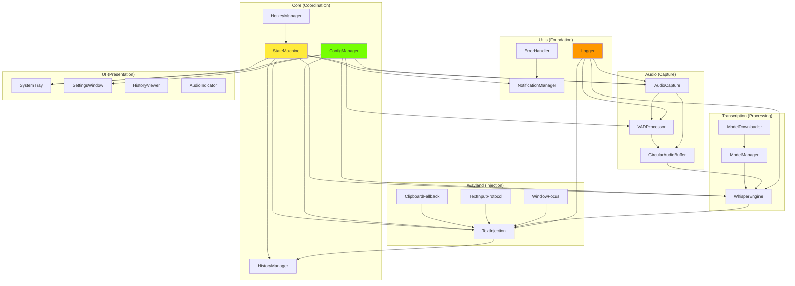
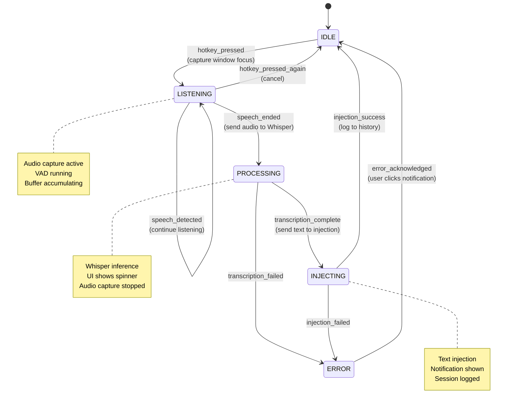

# Components

This section provides detailed breakdown of all application components, their responsibilities, interfaces, and interactions.

---

## Component Catalog

**Overview:** The application is organized into six primary component groups:

| Component Group | Location | Responsibility | Key Classes | Thread Context |
|----------------|----------|----------------|-------------|----------------|
| **Audio** | `src/audio/` | Audio capture, VAD, buffering | `AudioCapture`, `VADProcessor`, `CircularAudioBuffer` | Audio Thread |
| **Transcription** | `src/transcription/` | Whisper integration, model management | `WhisperEngine`, `ModelManager`, `ModelDownloader` | QThread Workers |
| **Wayland** | `src/wayland/` | Text injection, window focus tracking | `TextInjection`, `WindowFocus`, `TextInputProtocol`, `ClipboardFallback` | QThread (Injection) |
| **UI** | `src/ui/` | System tray, settings, history viewer | `SystemTray`, `SettingsWindow`, `HistoryViewer`, `AudioIndicator` | Qt Main Thread |
| **Core** | `src/core/` | State machine, configuration, history | `StateMachine`, `ConfigManager`, `HistoryManager`, `HotkeyManager` | Qt Main Thread |
| **Utils** | `src/utils/` | Logging, notifications, error handling | `Logger`, `NotificationManager`, `ErrorHandler`, `AudioFeedback` | Various |

**Component Dependency Graph:**



---

## Audio Components

### 1. AudioCapture (src/audio/capture.py)

**Responsibility:** Continuous microphone audio capture in background thread.

**Interface:**

```python
class AudioCapture(QObject):
    # Signals
    speechDetected = pyqtSignal(bytes)  # Emitted when VAD detects speech
    speechEnded = pyqtSignal(bytes)     # Emitted when VAD detects silence (with full audio)
    audioLevelChanged = pyqtSignal(float)  # Current audio level (0.0-1.0) for UI indicator
    deviceDisconnected = pyqtSignal()   # Audio device unplugged
    error = pyqtSignal(str)             # Capture error occurred

    def __init__(self, config: ConfigManager, vad: VADProcessor):
        """Initialize audio capture with configuration and VAD processor."""

    def start_capture(self):
        """Start capturing audio in background thread."""

    def stop_capture(self):
        """Stop audio capture and finalize buffer."""

    def list_devices(self) -> List[AudioDevice]:
        """Enumerate available audio input devices."""

    def set_device(self, device_id: str | int):
        """Switch to different audio input device."""

    def get_current_level(self) -> float:
        """Get current audio input level (0.0-1.0)."""
```

**Key Behaviors:**

- Runs in dedicated Python `threading.Thread` (not Qt main thread)
- Captures audio continuously using `sounddevice.InputStream` (non-blocking callback mode)
- Feeds audio chunks to VAD processor in real-time
- Maintains circular buffer of recent audio (5-30 seconds configurable)
- Emits Qt signals (thread-safe queued connections) to notify main thread
- Handles device hotplug (reconnection on device disconnect)
- Releases Python GIL during PortAudio callbacks (no main thread blocking)

**Threading Model:**

```python
def run(self):
    """Audio capture thread main loop."""
    with sounddevice.InputStream(
        device=self.device_id,
        channels=self.channels,
        samplerate=self.sample_rate,
        callback=self._audio_callback,  # Called from PortAudio thread
        blocksize=self.block_size
    ) as stream:
        while self.capturing:
            time.sleep(0.1)  # Keep thread alive, callbacks run in parallel

def _audio_callback(self, indata: np.ndarray, frames: int, time_info, status):
    """Called by PortAudio from audio thread (not main Python thread)."""
    # This runs with GIL released during PortAudio native code
    audio_chunk = AudioChunk(
        data=indata.copy(),
        timestamp=time.time(),
        sample_rate=self.sample_rate,
        is_speech=False  # VAD classifies below
    )

    # Process through VAD
    is_speech = self.vad.process_chunk(audio_chunk)
    audio_chunk.is_speech = is_speech

    # Buffer the chunk
    self.buffer.append(audio_chunk)

    # Emit level for UI (thread-safe Qt signal)
    level = np.abs(indata).mean()
    self.audioLevelChanged.emit(float(level))

    # Emit speech detection (thread-safe)
    if is_speech and not self.was_speaking:
        self.was_speaking = True
        self.speechDetected.emit(b'')  # Placeholder, actual audio in buffer
    elif not is_speech and self.was_speaking:
        # Silence detected after speech
        if self.silence_duration > self.vad_timeout:
            self.was_speaking = False
            audio_data = self.buffer.get_all_audio().tobytes()
            self.speechEnded.emit(audio_data)
            self.buffer.clear()
```

**Error Handling:**

- Device not found → Emit `deviceDisconnected` signal, attempt auto-reconnect every 5s
- Permission denied → Emit `error` signal, transition to ERROR state
- Buffer overflow → Drop oldest chunks (already handled by CircularAudioBuffer)
- PortAudio errors → Log error, attempt stream restart once

**Configuration Dependencies:**

- `audio.device_id` - Which microphone to use
- `audio.sample_rate` - 16kHz required for Whisper
- `audio.channels` - Mono (1) recommended
- `audio.buffer_duration_ms` - Initial buffer size
- `audio.buffer_max_duration_ms` - Maximum before dropping

---

### 2. VADProcessor (src/audio/vad.py)

**Responsibility:** Voice Activity Detection using silero-vad neural network.

**Interface:**

```python
class VADProcessor:
    def __init__(self, config: ConfigManager):
        """Initialize VAD with sensitivity from config."""

    def process_chunk(self, chunk: AudioChunk) -> bool:
        """
        Classify audio chunk as speech or non-speech.
        Returns True if speech detected, False otherwise.
        """

    def get_speech_probability(self, chunk: AudioChunk) -> float:
        """Get speech probability (0.0-1.0) for audio chunk."""

    def reset(self):
        """Reset VAD internal state (call between sessions)."""

    def set_sensitivity(self, sensitivity: float):
        """Update VAD sensitivity threshold (0.1-1.0)."""
```

**Key Behaviors:**

- Loads silero-vad PyTorch model on initialization (~10MB, auto-downloaded to cache)
- Runs model inference on GPU if available, CPU otherwise
- Processes audio in 512-sample chunks (32ms at 16kHz)
- Maintains internal state for temporal smoothing (reduces false positives)
- Configurable sensitivity threshold (default 0.5)
- Thread-safe (can be called from audio thread)

**Performance Characteristics:**

- Inference time: ~5-10ms per chunk (GPU), ~20-30ms (CPU)
- Accuracy: ~95% true positive rate, ~5% false positive rate (vs webrtcvad ~85%/15%)
- GPU: Shares CUDA context with Whisper (no context switch overhead)
- Memory: ~50MB GPU VRAM, ~10MB CPU RAM

**Sensitivity Tuning:**

```python
# Lower sensitivity = fewer false positives, may miss quiet speech
vad.set_sensitivity(0.3)  # Conservative (quiet environments)

# Higher sensitivity = catches all speech, more false positives
vad.set_sensitivity(0.8)  # Aggressive (noisy environments, accents)

# Default balanced
vad.set_sensitivity(0.5)  # Recommended starting point
```

---

### 3. CircularAudioBuffer (src/audio/buffer.py)

**Responsibility:** Dynamic circular buffer for audio chunks with automatic pruning.

**Interface:**

```python
class CircularAudioBuffer:
    def __init__(self, initial_duration_ms: int, max_duration_ms: int, sample_rate: int):
        """Create buffer with initial and maximum capacity."""

    def append(self, chunk: AudioChunk):
        """Add audio chunk, dropping oldest if buffer full."""

    def get_all_audio(self) -> np.ndarray:
        """Concatenate all buffered audio into single array."""

    def get_speech_only(self) -> np.ndarray:
        """Get only chunks marked as speech by VAD."""

    def clear(self):
        """Clear all buffered audio."""

    def duration_ms(self) -> float:
        """Total buffered audio duration in milliseconds."""

    def is_full(self) -> bool:
        """Check if buffer reached maximum capacity."""
```

**Key Behaviors:**

- Starts at 5 seconds capacity, grows to 30 seconds maximum
- Drops oldest chunks when maximum reached (prevents unbounded growth)
- Efficient numpy array operations (no repeated allocations)
- Tracks speech vs non-speech chunks (VAD results)
- Thread-safe append (called from audio thread)

**Memory Management:**

```python
# Example: 30 seconds at 16kHz mono = 480,000 samples
# At float32 = 480,000 * 4 bytes = 1.92 MB maximum per buffer
# Acceptable memory overhead for desktop application
```

---

## Transcription Components

### 4. WhisperEngine (src/transcription/whisper_engine.py)

**Responsibility:** Whisper model inference with GPU acceleration.

**Interface:**

```python
class WhisperEngine(QObject):
    # Signals
    transcriptionComplete = pyqtSignal(TranscriptionResult)  # Transcription finished
    transcriptionProgress = pyqtSignal(str)  # Partial transcription (streaming)
    modelLoadStarted = pyqtSignal(str)  # Model loading began
    modelLoadComplete = pyqtSignal(str)  # Model loaded successfully
    error = pyqtSignal(str)  # Transcription error

    def __init__(self, config: ConfigManager, model_manager: ModelManager):
        """Initialize Whisper engine with configuration."""

    def transcribe_async(self, audio: np.ndarray) -> None:
        """
        Transcribe audio asynchronously in QThread.
        Emits transcriptionComplete when done.
        """

    def transcribe_sync(self, audio: np.ndarray) -> TranscriptionResult:
        """Synchronous transcription (blocks caller, for testing)."""

    def is_cuda_available(self) -> bool:
        """Check if CUDA GPU is available."""

    def get_loaded_model(self) -> str:
        """Get currently loaded model size (e.g., 'base')."""

    def change_model(self, model_size: str):
        """Switch to different model size (triggers reload)."""
```

**Key Behaviors:**

- Runs in QThread worker (never blocks main thread)
- Loads Whisper model once on startup (base model ~150MB)
- Uses CUDA if available (torch.cuda.is_available()), CPU fallback otherwise
- FP16 precision on GPU for 2x speedup (configurable)
- Beam search size configurable (5 default, balance speed/accuracy)
- Releases Python GIL during CUDA operations
- Caches model in GPU VRAM between transcriptions (no reload overhead)

**Threading Implementation:**

```python
class TranscriptionWorker(QThread):
    """Worker thread for Whisper transcription."""

    transcriptionComplete = pyqtSignal(TranscriptionResult)

    def __init__(self, whisper_model, audio: np.ndarray, config: dict):
        super().__init__()
        self.model = whisper_model
        self.audio = audio
        self.config = config

    def run(self):
        """Execute transcription in QThread (off main thread)."""
        start_time = time.time()

        try:
            # This releases GIL during CUDA operations
            result = self.model.transcribe(
                self.audio,
                language="en",
                fp16=self.config["whisper_fp16"],
                beam_size=self.config["whisper_beam_size"],
                temperature=0.0  # Deterministic
            )

            inference_time_ms = int((time.time() - start_time) * 1000)

            transcription_result = TranscriptionResult(
                text=result["text"].strip(),
                segments=[...],  # Parse segments from result
                language=result["language"],
                model_used=self.config["model_size"],
                inference_time_ms=inference_time_ms,
                audio_duration_ms=int(len(self.audio) / 16000 * 1000),
                real_time_factor=inference_time_ms / (len(self.audio) / 16),
                error=None
            )

            self.transcriptionComplete.emit(transcription_result)

        except Exception as e:
            error_result = TranscriptionResult(
                text="",
                segments=[],
                language="",
                model_used=self.config["model_size"],
                inference_time_ms=0,
                audio_duration_ms=0,
                real_time_factor=0.0,
                error=str(e)
            )
            self.transcriptionComplete.emit(error_result)

# In WhisperEngine.transcribe_async():
def transcribe_async(self, audio: np.ndarray):
    worker = TranscriptionWorker(self.model, audio, self.config)
    worker.transcriptionComplete.connect(self._on_transcription_complete)
    self.workers.append(worker)  # Keep reference so it's not GC'd
    worker.start()  # Start QThread
```

**Performance Optimization:**

- Model loaded once and cached in GPU VRAM (no reload per transcription)
- FP16 reduces VRAM usage and increases speed (2x faster)
- Beam size 5 balances accuracy and speed (10 = more accurate but 2x slower)
- Temperature 0.0 for deterministic results (no randomness)
- Language forced to "en" (no language detection overhead)

**CUDA Fallback:**

```python
def __init__(self, config: ConfigManager, model_manager: ModelManager):
    self.use_cpu = False

    try:
        import torch
        if torch.cuda.is_available():
            self.device = "cuda"
            self.model = whisper.load_model(
                config.get("model.size"),
                device="cuda"
            )
        else:
            raise CUDAInitializationError("CUDA not available")
    except Exception as e:
        logger.warning(f"CUDA initialization failed: {e}")
        if config.get("advanced.enable_cpu_fallback"):
            self.use_cpu = True
            self.device = "cpu"
            self.model = whisper.load_model(
                config.get("model.size"),
                device="cpu"
            )
            notify_user("GPU unavailable, using CPU (slower)")
        else:
            raise  # No fallback, fail hard
```

---

### 5. ModelManager (src/transcription/model_manager.py)

**Responsibility:** Whisper model lifecycle management (download, load, cache, switch).

**Interface:**

```python
class ModelManager:
    def __init__(self, config: ConfigManager, model_downloader: ModelDownloader):
        """Initialize model manager with configuration."""

    def get_model_path(self, model_size: str) -> Path:
        """Get local path to model file (download if not exists)."""

    def is_model_downloaded(self, model_size: str) -> bool:
        """Check if model exists locally."""

    def list_available_models(self) -> List[str]:
        """List all Whisper model sizes."""

    def get_model_info(self, model_size: str) -> ModelInfo:
        """Get model metadata (size, parameters, VRAM requirements)."""

    def delete_model(self, model_size: str):
        """Delete model from disk (free space)."""
```

**Model Information:**

```python
@dataclass
class ModelInfo:
    size: str  # "tiny", "base", "small", "medium", "large"
    parameters: str  # "39M", "74M", "244M", "769M", "1550M"
    file_size_mb: int  # Disk space
    vram_gb: float  # GPU VRAM required (FP16)
    relative_speed: float  # 1.0 = base, 2.0 = 2x slower
    english_only: bool

MODEL_INFO = {
    "tiny": ModelInfo("tiny", "39M", 75, 1.0, 4.0, True),
    "base": ModelInfo("base", "74M", 150, 1.5, 1.0, True),
    "small": ModelInfo("small", "244M", 488, 2.0, 0.5, True),
    "medium": ModelInfo("medium", "769M", 1540, 5.0, 0.3, True),
    "large": ModelInfo("large", "1550M", 3100, 10.0, 0.15, False)
}
```

**Key Behaviors:**

- Checks `~/.local/share/fedora-voice-dictation/models/` for existing models
- Delegates download to ModelDownloader if model missing
- Validates model checksums (prevents corruption)
- Provides size/VRAM information for UI model selector
- Handles model deletion (user can free disk space)

---

### 6. ModelDownloader (src/transcription/model_downloader.py)

**Responsibility:** Download Whisper models from OpenAI with progress reporting.

**Interface:**

```python
class ModelDownloader(QObject):
    # Signals
    downloadStarted = pyqtSignal(str, int)  # model_size, total_bytes
    downloadProgress = pyqtSignal(int)  # bytes_downloaded
    downloadComplete = pyqtSignal(str)  # model_size
    downloadFailed = pyqtSignal(str, str)  # model_size, error_message

    def download_model(self, model_size: str) -> Path:
        """Download model, return path when complete."""

    def cancel_download(self):
        """Cancel in-progress download."""
```

**Key Behaviors:**

- Downloads from OpenAI CDN (https://openaipublic.azureedge.net/...)
- Shows progress UI (download dialog with progress bar)
- Validates checksum after download (SHA256)
- Atomic download (temp file + rename on success)
- Retry on failure (3 attempts with exponential backoff)
- Emits Qt signals for progress UI updates

**Download Flow:**

```python
def download_model(self, model_size: str) -> Path:
    url = f"https://openaipublic.azureedge.net/whisper/{model_size}.pt"
    dest_path = self.models_dir / f"{model_size}.pt"
    temp_path = dest_path.with_suffix(".pt.tmp")

    # Emit started signal
    response = requests.get(url, stream=True)
    total_size = int(response.headers.get('content-length', 0))
    self.downloadStarted.emit(model_size, total_size)

    # Download with progress
    downloaded = 0
    with open(temp_path, 'wb') as f:
        for chunk in response.iter_content(chunk_size=8192):
            if self.cancelled:
                temp_path.unlink()
                return None
            f.write(chunk)
            downloaded += len(chunk)
            self.downloadProgress.emit(downloaded)

    # Validate checksum
    if not self._validate_checksum(temp_path, model_size):
        temp_path.unlink()
        self.downloadFailed.emit(model_size, "Checksum mismatch")
        return None

    # Atomic rename
    temp_path.rename(dest_path)
    self.downloadComplete.emit(model_size)
    return dest_path
```

---

## Wayland Integration Components

### 7. TextInjection (src/wayland/text_injection.py)

**Responsibility:** Orchestrate text injection via Wayland protocol or clipboard fallback.

**Interface:**

```python
class TextInjection(QObject):
    # Signals
    injectionComplete = pyqtSignal(InjectionResult)
    injectionFailed = pyqtSignal(str)

    def __init__(self, config: ConfigManager, window_focus: WindowFocus):
        """Initialize text injection orchestrator."""

    def inject_async(self, text: str, target_window: WindowInfo) -> None:
        """
        Inject text asynchronously (runs in QThread to avoid blocking).
        Emits injectionComplete when done.
        """

    def inject_sync(self, text: str, target_window: WindowInfo) -> InjectionResult:
        """Synchronous injection (for testing)."""
```

**Strategy Pattern Implementation:**

```python
class TextInjection(QObject):
    def __init__(self, config: ConfigManager, window_focus: WindowFocus):
        self.config = config
        self.window_focus = window_focus

        # Initialize strategies
        self.strategies = {
            "wayland_protocol": TextInputProtocol(),
            "clipboard": ClipboardFallback()
        }

    def inject_async(self, text: str, target_window: WindowInfo):
        """Try strategies based on config."""
        method = self.config.get("text_injection.method")

        worker = InjectionWorker(
            text,
            target_window,
            self.strategies,
            method
        )
        worker.injectionComplete.connect(self._on_injection_complete)
        worker.start()

class InjectionWorker(QThread):
    injectionComplete = pyqtSignal(InjectionResult)

    def run(self):
        if self.method == "auto":
            # Try protocol first
            result = self.strategies["wayland_protocol"].inject(
                self.text,
                self.target_window
            )
            if not result.success:
                # Fallback to clipboard
                result = self.strategies["clipboard"].inject(
                    self.text,
                    self.target_window
                )
                result.fallback_used = True
        elif self.method == "protocol_only":
            result = self.strategies["wayland_protocol"].inject(...)
        elif self.method == "clipboard_only":
            result = self.strategies["clipboard"].inject(...)

        self.injectionComplete.emit(result)
```

---

### 8. TextInputProtocol (src/wayland/text_input_protocol.py)

**Responsibility:** Wayland text-input-unstable-v3 protocol implementation.

**Interface:**

```python
class TextInputProtocol:
    def inject(self, text: str, target_window: WindowInfo) -> InjectionResult:
        """Inject text using Wayland text input protocol."""

    def is_available(self) -> bool:
        """Check if protocol is supported by compositor."""
```

**Key Behaviors:**

- Uses `pywayland` bindings for text-input-unstable-v3
- Requires compositor support (works on GNOME/KDE, may fail on Hyprland/Sway)
- Directly inserts text into focused application's text input
- No clipboard pollution (text doesn't appear in clipboard history)
- Timeout after 500ms if protocol doesn't respond
- Emits Qt signal on completion or failure

**Protocol Details:**

```python
def inject(self, text: str, target_window: WindowInfo) -> InjectionResult:
    start_time = time.time()

    try:
        # Connect to Wayland display
        display = Display()
        display.connect()

        # Get text input manager
        registry = display.get_registry()
        text_input_manager = registry.bind(ZwpTextInputManagerV3)

        # Create text input for focused surface
        text_input = text_input_manager.get_text_input(seat)

        # Send text commit
        text_input.commit_string(text)
        text_input.commit()

        # Roundtrip to ensure processed
        display.roundtrip()

        latency_ms = int((time.time() - start_time) * 1000)

        return InjectionResult(
            success=True,
            method_used="wayland_protocol",
            latency_ms=latency_ms,
            error=None,
            fallback_used=False
        )

    except Exception as e:
        logger.warning(f"Wayland protocol injection failed: {e}")
        return InjectionResult(
            success=False,
            method_used="wayland_protocol",
            latency_ms=0,
            error=str(e),
            fallback_used=False
        )
```

---

### 9. ClipboardFallback (src/wayland/clipboard_fallback.py)

**Responsibility:** Clipboard-based text injection as fallback.

**Interface:**

```python
class ClipboardFallback:
    def inject(self, text: str, target_window: WindowInfo) -> InjectionResult:
        """Copy text to clipboard (user must paste with Ctrl+V)."""
```

**Key Behaviors:**

- Uses `pyperclip` library for cross-platform clipboard access
- Copies text to clipboard
- Optionally sends D-Bus notification: "Text copied to clipboard (Ctrl+V to paste)"
- Fast (<20ms typically)
- Works on all compositors (universal fallback)
- Pollutes clipboard history (downside vs protocol)

**Implementation:**

```python
def inject(self, text: str, target_window: WindowInfo) -> InjectionResult:
    start_time = time.time()

    try:
        # Copy to clipboard
        pyperclip.copy(text)

        latency_ms = int((time.time() - start_time) * 1000)

        # Notify user (clipboard requires manual paste)
        notify_user(
            "Text copied to clipboard",
            "Press Ctrl+V to paste",
            urgency="low"
        )

        return InjectionResult(
            success=True,
            method_used="clipboard",
            latency_ms=latency_ms,
            error=None,
            fallback_used=False  # It's the method used, not a fallback from this strategy's POV
        )

    except Exception as e:
        return InjectionResult(
            success=False,
            method_used="clipboard",
            latency_ms=0,
            error=str(e),
            fallback_used=False
        )
```

---

### 10. WindowFocus (src/wayland/window_focus.py)

**Responsibility:** Track focused window for text injection targeting.

**Interface:**

```python
class WindowFocus:
    def get_focused_window(self) -> WindowInfo:
        """Get currently focused window information."""

    def wait_for_focus_change(self, timeout_ms: int) -> Optional[WindowInfo]:
        """Wait for window focus to change (for testing)."""
```

**Key Behaviors:**

- Queries Wayland compositor for focused surface
- Extracts application name, window title, app_id
- Caches result (valid for current dictation session)
- Called when hotkey pressed (captures focus at dictation start, not injection time)

---

## UI Components (PyQt5)

### 11. SystemTray (src/ui/system_tray.py)

**Responsibility:** System tray icon with menu and status indication.

**Interface:**

```python
class SystemTray(QSystemTrayIcon):
    def __init__(self, state_machine: StateMachine, config: ConfigManager):
        """Initialize system tray with state machine connection."""

    def on_state_changed(self, new_state: ApplicationState):
        """Update icon/tooltip when state changes."""

    def show_notification(self, title: str, message: str, urgency: str):
        """Show desktop notification via tray."""
```

**Key Behaviors:**

- Shows status icon: 🎤 (idle), 🔴 (listening), ⚙️ (processing), ❌ (error)
- Tooltip shows current state and model info
- Context menu: Start/Stop Dictation, Settings, History, About, Quit
- Listens to state machine signals (icon updates automatically)
- Uses StatusNotifierItem on KDE/GNOME (better Wayland support)
- Fallback to QSystemTrayIcon on other DEs

**Menu Structure:**

```
🎤 Fedora Voice Dictation
─────────────────────
▶ Start Dictation (Ctrl+Space)
🔴 Stop Dictation
─────────────────────
⚙ Settings
📜 History
ℹ About
─────────────────────
🚪 Quit
```

---

### 12. SettingsWindow (src/ui/settings_window.py)

**Responsibility:** Settings dialog for configuration changes.

**Interface:**

```python
class SettingsWindow(QDialog):
    def __init__(self, config: ConfigManager):
        """Initialize settings UI with current config."""

    def save_settings(self):
        """Validate and save settings to config."""

    def reset_to_defaults(self):
        """Reset all settings to DEFAULT_CONFIG."""
```

**UI Layout:**

```
[Tabs: General | Audio | Advanced | About]

General Tab:
  Model Size: ( ) tiny  (•) base  ( ) small  ( ) medium  ( ) large
  Hotkey: [<Super>Space    ] [Record Hotkey]
  Text Injection: (•) Auto  ( ) Protocol Only  ( ) Clipboard Only

Audio Tab:
  Input Device: [Default Microphone          ▼]
  VAD Sensitivity: [========|===========] 0.5 (Lower = fewer false positives)
  End-of-Speech Timeout: [500] ms

Advanced Tab:
  Log Level: [INFO ▼]
  CPU Fallback: [✓] Enable CPU fallback if GPU unavailable
  Whisper FP16: [✓] Use FP16 precision (faster, GPU only)
  Beam Size: [5] (Higher = more accurate, slower)

[Reset to Defaults]  [Cancel] [Save]
```

**Validation:**

- Hotkey format regex: `^(<\w+>)*\w+$`
- VAD sensitivity range: 0.1-1.0
- Beam size range: 1-10
- Warns if changing model requires download
- Shows current disk space for models

---

### 13. HistoryViewer (src/ui/history_viewer.py)

**Responsibility:** Browse and search dictation history.

**Interface:**

```python
class HistoryViewer(QDialog):
    def __init__(self, history_manager: HistoryManager):
        """Initialize history viewer with history data."""

    def filter_by_date(self, start_date: QDate, end_date: QDate):
        """Filter sessions by date range."""

    def filter_by_application(self, app_name: str):
        """Filter sessions by target application."""

    def search_text(self, query: str):
        """Full-text search in transcriptions."""

    def export_to_csv(self, filepath: str):
        """Export history to CSV file."""
```

**UI Layout:**

```
[Search: ____________] [Date: Last 7 Days ▼] [App: All ▼] [Export CSV]

┌─────────────────────────────────────────────────────────────────────────┐
│ Timestamp          │ Text Preview              │ App         │ Latency │
├─────────────────────────────────────────────────────────────────────────┤
│ 2025-10-22 14:30   │ "Please refactor the..."  │ Claude Code │ 780ms   │
│ 2025-10-22 14:25   │ "git commit -m Fix..."    │ Terminal    │ 650ms   │
│ 2025-10-22 14:20   │ "Add error handling to"   │ VSCode      │ 720ms   │
└─────────────────────────────────────────────────────────────────────────┘

[Selected session details]
Full Text: "Please refactor the authentication module to use async await..."
Model: base | Audio Duration: 4.5s | Latency Breakdown: VAD 120ms | Whisper 550ms | Injection 110ms
Method: Wayland Protocol | Window: src/auth.ts - Claude Code

[Copy Text] [Delete Session] [Close]
```

---

### 14. AudioIndicator (src/ui/audio_indicator.py)

**Responsibility:** Floating overlay showing audio level and state.

**Interface:**

```python
class AudioIndicator(QWidget):
    def __init__(self):
        """Create frameless overlay widget."""

    def update_level(self, level: float):
        """Update audio level visualization (0.0-1.0)."""

    def set_state(self, state: ApplicationState):
        """Update visual state (idle/listening/processing)."""

    def set_position(self, position: str):
        """Set screen position (bottom-right, top-left, etc)."""
```

**Visual Design:**

```
[Bottom-right overlay, always on top]

┌──────────────┐
│  🎤 IDLE     │  ← Gray when idle
└──────────────┘

┌──────────────┐
│  🔴 ████████ │  ← Red bar shows audio level when listening
└──────────────┘

┌──────────────┐
│  ⚙ PROCESSING│  ← Orange + spinner when transcribing
└──────────────┘
```

---

## Core Components

### 15. StateMachine (src/core/state_machine.py)

**Responsibility:** Central FSM coordinating all application behavior.

**Interface:**

```python
class StateMachine(QStateMachine):
    # Signals
    stateChanged = pyqtSignal(ApplicationState, ApplicationState)  # old, new
    dictationStarted = pyqtSignal()
    dictationCompleted = pyqtSignal(DictationSession)
    errorOccurred = pyqtSignal(str)

    def __init__(self, config: ConfigManager):
        """Initialize state machine with states and transitions."""

    def trigger_hotkey(self):
        """External trigger: hotkey pressed."""

    def on_speech_detected(self, audio: bytes):
        """External trigger: VAD detected speech."""

    def on_speech_ended(self, audio: bytes):
        """External trigger: VAD detected silence after speech."""

    def on_transcription_complete(self, result: TranscriptionResult):
        """External trigger: Whisper finished transcription."""

    def on_injection_complete(self, result: InjectionResult):
        """External trigger: Text injection finished."""
```

**State Transition Diagram:**



**QStateMachine Implementation:**

```python
class StateMachine(QStateMachine):
    def __init__(self, config: ConfigManager):
        super().__init__()

        # Create states
        self.idle_state = QState(self)
        self.listening_state = QState(self)
        self.processing_state = QState(self)
        self.injecting_state = QState(self)
        self.error_state = QState(self)

        # Set initial state
        self.setInitialState(self.idle_state)

        # Define transitions
        self.idle_state.addTransition(
            self.hotkey_triggered,  # Signal
            self.listening_state
        )

        self.listening_state.addTransition(
            self.speech_ended_signal,
            self.processing_state
        )

        self.processing_state.addTransition(
            self.transcription_complete_signal,
            self.injecting_state
        )

        self.injecting_state.addTransition(
            self.injection_complete_signal,
            self.idle_state
        )

        # Error transitions from any state
        for state in [self.listening_state, self.processing_state, self.injecting_state]:
            state.addTransition(
                self.error_signal,
                self.error_state
            )

        # Error recovery
        self.error_state.addTransition(
            self.error_acknowledged_signal,
            self.idle_state
        )

        # Connect state entry/exit actions
        self.listening_state.entered.connect(self._on_enter_listening)
        self.processing_state.entered.connect(self._on_enter_processing)
        self.injecting_state.entered.connect(self._on_enter_injecting)
        self.idle_state.entered.connect(self._on_enter_idle)

        # Start machine
        self.start()
```

---

### 16. ConfigManager (src/core/config.py)

**Covered in Data Models section** - Repository pattern for configuration with validation.

---

### 17. HistoryManager (src/core/history.py)

**Covered in Data Models section** - Repository pattern for session history with pruning.

---

### 18. HotkeyManager (src/core/hotkey.py)

**Responsibility:** Register and handle global hotkeys via compositor D-Bus APIs.

**Interface:**

```python
class HotkeyManager(QObject):
    # Signals
    activated = pyqtSignal()  # Hotkey pressed
    registrationFailed = pyqtSignal(str)  # Hotkey registration failed

    def __init__(self, config: ConfigManager):
        """Initialize hotkey manager."""

    def register(self, combination: str) -> bool:
        """Register global hotkey with compositor."""

    def unregister(self):
        """Unregister current hotkey."""

    def is_supported(self) -> bool:
        """Check if compositor supports global hotkeys."""
```

**Compositor-Specific Registration:**

```python
def register(self, combination: str) -> bool:
    desktop = os.environ.get("XDG_CURRENT_DESKTOP", "").lower()

    if "gnome" in desktop:
        return self._register_gnome(combination)
    elif "kde" in desktop or "plasma" in desktop:
        return self._register_kde(combination)
    else:
        # Hyprland, Sway don't support global hotkeys via D-Bus
        logger.warning(f"Global hotkeys not supported on {desktop}")
        return False

def _register_gnome(self, combination: str) -> bool:
    """Register hotkey via org.gnome.Shell D-Bus interface."""
    try:
        bus = dbus.SessionBus()
        shell = bus.get_object('org.gnome.Shell', '/org/gnome/Shell')

        # Add keybinding
        shell.Eval(f"""
            Main.wm.addKeybinding(
                'fedora-voice-dictation',
                new Gio.Settings(),
                Meta.KeyBindingFlags.NONE,
                Shell.ActionMode.NORMAL,
                () => {{ /* callback handled via D-Bus signal */ }}
            );
        """)

        # Listen for activation signal
        shell.connect_to_signal('Accelerator', self._on_hotkey_activated)

        return True

    except Exception as e:
        logger.error(f"GNOME hotkey registration failed: {e}")
        return False

def _register_kde(self, combination: str) -> bool:
    """Register hotkey via org.kde.KGlobalAccel."""
    try:
        bus = dbus.SessionBus()
        kglobalaccel = bus.get_object(
            'org.kde.kglobalaccel',
            '/kglobalaccel'
        )

        # Register shortcut
        kglobalaccel.registerShortcut(
            'fedora-voice-dictation',
            'FedoraVoiceDictation',
            'Activate Dictation',
            combination
        )

        # Connect signal
        kglobalaccel.connect_to_signal(
            'yourShortcutGotActivated',
            self._on_hotkey_activated
        )

        return True

    except Exception as e:
        logger.error(f"KDE hotkey registration failed: {e}")
        return False
```

---

## Utility Components

### 19. Logger (src/utils/logger.py)

**Responsibility:** Centralized logging with rotation and filtering.

**Key Behaviors:**

- Rotating file handler (10MB max per file, 7-day retention)
- Writes to `~/.local/share/fedora-voice-dictation/logs/app.log`
- Configurable log level (DEBUG/INFO/WARNING/ERROR)
- Flushes immediately on ERROR level (minimize data loss on crash)
- Structured logging with timestamps, thread names, component names

---

### 20. NotificationManager (src/utils/notifications.py)

**Responsibility:** D-Bus desktop notifications.

**Interface:**

```python
class NotificationManager:
    def show(self, title: str, message: str, urgency: str = "normal"):
        """Show desktop notification via org.freedesktop.Notifications."""

    def show_error(self, message: str):
        """Show error notification (critical urgency, persists)."""
```

---

### 21. ErrorHandler (src/utils/error_handler.py)

**Responsibility:** Global exception handling and recovery.

**Key Behaviors:**

- Catches unhandled exceptions
- Logs full stack trace
- Shows user-friendly error dialog
- Attempts graceful recovery (return to IDLE state)
- Circuit breaker for repeated errors (prevent infinite loops)

---

## Component Lifecycle

**Application Startup Sequence:**

```python
def main():
    # 1. Initialize Qt application
    app = QApplication(sys.argv)

    # 2. Load configuration
    config = ConfigManager()
    config.load()

    # 3. Setup logging
    setup_logging(config.get("advanced.log_level"))

    # 4. Initialize error handler
    error_handler = ErrorHandler()
    sys.excepthook = error_handler.handle_exception

    # 5. Download models if needed
    model_downloader = ModelDownloader(config)
    model_manager = ModelManager(config, model_downloader)

    # Check if base model exists
    if not model_manager.is_model_downloaded("base"):
        # Show download dialog
        download_dialog = ModelDownloadDialog("base")
        model_downloader.download_model("base")
        download_dialog.exec_()

    # 6. Initialize Whisper engine (loads model)
    whisper_engine = WhisperEngine(config, model_manager)

    # 7. Initialize VAD
    vad = VADProcessor(config)

    # 8. Initialize audio capture
    audio_capture = AudioCapture(config, vad)

    # 9. Initialize state machine
    state_machine = StateMachine(config)

    # 10. Initialize Wayland integration
    window_focus = WindowFocus()
    text_injection = TextInjection(config, window_focus)

    # 11. Initialize UI
    system_tray = SystemTray(state_machine, config)
    system_tray.show()

    # 12. Initialize hotkey (may fail on some DEs)
    hotkey_manager = HotkeyManager(config)
    hotkey_supported = hotkey_manager.register(config.get("hotkey.combination"))
    if not hotkey_supported:
        system_tray.showMessage(
            "Hotkey Not Supported",
            "Use system tray menu to activate dictation",
            QSystemTrayIcon.Warning
        )

    # 13. Wire signals/slots
    wire_components(
        state_machine,
        audio_capture,
        whisper_engine,
        text_injection,
        system_tray,
        hotkey_manager
    )

    # 14. Run Qt event loop
    sys.exit(app.exec_())
```

---

## Component Communication Patterns

**All inter-component communication uses Qt signals/slots:**

```python
# Example: Full dictation flow signal connections

# Hotkey → State Machine
hotkey_manager.activated.connect(state_machine.trigger_hotkey)

# State Machine → Audio Capture
state_machine.listening_state.entered.connect(audio_capture.start_capture)
state_machine.listening_state.exited.connect(audio_capture.stop_capture)

# Audio Capture → State Machine
audio_capture.speechEnded.connect(state_machine.on_speech_ended)

# State Machine → Whisper Engine
state_machine.processing_state.entered.connect(
    lambda: whisper_engine.transcribe_async(state_machine.context.audio_buffer)
)

# Whisper Engine → State Machine
whisper_engine.transcriptionComplete.connect(state_machine.on_transcription_complete)

# State Machine → Text Injection
state_machine.injecting_state.entered.connect(
    lambda: text_injection.inject_async(
        state_machine.context.transcription_result.text,
        state_machine.context.target_window
    )
)

# Text Injection → State Machine
text_injection.injectionComplete.connect(state_machine.on_injection_complete)

# State Machine → History Manager
state_machine.dictationCompleted.connect(history_manager.add_session)

# State Machine → System Tray (UI updates)
state_machine.stateChanged.connect(system_tray.on_state_changed)

# Audio Capture → Audio Indicator (level visualization)
audio_capture.audioLevelChanged.connect(audio_indicator.update_level)
```

**Benefits of Signal/Slot Architecture:**

✅ **Loose Coupling:** Components don't know about each other, only signals
✅ **Thread Safety:** Qt handles thread-safe signal delivery automatically
✅ **Testability:** Mock signals in unit tests
✅ **Flexibility:** Add/remove connections without changing component code
✅ **Debuggability:** Can trace signal flow with Qt's signal spy

---
