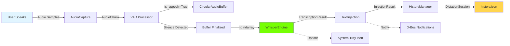
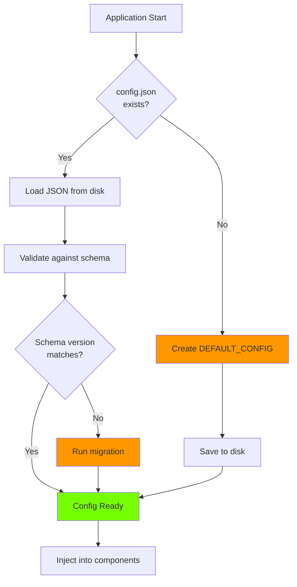
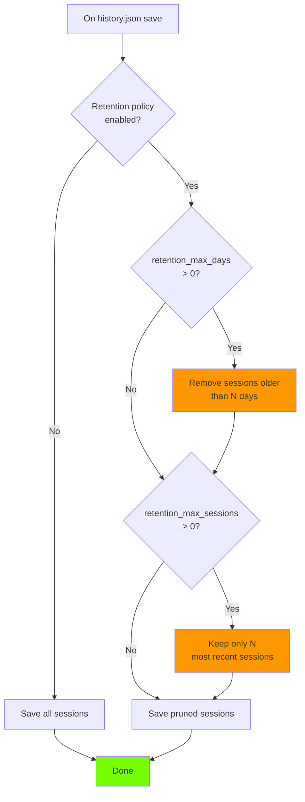

# Data Models

This section defines all data structures, schemas, and data flow patterns used throughout the application.

---

## Configuration Data Model

**File Location:** `~/.config/fedora-voice-dictation/config.json`

**Schema Definition (JSON Schema):**

```json
{
  "$schema": "http://json-schema.org/draft-07/schema#",
  "title": "Fedora Voice Dictation Configuration",
  "type": "object",
  "required": ["model", "audio", "vad", "hotkey", "text_injection", "ui", "history", "advanced"],
  "properties": {
    "_schema_version": {
      "type": "string",
      "const": "1.0",
      "description": "Configuration schema version for migration tracking"
    },

    "model": {
      "type": "object",
      "required": ["size"],
      "properties": {
        "size": {
          "type": "string",
          "enum": ["tiny", "base", "small", "medium", "large"],
          "default": "base",
          "description": "Whisper model size (base recommended for RTX 4060)"
        }
      }
    },

    "audio": {
      "type": "object",
      "required": ["device_id", "sample_rate", "channels", "buffer_duration_ms", "buffer_max_duration_ms"],
      "properties": {
        "device_id": {
          "type": ["string", "integer"],
          "default": "default",
          "description": "Audio input device ID from sounddevice.query_devices()"
        },
        "sample_rate": {
          "type": "integer",
          "enum": [8000, 16000, 22050, 44100, 48000],
          "default": 16000,
          "description": "Audio sample rate in Hz (16kHz required for Whisper)"
        },
        "channels": {
          "type": "integer",
          "enum": [1, 2],
          "default": 1,
          "description": "Audio channels (1=mono, 2=stereo; mono recommended)"
        },
        "buffer_duration_ms": {
          "type": "integer",
          "minimum": 1000,
          "maximum": 10000,
          "default": 5000,
          "description": "Initial audio buffer duration in milliseconds"
        },
        "buffer_max_duration_ms": {
          "type": "integer",
          "minimum": 10000,
          "maximum": 60000,
          "default": 30000,
          "description": "Maximum audio buffer duration before dropping oldest chunks"
        }
      }
    },

    "vad": {
      "type": "object",
      "required": ["sensitivity", "end_of_speech_timeout_ms"],
      "properties": {
        "sensitivity": {
          "type": "number",
          "minimum": 0.1,
          "maximum": 1.0,
          "default": 0.5,
          "description": "VAD sensitivity (higher = more sensitive, more false positives)"
        },
        "end_of_speech_timeout_ms": {
          "type": "integer",
          "minimum": 100,
          "maximum": 2000,
          "default": 500,
          "description": "Silence duration before considering speech ended"
        }
      }
    },

    "hotkey": {
      "type": "object",
      "required": ["enabled", "combination"],
      "properties": {
        "enabled": {
          "type": "boolean",
          "default": true,
          "description": "Enable global hotkey (may not work on all DEs)"
        },
        "combination": {
          "type": "string",
          "pattern": "^(<\\w+>)*\\w+$",
          "default": "<Super>Space",
          "description": "Global hotkey combination (format: <Modifier>Key)"
        }
      }
    },

    "text_injection": {
      "type": "object",
      "required": ["method"],
      "properties": {
        "method": {
          "type": "string",
          "enum": ["auto", "protocol_only", "clipboard_only"],
          "default": "auto",
          "description": "auto = try Wayland protocol, fallback to clipboard"
        }
      }
    },

    "ui": {
      "type": "object",
      "required": ["show_audio_indicator", "audio_indicator_position", "audio_feedback", "notification_level"],
      "properties": {
        "show_audio_indicator": {
          "type": "boolean",
          "default": true,
          "description": "Show audio level indicator overlay"
        },
        "audio_indicator_position": {
          "type": "string",
          "enum": ["bottom-right", "bottom-left", "top-right", "top-left"],
          "default": "bottom-right",
          "description": "Screen position for audio indicator"
        },
        "audio_feedback": {
          "type": "object",
          "properties": {
            "beep_on_start": {
              "type": "boolean",
              "default": true,
              "description": "Play beep when listening starts"
            },
            "beep_on_complete": {
              "type": "boolean",
              "default": true,
              "description": "Play beep when transcription completes"
            },
            "beep_on_error": {
              "type": "boolean",
              "default": true,
              "description": "Play beep on error"
            }
          }
        },
        "notification_level": {
          "type": "string",
          "enum": ["all", "errors_only", "none"],
          "default": "all",
          "description": "Desktop notification verbosity"
        }
      }
    },

    "history": {
      "type": "object",
      "required": ["enabled", "retention_max_sessions", "retention_max_days", "excluded_applications"],
      "properties": {
        "enabled": {
          "type": "boolean",
          "default": true,
          "description": "Enable session history logging"
        },
        "retention_max_sessions": {
          "type": "integer",
          "minimum": 0,
          "maximum": 10000,
          "default": 500,
          "description": "Maximum sessions to keep (0 = unlimited)"
        },
        "retention_max_days": {
          "type": "integer",
          "minimum": 0,
          "maximum": 365,
          "default": 90,
          "description": "Maximum age of sessions in days (0 = unlimited)"
        },
        "excluded_applications": {
          "type": "array",
          "items": {
            "type": "string"
          },
          "default": [],
          "description": "Application names to exclude from history (e.g., password managers)"
        }
      }
    },

    "advanced": {
      "type": "object",
      "required": ["log_level", "enable_cpu_fallback", "whisper_fp16", "whisper_beam_size"],
      "properties": {
        "log_level": {
          "type": "string",
          "enum": ["DEBUG", "INFO", "WARNING", "ERROR"],
          "default": "INFO",
          "description": "Logging verbosity"
        },
        "enable_cpu_fallback": {
          "type": "boolean",
          "default": true,
          "description": "Fall back to CPU if CUDA initialization fails"
        },
        "whisper_fp16": {
          "type": "boolean",
          "default": true,
          "description": "Use fp16 precision for faster inference (requires GPU)"
        },
        "whisper_beam_size": {
          "type": "integer",
          "minimum": 1,
          "maximum": 10,
          "default": 5,
          "description": "Whisper beam search size (higher = more accurate, slower)"
        }
      }
    },

    "_internal": {
      "type": "object",
      "description": "Internal metadata, not user-editable",
      "properties": {
        "setup_complete": {
          "type": "boolean",
          "default": false
        },
        "first_run_date": {
          "type": "string",
          "format": "date"
        },
        "config_version": {
          "type": "string"
        }
      }
    }
  }
}
```

**Python Type Definitions (src/core/config.py):**

```python
from typing import TypedDict, Literal, List
from dataclasses import dataclass

class ModelConfig(TypedDict):
    size: Literal["tiny", "base", "small", "medium", "large"]

class AudioConfig(TypedDict):
    device_id: str | int
    sample_rate: int
    channels: int
    buffer_duration_ms: int
    buffer_max_duration_ms: int

class VADConfig(TypedDict):
    sensitivity: float
    end_of_speech_timeout_ms: int

class HotkeyConfig(TypedDict):
    enabled: bool
    combination: str

class TextInjectionConfig(TypedDict):
    method: Literal["auto", "protocol_only", "clipboard_only"]

class AudioFeedbackConfig(TypedDict):
    beep_on_start: bool
    beep_on_complete: bool
    beep_on_error: bool

class UIConfig(TypedDict):
    show_audio_indicator: bool
    audio_indicator_position: Literal["bottom-right", "bottom-left", "top-right", "top-left"]
    audio_feedback: AudioFeedbackConfig
    notification_level: Literal["all", "errors_only", "none"]

class HistoryConfig(TypedDict):
    enabled: bool
    retention_max_sessions: int
    retention_max_days: int
    excluded_applications: List[str]

class AdvancedConfig(TypedDict):
    log_level: Literal["DEBUG", "INFO", "WARNING", "ERROR"]
    enable_cpu_fallback: bool
    whisper_fp16: bool
    whisper_beam_size: int

class InternalMetadata(TypedDict):
    setup_complete: bool
    first_run_date: str
    config_version: str

class AppConfig(TypedDict):
    _schema_version: str
    model: ModelConfig
    audio: AudioConfig
    vad: VADConfig
    hotkey: HotkeyConfig
    text_injection: TextInjectionConfig
    ui: UIConfig
    history: HistoryConfig
    advanced: AdvancedConfig
    _internal: InternalMetadata
```

**Default Configuration (loaded on first run):**

```python
DEFAULT_CONFIG: AppConfig = {
    "_schema_version": "1.0",
    "model": {
        "size": "base"
    },
    "audio": {
        "device_id": "default",
        "sample_rate": 16000,
        "channels": 1,
        "buffer_duration_ms": 5000,
        "buffer_max_duration_ms": 30000
    },
    "vad": {
        "sensitivity": 0.5,
        "end_of_speech_timeout_ms": 500
    },
    "hotkey": {
        "enabled": True,
        "combination": "<Super>Space"
    },
    "text_injection": {
        "method": "auto"
    },
    "ui": {
        "show_audio_indicator": True,
        "audio_indicator_position": "bottom-right",
        "audio_feedback": {
            "beep_on_start": True,
            "beep_on_complete": True,
            "beep_on_error": True
        },
        "notification_level": "all"
    },
    "history": {
        "enabled": True,
        "retention_max_sessions": 500,
        "retention_max_days": 90,
        "excluded_applications": []
    },
    "advanced": {
        "log_level": "INFO",
        "enable_cpu_fallback": True,
        "whisper_fp16": True,
        "whisper_beam_size": 5
    },
    "_internal": {
        "setup_complete": False,
        "first_run_date": "",
        "config_version": "1.0"
    }
}
```

**Configuration Migration Strategy:**

When schema version changes (future updates):

```python
def migrate_config(old_config: dict, old_version: str, new_version: str) -> AppConfig:
    """Migrate configuration from old version to new version."""
    if old_version == "1.0" and new_version == "1.1":
        # Example migration: Add new field with default
        old_config.setdefault("new_feature", {"enabled": False})

    # Update schema version
    old_config["_schema_version"] = new_version
    return old_config
```

---

## History/Session Data Model

**File Location:** `~/.local/share/fedora-voice-dictation/history.json`

**Schema Definition:**

```json
{
  "$schema": "http://json-schema.org/draft-07/schema#",
  "title": "Fedora Voice Dictation Session History",
  "type": "object",
  "required": ["version", "sessions"],
  "properties": {
    "version": {
      "type": "string",
      "const": "1.0"
    },
    "sessions": {
      "type": "array",
      "items": {
        "$ref": "#/definitions/session"
      }
    }
  },
  "definitions": {
    "session": {
      "type": "object",
      "required": ["id", "timestamp", "transcribed_text", "target_application", "model_used", "latency_ms", "injection_method"],
      "properties": {
        "id": {
          "type": "string",
          "format": "uuid",
          "description": "Unique session identifier"
        },
        "timestamp": {
          "type": "string",
          "format": "date-time",
          "description": "ISO 8601 timestamp (e.g., 2025-10-22T14:30:00Z)"
        },
        "transcribed_text": {
          "type": "string",
          "description": "Final transcribed text"
        },
        "target_application": {
          "type": "string",
          "description": "Application name where text was injected (e.g., 'Claude Code', 'GNOME Terminal')"
        },
        "target_window_title": {
          "type": "string",
          "description": "Window title at time of dictation"
        },
        "model_used": {
          "type": "string",
          "enum": ["tiny", "base", "small", "medium", "large"],
          "description": "Whisper model size used"
        },
        "audio_duration_ms": {
          "type": "integer",
          "minimum": 0,
          "description": "Duration of captured audio in milliseconds"
        },
        "latency_ms": {
          "type": "integer",
          "minimum": 0,
          "description": "Total end-to-end latency (speech end → text injected)"
        },
        "latency_breakdown": {
          "type": "object",
          "properties": {
            "vad_detection_ms": {
              "type": "integer",
              "description": "Time for VAD to detect speech end"
            },
            "whisper_inference_ms": {
              "type": "integer",
              "description": "Whisper model inference time"
            },
            "text_injection_ms": {
              "type": "integer",
              "description": "Time to inject text into application"
            }
          }
        },
        "injection_method": {
          "type": "string",
          "enum": ["wayland_protocol", "clipboard"],
          "description": "Method used to inject text"
        },
        "word_count": {
          "type": "integer",
          "minimum": 0,
          "description": "Number of words in transcription"
        },
        "error": {
          "type": ["string", "null"],
          "description": "Error message if session failed (null if successful)"
        }
      }
    }
  }
}
```

**Python Type Definitions (src/core/history.py):**

```python
from dataclasses import dataclass
from datetime import datetime
from typing import Optional, Literal
from uuid import UUID

@dataclass
class LatencyBreakdown:
    vad_detection_ms: int
    whisper_inference_ms: int
    text_injection_ms: int

    def total_ms(self) -> int:
        return self.vad_detection_ms + self.whisper_inference_ms + self.text_injection_ms

@dataclass
class DictationSession:
    id: UUID
    timestamp: datetime
    transcribed_text: str
    target_application: str
    target_window_title: str
    model_used: Literal["tiny", "base", "small", "medium", "large"]
    audio_duration_ms: int
    latency_ms: int
    latency_breakdown: LatencyBreakdown
    injection_method: Literal["wayland_protocol", "clipboard"]
    word_count: int
    error: Optional[str] = None

    def was_successful(self) -> bool:
        return self.error is None

    def to_dict(self) -> dict:
        """Convert to JSON-serializable dictionary."""
        return {
            "id": str(self.id),
            "timestamp": self.timestamp.isoformat(),
            "transcribed_text": self.transcribed_text,
            "target_application": self.target_application,
            "target_window_title": self.target_window_title,
            "model_used": self.model_used,
            "audio_duration_ms": self.audio_duration_ms,
            "latency_ms": self.latency_ms,
            "latency_breakdown": {
                "vad_detection_ms": self.latency_breakdown.vad_detection_ms,
                "whisper_inference_ms": self.latency_breakdown.whisper_inference_ms,
                "text_injection_ms": self.latency_breakdown.text_injection_ms
            },
            "injection_method": self.injection_method,
            "word_count": self.word_count,
            "error": self.error
        }

@dataclass
class SessionHistory:
    version: str
    sessions: list[DictationSession]

    def add_session(self, session: DictationSession):
        self.sessions.append(session)

    def get_recent(self, count: int) -> list[DictationSession]:
        """Get N most recent sessions."""
        return sorted(self.sessions, key=lambda s: s.timestamp, reverse=True)[:count]

    def get_average_latency(self) -> float:
        """Calculate average latency across all successful sessions."""
        successful = [s for s in self.sessions if s.was_successful()]
        if not successful:
            return 0.0
        return sum(s.latency_ms for s in successful) / len(successful)

    def prune(self, max_sessions: int, max_days: int):
        """Remove old sessions based on retention policy."""
        from datetime import timedelta

        # Remove sessions older than max_days
        if max_days > 0:
            cutoff = datetime.now() - timedelta(days=max_days)
            self.sessions = [s for s in self.sessions if s.timestamp > cutoff]

        # Keep only max_sessions most recent
        if max_sessions > 0 and len(self.sessions) > max_sessions:
            self.sessions = sorted(self.sessions, key=lambda s: s.timestamp, reverse=True)[:max_sessions]
```

**History File Example:**

```json
{
  "version": "1.0",
  "sessions": [
    {
      "id": "550e8400-e29b-41d4-a716-446655440000",
      "timestamp": "2025-10-22T14:30:15.123Z",
      "transcribed_text": "Please refactor the authentication module to use async await instead of callbacks.",
      "target_application": "Claude Code",
      "target_window_title": "src/auth.ts - Claude Code",
      "model_used": "base",
      "audio_duration_ms": 4500,
      "latency_ms": 780,
      "latency_breakdown": {
        "vad_detection_ms": 120,
        "whisper_inference_ms": 550,
        "text_injection_ms": 110
      },
      "injection_method": "wayland_protocol",
      "word_count": 13,
      "error": null
    },
    {
      "id": "660e8400-e29b-41d4-a716-446655440001",
      "timestamp": "2025-10-22T14:25:00.456Z",
      "transcribed_text": "git commit -m \"Fix authentication bug in login handler\"",
      "target_application": "GNOME Terminal",
      "target_window_title": "Terminal - ~/projects/myapp",
      "model_used": "base",
      "audio_duration_ms": 3200,
      "latency_ms": 650,
      "latency_breakdown": {
        "vad_detection_ms": 100,
        "whisper_inference_ms": 480,
        "text_injection_ms": 70
      },
      "injection_method": "clipboard",
      "word_count": 9,
      "error": null
    }
  ]
}
```

**Phase 2: SQLite Migration**

When history grows large (>1000 sessions), migrate to SQLite:

```sql
-- Phase 2 schema (for reference)
CREATE TABLE sessions (
    id TEXT PRIMARY KEY,
    timestamp DATETIME NOT NULL,
    transcribed_text TEXT NOT NULL,
    target_application TEXT,
    target_window_title TEXT,
    model_used TEXT,
    audio_duration_ms INTEGER,
    latency_ms INTEGER,
    vad_detection_ms INTEGER,
    whisper_inference_ms INTEGER,
    text_injection_ms INTEGER,
    injection_method TEXT,
    word_count INTEGER,
    error TEXT,
    created_at DATETIME DEFAULT CURRENT_TIMESTAMP
);

CREATE INDEX idx_timestamp ON sessions(timestamp DESC);
CREATE INDEX idx_target_application ON sessions(target_application);
CREATE INDEX idx_error ON sessions(error) WHERE error IS NOT NULL;

-- Enable full-text search on transcriptions
CREATE VIRTUAL TABLE sessions_fts USING fts5(transcribed_text, content='sessions', content_rowid='rowid');
```

---

## Internal Data Structures

**1. Audio Buffer (src/audio/buffer.py):**

```python
from collections import deque
from dataclasses import dataclass
import numpy as np

@dataclass
class AudioChunk:
    """Single audio chunk with metadata."""
    data: np.ndarray  # Audio samples (float32, shape: [samples])
    timestamp: float  # Capture timestamp (seconds since epoch)
    sample_rate: int  # Sample rate in Hz
    is_speech: bool  # VAD classification result

    def duration_ms(self) -> float:
        return (len(self.data) / self.sample_rate) * 1000

class CircularAudioBuffer:
    """Dynamic circular buffer for audio chunks."""

    def __init__(self, initial_duration_ms: int, max_duration_ms: int, sample_rate: int):
        self.sample_rate = sample_rate
        self.initial_capacity = self._ms_to_samples(initial_duration_ms)
        self.max_capacity = self._ms_to_samples(max_duration_ms)
        self.chunks: deque[AudioChunk] = deque(maxlen=None)  # Unbounded initially
        self._current_size_samples = 0

    def append(self, chunk: AudioChunk):
        """Add audio chunk, dropping oldest if buffer full."""
        self.chunks.append(chunk)
        self._current_size_samples += len(chunk.data)

        # Drop oldest chunks if exceeded max capacity
        while self._current_size_samples > self.max_capacity:
            dropped = self.chunks.popleft()
            self._current_size_samples -= len(dropped.data)

    def get_all_audio(self) -> np.ndarray:
        """Concatenate all chunks into single numpy array."""
        if not self.chunks:
            return np.array([], dtype=np.float32)
        return np.concatenate([chunk.data for chunk in self.chunks])

    def get_speech_only(self) -> np.ndarray:
        """Get only chunks marked as speech by VAD."""
        speech_chunks = [chunk.data for chunk in self.chunks if chunk.is_speech]
        if not speech_chunks:
            return np.array([], dtype=np.float32)
        return np.concatenate(speech_chunks)

    def clear(self):
        """Clear all buffered audio."""
        self.chunks.clear()
        self._current_size_samples = 0

    def duration_ms(self) -> float:
        """Total buffered audio duration in milliseconds."""
        return (self._current_size_samples / self.sample_rate) * 1000

    def _ms_to_samples(self, ms: int) -> int:
        return int((ms / 1000) * self.sample_rate)
```

**2. Transcription Result (src/transcription/whisper_engine.py):**

```python
from dataclasses import dataclass
from typing import List, Optional

@dataclass
class TranscriptionSegment:
    """Single segment of transcribed text with timing."""
    text: str
    start_time: float  # Seconds from audio start
    end_time: float    # Seconds from audio start
    confidence: float  # 0.0 - 1.0

    def duration(self) -> float:
        return self.end_time - self.start_time

@dataclass
class TranscriptionResult:
    """Complete transcription with metadata."""
    text: str  # Full transcribed text
    segments: List[TranscriptionSegment]  # Word/phrase segments
    language: str  # Detected language code (e.g., "en")
    model_used: str  # Model size (e.g., "base")
    inference_time_ms: int  # Whisper inference duration
    audio_duration_ms: int  # Input audio duration
    real_time_factor: float  # inference_time / audio_duration (< 1.0 = faster than real-time)
    error: Optional[str] = None

    def was_successful(self) -> bool:
        return self.error is None

    def word_count(self) -> int:
        return len(self.text.split())

    def average_confidence(self) -> float:
        if not self.segments:
            return 0.0
        return sum(seg.confidence for seg in self.segments) / len(self.segments)
```

**3. State Machine States (src/core/state_machine.py):**

```python
from enum import Enum, auto

class ApplicationState(Enum):
    """Application finite state machine states."""
    IDLE = auto()           # No active dictation, waiting for hotkey
    LISTENING = auto()      # Audio capture active, VAD detecting speech
    PROCESSING = auto()     # Speech ended, Whisper transcribing
    INJECTING = auto()      # Transcription complete, injecting text
    ERROR = auto()          # Recoverable error occurred

    def is_active(self) -> bool:
        """Check if dictation is in progress."""
        return self in {ApplicationState.LISTENING, ApplicationState.PROCESSING, ApplicationState.INJECTING}

@dataclass
class StateTransition:
    """State machine transition with metadata."""
    from_state: ApplicationState
    to_state: ApplicationState
    timestamp: datetime
    trigger: str  # What caused transition (e.g., "hotkey_pressed", "speech_detected")
    metadata: dict  # Additional context

    def duration_in_from_state_ms(self, previous_transition: Optional['StateTransition']) -> int:
        """Calculate how long we were in from_state."""
        if not previous_transition:
            return 0
        delta = self.timestamp - previous_transition.timestamp
        return int(delta.total_seconds() * 1000)

class StateMachineContext:
    """Context data carried through state machine."""
    audio_buffer: Optional[np.ndarray] = None
    transcription_result: Optional[TranscriptionResult] = None
    target_window: Optional[str] = None
    target_application: Optional[str] = None
    session_start_time: Optional[datetime] = None
    error_message: Optional[str] = None
```

**4. Window Focus Information (src/wayland/window_focus.py):**

```python
@dataclass
class WindowInfo:
    """Information about focused window."""
    application_name: str  # e.g., "Claude Code", "GNOME Terminal"
    window_title: str      # e.g., "src/main.py - Claude Code"
    app_id: str           # Wayland app_id (e.g., "org.gnome.Terminal")
    pid: Optional[int]    # Process ID if available
    timestamp: datetime   # When focus was captured

    def is_excluded(self, excluded_apps: List[str]) -> bool:
        """Check if this application is in exclusion list."""
        return self.application_name in excluded_apps or self.app_id in excluded_apps
```

**5. Text Injection Result (src/wayland/text_injection.py):**

```python
@dataclass
class InjectionResult:
    """Result of text injection attempt."""
    success: bool
    method_used: Literal["wayland_protocol", "clipboard"]
    latency_ms: int
    error: Optional[str] = None
    fallback_used: bool = False  # True if clipboard was fallback

    def __post_init__(self):
        if not self.success and not self.error:
            self.error = "Unknown injection failure"
```

---

## Data Flow Diagrams

**Dictation Session Data Flow:**



**Configuration Load Flow:**



**History Pruning Flow:**



---

## Data Validation and Integrity

**Configuration Validation (src/core/config.py):**

```python
import jsonschema

class ConfigManager:
    def __init__(self, config_path: str):
        self.config_path = config_path
        self.config: AppConfig = {}
        self.schema = self._load_schema()

    def validate(self, config: dict) -> tuple[bool, Optional[str]]:
        """Validate configuration against JSON schema."""
        try:
            jsonschema.validate(instance=config, schema=self.schema)
            return True, None
        except jsonschema.ValidationError as e:
            return False, str(e)

    def load(self) -> AppConfig:
        """Load configuration from disk with validation."""
        if not os.path.exists(self.config_path):
            self.config = DEFAULT_CONFIG.copy()
            self.save()
            return self.config

        try:
            with open(self.config_path, 'r') as f:
                loaded = json.load(f)

            # Validate
            is_valid, error = self.validate(loaded)
            if not is_valid:
                logger.error(f"Config validation failed: {error}")
                # Backup corrupted config
                backup_path = f"{self.config_path}.corrupted.{int(time.time())}"
                shutil.copy(self.config_path, backup_path)
                logger.info(f"Corrupted config backed up to {backup_path}")
                # Load defaults
                self.config = DEFAULT_CONFIG.copy()
                self.save()
            else:
                self.config = loaded

            return self.config

        except json.JSONDecodeError as e:
            logger.error(f"Config JSON parse error: {e}")
            # Same backup and default recovery as above
            return DEFAULT_CONFIG.copy()

    def save(self):
        """Atomically save configuration to disk."""
        temp_path = f"{self.config_path}.tmp"
        try:
            # Validate before saving
            is_valid, error = self.validate(self.config)
            if not is_valid:
                raise ValueError(f"Cannot save invalid config: {error}")

            # Write to temp file
            with open(temp_path, 'w') as f:
                json.dump(self.config, f, indent=2, sort_keys=True)

            # Atomic rename (POSIX guarantees atomicity)
            os.replace(temp_path, self.config_path)

        except Exception as e:
            logger.error(f"Failed to save config: {e}")
            # Clean up temp file
            if os.path.exists(temp_path):
                os.remove(temp_path)
            raise
```

**History Validation:**

- Sessions must have valid UUID
- Timestamps must be valid ISO 8601 format
- Latency values must be non-negative integers
- Model names must be in allowed set
- Injection method must be valid enum value
- Corrupted history files trigger full rebuild from valid sessions

---

## Data Persistence Strategy

| Data Type | Storage Format | Location | Atomicity | Backup | Retention |
|-----------|---------------|----------|-----------|--------|-----------|
| **Configuration** | JSON | `~/.config/fedora-voice-dictation/config.json` | Temp + rename | `.corrupted.*` on error | Permanent |
| **History (MVP)** | JSON | `~/.local/share/fedora-voice-dictation/history.json` | Append-only, periodic prune | `.bak` on migration | Configurable (90 days default) |
| **History (Phase 2)** | SQLite | `~/.local/share/fedora-voice-dictation/history.db` | Transaction-based | SQLite journal | Same as MVP |
| **Logs** | Text (rotating) | `~/.local/share/fedora-voice-dictation/logs/*.log` | Buffered writes | N/A | 7 days (10MB max per file) |
| **Whisper Models** | Binary (PyTorch) | `~/.local/share/fedora-voice-dictation/models/*.pt` | Direct write | N/A | Permanent (user deletable) |
| **VAD Model** | Binary (PyTorch) | `~/.cache/torch/hub/snakers4_silero-vad/*.jit` | PyTorch Hub manages | N/A | Permanent (cache) |

**Crash Recovery:**

- Configuration: Atomic writes prevent partial writes. Corrupted files backed up, defaults loaded.
- History: Append-only minimizes corruption risk. Partial entries at end discarded on load.
- Logs: Rotating handler flushes on ERROR level, minimizing data loss.
- Models: Checksum validation on download. Re-download on corruption.

---
