# High Level Architecture

## Technical Summary

Fedora Voice Dictation is a **single-process, event-driven desktop application** built on Python 3.10+ with PyQt5 UI framework. The architecture orchestrates five primary subsystems—audio capture, voice activity detection, GPU-accelerated speech recognition, Wayland text injection, and Qt-based UI—through a centralized state machine and Qt signal/slot message passing.

**Core Architecture Pattern:** Event-driven state machine with multi-threaded processing. The Qt event loop serves as the main orchestrator, with audio capture running in a dedicated background thread (Python threading), Whisper transcription executing in QThread workers (releasing Python GIL during CUDA operations), and Wayland text injection coordinated through a separate QThread to avoid blocking the UI.

**Performance Strategy:** **Targets** <500ms end-to-end latency (MVP acceptance criteria: <1000ms) through parallel processing (audio capture concurrent with UI), GPU acceleration (3-5x faster than CPU), and optimized buffering (dynamic buffer expanding from 5s to 30s maximum). The architecture is latency-budget-driven with each component allocated specific time targets to be validated through Week 1-2 prototyping.

**Integration Approach:** Native Wayland integration via pywayland bindings for text-input-unstable-v3 protocol. **Text injection method (Wayland vs clipboard) will be determined during Week 2-3 spike testing** across all target desktop environments. If protocol unreliable on ≥2 DEs, architecture pivots to clipboard-primary approach. Desktop integration through D-Bus (StatusNotifierItem for system tray via compositor-specific APIs, org.freedesktop.Notifications for toast messages).

**Privacy and Offline Operation:** Zero network connectivity after initial model download. All audio processing, transcription, and data storage happens locally with no telemetry or analytics. Models stored in `~/.local/share/fedora-voice-dictation/models/`, configuration in `~/.config/fedora-voice-dictation/config.json`, history in `~/.local/share/fedora-voice-dictation/history.json`, ensuring user data ownership and portability.

**Deployment Model:** Distributed as RPM package for Fedora 38+ with clear dependency declarations (PyQt5, torch+CUDA, sounddevice, pywayland). Single-user installation to user's home directory, running as background service with system tray presence. No system services, no root permissions required beyond initial NVIDIA driver/CUDA toolkit setup.

**Critical Architecture Decision Points:**
- ⚠️ **Week 1-2:** If Python latency >1.5s → Migrate to whisper.cpp + Python bindings
- ⚠️ **Week 2-3:** If Wayland protocol fails on ≥2/4 DEs → Clipboard becomes primary injection method
- ⚠️ **Week 1-2:** Confirm threading model (QThread) sufficient vs multiprocessing

---

## Platform and Infrastructure Choice

**Platform:** Fedora Linux 38+ on Wayland Desktop Environment

**Supported Desktop Environments:**
- **GNOME 43+** (primary development/testing environment)
- **KDE Plasma 5.27+** (full support expected)
- **Hyprland 0.30+** (community testing, may have protocol limitations)
- **Sway 1.8+** (community testing, may have protocol limitations)

**Rationale for Fedora + Wayland:**
- **Fedora Default:** Fedora Workstation defaults to Wayland since version 25 (2016), ensuring large compatible user base
- **Bleeding Edge:** Fedora's rapid release cycle (6-month) provides access to latest Wayland protocol implementations and NVIDIA drivers
- **Developer Tools:** Excellent Python ecosystem support (Python 3.11+ available), RPM packaging tools (rpmbuild, mock), CUDA toolkit availability via RPM Fusion
- **Wayland Maturity:** Major desktop environments on Fedora have production-ready Wayland support (GNOME Shell, KWin, wlroots-based compositors)

**Minimum System Requirements:**

| Requirement | Minimum | Recommended | Validation Method |
|-------------|---------|-------------|-------------------|
| **OS** | Fedora 38 | Fedora 40+ | `cat /etc/fedora-release` |
| **Kernel** | 6.0+ | 6.5+ | `uname -r` |
| **Display Server** | Wayland | Wayland | `echo $XDG_SESSION_TYPE` (must show "wayland") |
| **Desktop Environment** | GNOME 43, KDE 5.27, Hyprland 0.30, Sway 1.8 | GNOME 45+, KDE 6+ | DE-specific version check |
| **NVIDIA Driver** | 515+ | 535+ | `nvidia-smi` (CUDA 11.8+ support) |
| **CUDA Toolkit** | 11.8 | 12.0+ | `nvcc --version` |
| **GPU** | GTX 1660+ (6GB VRAM) | RTX 4060+ (8GB+ VRAM) | Diagnostic tool in app |
| **System RAM** | 16GB | 32GB | `free -h` |
| **CPU** | 4 cores | 8+ cores | `nproc` |
| **Python** | 3.10 | 3.11+ | `python3 --version` |

**Alternative Platforms Considered:**

| Platform | Decision | Rationale |
|----------|----------|-----------|
| **Ubuntu 22.04+ LTS** | Deferred to Phase 2 | Slower Wayland adoption, defaults to X11 on some configs. PPA distribution option attractive for broader reach. |
| **Arch Linux** | Community-driven post-MVP | Rolling release, latest packages. No official binary distribution (AUR only). Higher support burden. Will support via community AUR package. |
| **AMD GPU (ROCm)** | Deferred to Phase 2 | Large market share but ROCm integration complexity high. Focus NVIDIA for MVP, add AMD support once Wayland integration validated. |

---

**Key Services and Components:**

| Service/Component | Technology | Purpose | Installation Method |
|-------------------|------------|---------|---------------------|
| **GPU Compute** | NVIDIA CUDA 11.8+ | Whisper model acceleration (3-5x speedup) | System dependency: `dnf install cuda-toolkit nvidia-driver` (RPM Fusion) |
| **Audio System** | PulseAudio 15+ / PipeWire 0.3+ | Microphone input via sounddevice library | Pre-installed on Fedora (PipeWire default since Fedora 34) |
| **Display Server** | Wayland Compositor | Text injection, window focus tracking, system tray | Core desktop component |
| **D-Bus Session Bus** | D-Bus 1.12+ | Toast notifications, system tray StatusNotifierItem | Standard Linux desktop (systemd dependency) |
| **Python Runtime** | CPython 3.10+ | Application execution | Fedora base installation (`python3` package) |

**Deployment Regions:** Local user machine only (no cloud infrastructure, no servers, no CDN)

---

## Repository Structure

**Structure:** Monorepo (single repository containing application code, packaging specifications, documentation, and tests)

**Rationale:**
- **Simplicity:** Single-user, local-only application has no need for distributed repositories or microservice coordination
- **Atomic Versioning:** Application code, packaging specs, and documentation versioned together—no cross-repo version skew
- **Development Efficiency:** All code accessible in single checkout, IDE workspace covers entire project
- **Clear Ownership:** Single repository = single source of truth for all project artifacts
- **Contributor Convenience:** Clone once, build anywhere, submit single PR

**Monorepo Tool:** None (standard Git workflow sufficient for single-developer project)

**Package Organization:**

```
fedora-voice-dictation/              # Root repository
├── src/                              # Application source (Python package)
│   ├── __init__.py                   # Package initialization, version constant
│   ├── __main__.py                   # CLI entry point: python -m fedora_voice_dictation
│   │
│   ├── audio/                        # Audio capture and Voice Activity Detection
│   │   ├── __init__.py
│   │   ├── capture.py                # sounddevice audio stream (background thread)
│   │   ├── vad.py                    # silero-vad integration
│   │   ├── buffer.py                 # Dynamic audio buffer (5s-30s)
│   │   └── device_manager.py         # Enumerate/select audio devices
│   │
│   ├── transcription/                # Whisper integration and model management
│   │   ├── __init__.py
│   │   ├── whisper_engine.py         # Whisper model wrapper (QThread worker)
│   │   ├── model_downloader.py       # Model download with progress reporting
│   │   └── model_manager.py          # Load/unload/switch models
│   │
│   ├── wayland/                      # Wayland protocol integration
│   │   ├── __init__.py
│   │   ├── text_injection.py         # Text injection orchestrator
│   │   ├── text_input_protocol.py    # text-input-unstable-v3 implementation
│   │   ├── clipboard_fallback.py     # Clipboard injection (pyperclip/pyclip)
│   │   └── window_focus.py           # Focus tracking via Wayland compositor
│   │
│   ├── ui/                           # PyQt5 UI components
│   │   ├── __init__.py
│   │   ├── system_tray.py            # QSystemTrayIcon + StatusNotifierItem
│   │   ├── settings_window.py        # Non-modal settings dialog
│   │   ├── history_viewer.py         # History browser table
│   │   ├── audio_indicator.py        # Frameless level overlay
│   │   ├── diagnostics.py            # GPU/audio/Wayland diagnostic tools
│   │   └── model_manager_dialog.py   # Model download/delete UI
│   │
│   ├── core/                         # Core application logic and state management
│   │   ├── __init__.py
│   │   ├── state_machine.py          # Finite state machine (QStateMachine)
│   │   ├── config.py                 # Configuration manager (JSON)
│   │   ├── history.py                # Session history manager (JSON → SQLite Phase 2)
│   │   ├── hotkey.py                 # Global hotkey via compositor D-Bus APIs
│   │   └── main_loop.py              # Application initialization and Qt event loop
│   │
│   └── utils/                        # Shared utilities
│       ├── __init__.py
│       ├── logger.py                 # Logging configuration (rotating file handler)
│       ├── audio_feedback.py         # Beep generation (start/complete/error tones)
│       ├── error_handler.py          # Exception hierarchy and error recovery
│       └── notifications.py          # D-Bus notification wrapper
│
├── packaging/                        # Distribution packaging
│   ├── fedora/                       # RPM packaging for Fedora
│   │   ├── fedora-voice-dictation.spec  # RPM spec file
│   │   ├── build.sh                  # rpmbuild wrapper script
│   │   ├── install.sh                # Local development install
│   │   └── README.md                 # Packaging documentation
│   └── flatpak/                      # Future: Flatpak manifest (Phase 2)
│       └── com.example.FedoraVoiceDictation.yaml
│
├── docs/                             # Documentation
│   ├── prd.md                        # Product requirements document
│   ├── architecture.md               # This document
│   ├── installation.md               # User installation guide
│   ├── configuration.md              # Configuration file reference
│   ├── troubleshooting.md            # Common issues and solutions
│   ├── compatibility.md              # DE/application compatibility matrix
│   ├── development.md                # Developer setup guide
│   └── api/                          # Component API documentation (autogenerated)
│
├── tests/                            # Test suite
│   ├── unit/                         # Unit tests (pytest)
│   │   ├── test_audio/
│   │   ├── test_transcription/
│   │   ├── test_wayland/
│   │   └── test_core/
│   ├── integration/                  # Integration tests (manual, GPU-required)
│   │   ├── test_end_to_end.py
│   │   ├── benchmark_latency.py
│   │   └── test_cross_de.py
│   └── fixtures/                     # Test data (audio files, mock configs)
│       ├── audio/
│       └── configs/
│
├── examples/                         # Example configurations
│   ├── config.example.json           # Sample configuration with comments
│   └── config.minimal.json           # Minimal working config
│
├── .github/                          # GitHub workflows and templates
│   ├── workflows/
│   │   ├── ci.yaml                   # CI: unit tests, linting, type checking
│   │   └── release.yaml              # Release: build RPM, create GitHub release
│   └── ISSUE_TEMPLATE/
│       ├── bug_report.md
│       └── feature_request.md
│
├── requirements.txt                  # Python runtime dependencies (pinned versions)
├── requirements-dev.txt              # Development dependencies (pytest, mypy, black)
├── setup.py                          # Python package metadata (setuptools)
├── pyproject.toml                    # Modern Python packaging (PEP 517/518)
├── README.md                         # Project overview, quick start, links
├── LICENSE                           # MIT or GPL v3 (TBD with user)
├── .gitignore                        # Git exclusions (*.pyc, __pycache__, venv/, etc.)
└── CHANGELOG.md                      # Version history (semantic versioning)
```

**Shared Code Strategy:**
- All shared types, constants, and utilities live in `src/utils/`
- No code duplication between UI and backend logic—single source of truth
- Type hints throughout for mypy static type checking
- Interfaces defined in `__init__.py` for each module for clear contracts

---

## High Level Architecture Diagrams

### Layer Architecture Diagram

```mermaid
graph TB
    subgraph "User Interaction Layer"
        User[👤 User]
        Hotkey[⌨️ Global Hotkey<br/>Compositor D-Bus]
        Tray[🔔 System Tray<br/>StatusNotifierItem]
    end

    subgraph "UI Layer (Qt Main Thread)"
        EventLoop[Qt Event Loop]
        StateMachine[State Machine FSM]
        TrayIcon[System Tray Icon]
        SettingsUI[Settings Window]
        HistoryUI[History Viewer]
    end

    subgraph "Processing Layer (Worker Threads)"
        AudioThread[Audio Capture Thread<br/>Python threading]
        TranscriptionThread[Transcription Workers<br/>QThread pool]
        InjectionThread[Text Injection Thread<br/>QThread]
    end

    subgraph "Core Services"
        AudioCapture[Audio Capture<br/>sounddevice]
        VAD[Voice Activity Detection<br/>silero-vad]
        WhisperEngine[Whisper Engine<br/>CUDA accelerated]
        TextInjection[Text Injection<br/>Wayland + Clipboard]
    end

    subgraph "Persistence Layer"
        ConfigMgr[Config Manager<br/>JSON]
        HistoryMgr[History Manager<br/>JSON]
    end

    subgraph "System Integration"
        Wayland[Wayland Compositor]
        DBus[D-Bus Notifications]
        GPU[NVIDIA GPU / CUDA]
        Filesystem[XDG Directories]
    end

    User -->|Activate| Hotkey
    User -->|Control| Tray
    Hotkey --> EventLoop
    Tray --> EventLoop

    EventLoop --> StateMachine
    StateMachine --> TrayIcon
    StateMachine --> SettingsUI
    EventLoop --> HistoryUI

    StateMachine -->|Qt Signals| AudioThread
    StateMachine -->|Qt Signals| TranscriptionThread
    StateMachine -->|Qt Signals| InjectionThread

    AudioThread --> AudioCapture
    AudioCapture --> VAD
    TranscriptionThread --> WhisperEngine
    InjectionThread --> TextInjection

    WhisperEngine --> GPU
    TextInjection --> Wayland
    EventLoop --> DBus

    ConfigMgr --> Filesystem
    HistoryMgr --> Filesystem

    style User fill:#e1f5ff
    style GPU fill:#76ff03
    style Wayland fill:#ff9800
    style StateMachine fill:#ffeb3b
```



### Dictation Session Sequence Diagram


---

## Threading Architecture

The application uses a **multi-threaded architecture** to achieve low latency while maintaining UI responsiveness:

**Thread Model:**

| Thread | Technology | Responsibility | Lifetime | Communication |
|--------|-----------|----------------|----------|---------------|
| **Main Thread** | Qt Event Loop | UI rendering, state machine coordination, event handling | Application lifetime | Qt signals/slots (direct connection) |
| **Audio Capture Thread** | Python `threading.Thread` | Continuous microphone capture via sounddevice, VAD processing | Started on app launch, stopped on quit | Qt signals (queued connection to main thread) |
| **Transcription Workers** | PyQt5 `QThread` (pool of 2) | Whisper model inference (CUDA), audio preprocessing | Created on-demand, reused | Qt signals (queued connection) |
| **Text Injection Thread** | PyQt5 `QThread` | Wayland protocol calls, clipboard operations | Created on first dictation, persistent | Qt signals (queued connection) |

**Thread Communication:**

All inter-thread communication uses **Qt signals/slots with queued connections** for thread safety:

```python
# Example: Audio thread notifies main thread of speech detection
class AudioCapture(QObject):  # Inherits QObject for signal support
    speechDetected = pyqtSignal(bytes)  # Signal carries audio data

    def run(self):
        """Runs in audio capture thread"""
        while self.capturing:
            audio_chunk = self.stream.read()
            if self.vad.is_speech(audio_chunk):
                self.speechDetected.emit(audio_chunk)  # Thread-safe emission

# In main thread initialization:
audio_capture = AudioCapture()
audio_thread = threading.Thread(target=audio_capture.run)
audio_thread.start()

# Connect signal to state machine slot (queued connection = thread-safe)
audio_capture.speechDetected.connect(
    state_machine.on_speech_detected,
    Qt.QueuedConnection  # Explicit queued connection for cross-thread
)
```

**Python GIL (Global Interpreter Lock) Considerations:**

- **Audio Capture Thread:** sounddevice library releases GIL during PortAudio C library calls—no blocking of other threads
- **Whisper Transcription:** PyTorch CUDA operations release GIL during GPU computation—main thread remains responsive
- **VAD Processing:** silero-vad (PyTorch-based) releases GIL during inference
- **Main Thread:** Qt event loop processes GUI events while worker threads run CUDA/audio operations in parallel

**Thread Safety Mechanisms:**

- **No shared mutable state:** Components communicate exclusively via Qt signals (message passing, not shared memory)
- **Atomic configuration access:** `ConfigManager` uses file locking for concurrent access protection
- **Bounded queues:** Audio buffer has fixed maximum size to prevent unbounded memory growth
- **State machine serialization:** All state transitions happen on main thread, preventing race conditions

**Why QThread vs Python multiprocessing:**

| Consideration | QThread (Chosen) | multiprocessing (Rejected) |
|---------------|------------------|----------------------------|
| **Communication** | Qt signals/slots (low overhead) | IPC overhead (pickling, pipes) |
| **Memory Sharing** | Shared Python process memory | Separate process memory (copying overhead) |
| **Model Loading** | Whisper model loaded once, shared | Each process loads model (VRAM duplication) |
| **Debugging** | Single process tree, unified logging | Multiple processes, harder debugging |
| **Simplicity** | Fits Qt event-driven model | Adds complexity for minimal benefit |

**Decision:** QThread sufficient because GPU operations release GIL, providing parallelism where it matters (CUDA inference).

---

## Latency Budget and Performance Targets

End-to-end latency breakdown with budgeted time per component:

| Pipeline Stage | Component | Budgeted Latency | Optimization Strategy | Validation |
|----------------|-----------|------------------|----------------------|------------|
| **Hotkey Detection** | HotkeyManager | <20ms | Compositor D-Bus API (async) | Week 1 prototype |
| **State Transition** | StateMachine | <10ms | Qt signal emission (direct) | Unit tests |
| **Window Focus Capture** | WindowFocus | <20ms | Wayland compositor query (cached) | Week 2 spike |
| **Audio Buffering Start** | AudioCapture | <10ms | Pre-allocated circular buffer | Unit tests |
| **VAD Speech Detection** | VAD (silero-vad) | 50-200ms | Neural network inference, batch processing | Week 1 prototype |
| **VAD Silence Detection** | VAD (end-of-speech) | 500ms | Configurable timeout (user adjustable) | User testing |
| **Audio Finalization** | AudioCapture | <10ms | Memory copy to transcription queue | Unit tests |
| **Whisper Preprocessing** | WhisperEngine | 50-100ms | Audio normalization, resampling | Week 1 benchmark |
| **Whisper Inference** | WhisperEngine (CUDA) | 200-500ms | GPU acceleration, base model, fp16 | **Week 1 critical** |
| **Text Injection (Wayland)** | TextInjection (protocol) | 50-100ms | Async protocol call, timeout 500ms | Week 2 spike |
| **Text Injection (Clipboard)** | TextInjection (fallback) | 20-50ms | Direct clipboard API | Week 2 spike |
| **UI Notification** | NotificationManager | <10ms | D-Bus async call | Integration test |
| | | | | |
| **Total (Optimistic)** | All components | **~850ms** | If all optimizations succeed | **Week 1-2 validation** |
| **MVP Acceptance** | All components | **<1000ms** | Minimum viable performance | Go/No-Go gate |
| **Target (Post-MVP)** | All components | **<500ms** | Requires whisper.cpp migration OR optimization | Phase 2 goal |

**Week 1-2 Validation Criteria:**

- ✅ **Python GO:** If p95 latency <1000ms with base model on RTX 4060 → Proceed with Python architecture
- ⚠️ **Python CONDITIONAL:** If p95 latency 1000-1500ms → Implement optimizations (streaming transcription, model caching), re-test
- ❌ **Python NO-GO:** If p95 latency >1500ms → **Pivot to whisper.cpp** with Python bindings, keep PyQt5 UI

**Performance Optimization Strategies (if needed):**

1. **Whisper Streaming:** Process audio incrementally (word-by-word) rather than waiting for complete transcription
2. **Model Quantization:** Use int8 quantized models (smaller VRAM, faster inference)
3. **Batch Size Tuning:** Optimize Whisper batch_size parameter for RTX 4060
4. **VAD Sensitivity:** Reduce false positives (wasted transcriptions) through tuning
5. **Audio Preprocessing:** Optimize resampling and normalization pipeline

---

## Error Handling Architecture

Comprehensive error handling strategy across all architectural layers:

**Exception Hierarchy:**

```python
class VoiceDictationError(Exception):
    """Base exception for all application errors"""
    pass

class AudioCaptureError(VoiceDictationError):
    """Audio device or capture errors"""
    # Examples: Device not found, permission denied, device disconnected

class VADError(VoiceDictationError):
    """Voice Activity Detection errors"""
    # Examples: Model loading failed, inference error

class TranscriptionError(VoiceDictationError):
    """Whisper transcription errors"""
    # Examples: CUDA OOM, model not loaded, inference timeout

class CUDAInitializationError(TranscriptionError):
    """CUDA/GPU initialization failed"""
    # Triggers CPU fallback mode

class TextInjectionError(VoiceDictationError):
    """Text injection errors"""
    # Examples: Wayland protocol failure, clipboard access denied

class WaylandProtocolError(TextInjectionError):
    """Wayland protocol communication failed"""
    # Triggers clipboard fallback

class ConfigurationError(VoiceDictationError):
    """Configuration file errors"""
    # Examples: Invalid JSON, missing required fields, corrupted file

class ModelDownloadError(VoiceDictationError):
    """Model download/verification errors"""
    # Examples: Network timeout, checksum mismatch, disk full
```

**Error Recovery Mechanisms:**

| Error Scenario | Detection | Recovery Strategy | User Notification |
|----------------|-----------|-------------------|-------------------|
| **CUDA Initialization Failure** | WhisperEngine init | Enable CPU fallback mode permanently, log warning | Persistent notification: "GPU unavailable, using CPU (slower)" + diagnostic link |
| **Audio Device Disconnected** | sounddevice exception | Pause capture, show device selector, auto-retry every 5s | Toast: "Microphone disconnected, select new device" |
| **Wayland Protocol Timeout** | 500ms timeout on protocol call | Fallback to clipboard injection | Toast: "Text copied to clipboard (Ctrl+V to paste)" |
| **Model Download Failed** | HTTP error, checksum mismatch | Retry up to 3 times with exponential backoff | Modal dialog with Retry/Cancel buttons |
| **Config File Corrupted** | JSON parse error | Backup current file (.bak), restore defaults | Notification: "Config restored to defaults (backup saved)" |
| **Disk Space Exhausted** | OSError on file write | Stop history logging, warn user | Error notification: "Disk full, history disabled" |
| **State Machine Invalid Transition** | FSM validation | Log error, force return to IDLE | System tray icon shows ERROR state |
| **Transcription Timeout** | Whisper >10s processing | Cancel transcription, return to IDLE | Toast: "Transcription timed out, please retry" |

**Circuit Breaker Pattern (CUDA):**

```python
class WhisperEngine:
    def __init__(self, config):
        self.use_cpu = False  # Circuit breaker state

        try:
            import torch
            if torch.cuda.is_available():
                self.device = "cuda"
            else:
                raise CUDAInitializationError("CUDA not available")
        except Exception as e:
            logger.error(f"CUDA initialization failed: {e}")
            self.use_cpu = True  # Open circuit breaker
            self.device = "cpu"
            # Show persistent notification to user
            notify_user("GPU acceleration unavailable. Running in CPU mode (slower).")
```

**Logging Strategy:**

- **ERROR level:** All exceptions logged with full stack trace
- **WARNING level:** Recoverable errors (e.g., Wayland fallback to clipboard)
- **INFO level:** State transitions, configuration changes, model loading
- **DEBUG level:** Detailed performance metrics, audio buffer states

**User Feedback Strategy:**

1. **Critical Errors:** Modal dialog blocking further operation (e.g., no audio device found)
2. **Recoverable Errors:** Toast notification with action buttons (e.g., "Retry", "View Diagnostics")
3. **Degraded Mode:** Persistent system tray icon state change (e.g., yellow warning icon for CPU fallback)
4. **Silent Recovery:** Log only, no user notification (e.g., temporary Wayland connection loss, auto-reconnect)

---

## Configuration Schema

Application configuration stored in `~/.config/fedora-voice-dictation/config.json`:

```json
{
  "_comment": "Fedora Voice Dictation Configuration File v1.0",
  "_schema_version": "1.0",

  "model": {
    "size": "base",
    "_options": ["tiny", "base", "small", "medium", "large"],
    "_comment": "Whisper model size (base recommended for RTX 4060)"
  },

  "audio": {
    "device_id": "default",
    "_comment": "Audio input device ID from sounddevice.query_devices()",
    "sample_rate": 16000,
    "channels": 1,
    "buffer_duration_ms": 5000,
    "buffer_max_duration_ms": 30000
  },

  "vad": {
    "sensitivity": 0.5,
    "_range": "0.1-1.0 (higher = more sensitive)",
    "end_of_speech_timeout_ms": 500,
    "_comment": "Silence duration before considering speech ended"
  },

  "hotkey": {
    "enabled": true,
    "combination": "<Super>Space",
    "_comment": "Global hotkey (format: <Modifier>Key, e.g., <Ctrl><Alt>V)"
  },

  "text_injection": {
    "method": "auto",
    "_options": ["auto", "protocol_only", "clipboard_only"],
    "_comment": "auto = try Wayland protocol, fallback to clipboard"
  },

  "ui": {
    "show_audio_indicator": true,
    "audio_indicator_position": "bottom-right",
    "_options": ["bottom-right", "bottom-left", "top-right", "top-left"],
    "audio_feedback": {
      "beep_on_start": true,
      "beep_on_complete": true,
      "beep_on_error": true
    },
    "notification_level": "all",
    "_options": ["all", "errors_only", "none"]
  },

  "history": {
    "enabled": true,
    "retention_max_sessions": 500,
    "retention_max_days": 90,
    "excluded_applications": []
  },

  "advanced": {
    "log_level": "INFO",
    "_options": ["DEBUG", "INFO", "WARNING", "ERROR"],
    "enable_cpu_fallback": true,
    "whisper_fp16": true,
    "whisper_beam_size": 5
  },

  "_internal": {
    "setup_complete": true,
    "first_run_date": "2025-10-22",
    "config_version": "1.0"
  }
}
```

**Validation Rules:**

- `model.size` must be one of: ["tiny", "base", "small", "medium", "large"]
- `vad.sensitivity` must be float between 0.1 and 1.0
- `hotkey.combination` must match regex: `^(<\w+>)*\w+$`
- `history.retention_max_sessions` must be integer ≥ 0
- `history.retention_max_days` must be integer ≥ 0

**ConfigManager Atomicity:**

- All writes use temp file + atomic rename pattern:
  ```python
  def save(self):
      temp_path = self.config_path + ".tmp"
      with open(temp_path, 'w') as f:
          json.dump(self.config, f, indent=2)
      os.replace(temp_path, self.config_path)  # Atomic on POSIX
  ```

---

## Dependency Injection and Component Wiring

Components are wired together during application initialization using explicit dependency injection:

**Initialization Sequence:**

```python
# In src/core/main_loop.py

class Application(QApplication):
    def __init__(self, argv):
        super().__init__(argv)

        # 1. Load configuration (no dependencies)
        self.config = ConfigManager()
        self.config.load()

        # 2. Setup logging (depends on config)
        setup_logging(self.config.get('advanced.log_level'))

        # 3. Initialize model downloader (depends on config, logger)
        self.model_downloader = ModelDownloader(self.config)

        # 4. Initialize Whisper engine (depends on config, model_downloader)
        self.whisper_engine = WhisperEngine(self.config, self.model_downloader)

        # 5. Initialize VAD (depends on config)
        self.vad = VADProcessor(self.config)

        # 6. Initialize audio capture (depends on config, vad)
        self.audio_capture = AudioCapture(self.config, self.vad)

        # 7. Initialize state machine (depends on config)
        self.state_machine = StateMachine(self.config)

        # 8. Initialize Wayland integration (depends on config)
        self.window_focus = WindowFocus()
        self.text_injection = TextInjection(self.config, self.window_focus)

        # 9. Initialize UI components (depend on state_machine, config)
        self.system_tray = SystemTray(self.state_machine, self.config)
        self.settings_window = SettingsWindow(self.config)

        # 10. Initialize persistence (depend on config)
        self.history_manager = HistoryManager(self.config)

        # 11. Wire components via Qt signals/slots (NO direct coupling)
        self._wire_signals()

    def _wire_signals(self):
        """Connect components via Qt signals (dependency injection via events)"""

        # Hotkey → State Machine
        self.hotkey_manager.activated.connect(
            self.state_machine.on_hotkey_activated,
            Qt.QueuedConnection
        )

        # State Machine → Audio Capture
        self.state_machine.enterListeningState.connect(
            self.audio_capture.start_capture,
            Qt.QueuedConnection
        )
        self.state_machine.exitListeningState.connect(
            self.audio_capture.stop_capture,
            Qt.QueuedConnection
        )

        # Audio Capture → State Machine
        self.audio_capture.speechDetected.connect(
            self.state_machine.on_speech_detected,
            Qt.QueuedConnection  # Cross-thread signal
        )

        # State Machine → Whisper Engine
        self.state_machine.enterProcessingState.connect(
            lambda audio: self.whisper_engine.transcribe_async(audio),
            Qt.QueuedConnection
        )

        # Whisper Engine → State Machine
        self.whisper_engine.transcriptionComplete.connect(
            self.state_machine.on_transcription_complete,
            Qt.QueuedConnection  # Cross-thread signal
        )

        # State Machine → Text Injection
        self.state_machine.enterInjectingState.connect(
            lambda text, target: self.text_injection.inject_async(text, target),
            Qt.QueuedConnection
        )

        # Text Injection → State Machine
        self.text_injection.injectionComplete.connect(
            self.state_machine.on_injection_complete,
            Qt.QueuedConnection  # Cross-thread signal
        )

        # State Machine → UI Updates
        self.state_machine.stateChanged.connect(
            self.system_tray.on_state_changed,
            Qt.DirectConnection  # Same thread (main)
        )

        # State Machine → History
        self.state_machine.dictationCompleted.connect(
            self.history_manager.add_session,
            Qt.QueuedConnection
        )
```

**Benefits of Signal-Based Dependency Injection:**

- ✅ **Loose Coupling:** Components don't hold references to each other
- ✅ **Testability:** Mock signals in unit tests, inject test doubles
- ✅ **Thread Safety:** Qt's queued connections handle thread safety automatically
- ✅ **Clear Dependencies:** All wiring visible in single initialization method
- ✅ **No Circular Dependencies:** Signals break circular reference cycles

---

## Decision Gates and Migration Paths

Critical architectural decisions pending prototype validation:

**Decision Gate 1: Python vs whisper.cpp (Week 1-2)**

| Criterion | Python (openai-whisper) | whisper.cpp + Python Bindings | Decision Rule |
|-----------|-------------------------|-------------------------------|---------------|
| **Latency (p95)** | Measured in prototype | Measured in prototype | <1s = Python, >1.5s = whisper.cpp |
| **VRAM Usage** | ~1.5GB (base model) | ~1.2GB (optimized) | Not a deciding factor (both acceptable) |
| **Development Velocity** | Fast (pure Python) | Slower (C++ bindings) | Tiebreaker if latency similar |
| **GIL Limitations** | Releases during CUDA | No GIL (C++) | Only relevant if Python shows GIL contention |

**Migration Path if whisper.cpp chosen:**
1. Keep PyQt5 UI layer unchanged
2. Replace `src/transcription/whisper_engine.py` implementation
3. Use whisper.cpp Python bindings (e.g., pywhispercpp)
4. Maintain same interface: `transcribe_async(audio: bytes) -> Future[str]`
5. Timeline impact: +1 week for integration and testing

---

**Decision Gate 2: Wayland Protocol vs Clipboard Primary (Week 2-3)**

| Desktop Environment | text-input-unstable-v3 Test Result | Decision Impact |
|---------------------|-------------------------------------|-----------------|
| **GNOME 43+** | Test in Week 2 | Must work (primary dev environment) |
| **KDE Plasma 5.27+** | Test in Week 2 | Must work (secondary target) |
| **Hyprland 0.30+** | Test in Week 3 | Can fallback to clipboard |
| **Sway 1.8+** | Test in Week 3 | Can fallback to clipboard |

**Decision Rule:**
- If protocol works on GNOME + KDE (2/2 primary DEs) → Protocol is PRIMARY, clipboard is fallback
- If protocol fails on ≥1 primary DE → Clipboard is PRIMARY, protocol is experimental opt-in

**Architectural Impact:**
- Clipboard-primary: Change default `text_injection.method` to `"clipboard_only"`
- Update user expectations in documentation (clipboard is norm, not degraded mode)
- Less emphasis on Wayland-native messaging

---

**Decision Gate 3: Threading Model Sufficiency (Week 1-2)**

| Observation | QThread (Current Plan) | multiprocessing (Alternative) |
|-------------|------------------------|-------------------------------|
| **GIL Contention Detected** | No change needed (CUDA releases GIL) | Migrate Whisper to subprocess |
| **Whisper Crashes Observed** | Isolate in subprocess | Migrate Whisper to subprocess |
| **Memory Sharing Issues** | No change needed | Not a factor |

**Migration Path if multiprocessing needed:**
1. Refactor `WhisperEngine` to run in separate process
2. Use Python `multiprocessing.Queue` for audio data transfer
3. Trade-off: IPC overhead vs crash isolation
4. Timeline impact: +1 week

---

## Architectural Patterns

This architecture employs the following patterns to achieve performance, maintainability, and reliability goals:

**Pattern: Event-Driven Architecture with Finite State Machine**

**Description:** Centralized finite state machine (QStateMachine) coordinates all application behavior through well-defined state transitions triggered by Qt signals.

**States:** IDLE, LISTENING, PROCESSING, INJECTING, ERROR

**Rationale:**
- Prevents race conditions from concurrent operations
- Makes behavior deterministic and testable
- Simplifies edge case handling (e.g., hotkey pressed while transcribing)

**Implementation:** `src/core/state_machine.py` using PyQt5 QStateMachine with Qt signals for transitions

---

**Pattern: Producer-Consumer with Bounded Queue**

**Description:** Audio capture thread produces audio chunks; Whisper worker consumes from queue. Dynamic buffer prevents memory exhaustion while accommodating variable speech durations.

**Rationale:**
- Decouples audio capture (real-time) from transcription (variable duration)
- Backpressure handling (expand buffer to 30s max, then drop oldest)

**Implementation:** `src/audio/buffer.py` with circular buffer expanding from 5s to 30s

---

**Pattern: Strategy Pattern (Text Injection)**

**Description:** Text injection orchestrator tries multiple strategies (Wayland protocol → Clipboard) based on configuration and runtime success/failure.

**Rationale:**
- Abstracts Wayland protocol fragmentation across compositors
- Enables graceful degradation
- Centralizes retry logic and error handling

**Implementation:** `src/wayland/text_injection.py` orchestrator with pluggable injection strategies

---

**Pattern: Repository Pattern (Configuration and History)**

**Description:** Configuration and history accessed through repository interfaces that abstract storage backend (JSON, future SQLite).

**Rationale:**
- Decouples application from storage format
- Enables atomic writes (crash safety)
- Simplifies migration (e.g., history to SQLite without changing callers)

**Implementation:** `src/core/config.py` and `src/core/history.py` with `get()`, `set()`, `save()`, `load()` methods

---

**Pattern: Observer Pattern (UI Updates)**

**Description:** UI components subscribe to state machine events via Qt signals/slots. State changes automatically propagate to all observers.

**Rationale:**
- Loose coupling between core logic and UI
- Multiple UI views of same state (tray + indicator + settings)
- Testable without UI (mock signal handlers)

**Implementation:** PyQt5 signals/slots throughout

---

**Pattern: Circuit Breaker (CUDA Failure)**

**Description:** If CUDA initialization fails, circuit breaker opens and app runs in CPU mode permanently for session.

**Rationale:**
- Avoids repeated GPU init attempts
- Provides clear user feedback once
- Enables graceful degradation

**Implementation:** `src/transcription/whisper_engine.py` with `use_cpu` flag

---

**Pattern: Asynchronous Processing (Whisper Transcription)**

**Description:** Transcription requests return immediately. Whisper processing happens in QThread, emitting signal on completion.

**Rationale:**
- Prevents UI blocking during multi-second transcription
- Enables parallel processing (audio continues during transcription)
- Familiar async pattern

**Implementation:** `WhisperEngine.transcribe_async()` returns immediately, emits `transcriptionComplete` signal

---
