# Fedora Voice Dictation UI/UX Specification

**Version:** 1.0
**Date:** 2025-10-21
**Author:** Sally (UX Expert)
**Status:** In Progress

---

## Introduction

This document defines the user experience goals, information architecture, user flows, and visual design specifications for Fedora Voice Dictation's user interface. It serves as the foundation for visual design and frontend development, ensuring a cohesive and user-centered experience.

---

## Information Architecture (IA)

### Site Map / Screen Inventory

```mermaid
graph TD
    Start[Application Launch] --> TrayCheck{System Tray Available?}
    TrayCheck -->|Yes| A[System Tray Icon - Primary Path]
    TrayCheck -->|No| Fallback[Settings Window Auto-Opens + CLI Instructions]

    A --> B[Quick Menu]
    A --> C[Settings Window]
    A --> D[History Viewer]
    A --> E[Diagnostics Window]

    B --> B1[Start/Stop Dictation]
    B --> B2[Settings]
    B --> B3[View History]
    B --> B4[Help Submenu]
    B --> B5[Recent Dictations - Last 3]
    B --> B6[Quit]

    B4 --> B4A[Documentation - GitHub]
    B4 --> B4B[Diagnostics]
    B4 --> B4C[Compatibility Database]
    B4 --> B4D[Platform Setup Guides]
    B4 --> B4E[Send Feedback - GitHub Issues]
    B4 --> B4F[About]

    C --> C1[Dictation Section]
    C --> C2[System Section]
    C --> C3[History & Privacy Section]
    C --> C4[Advanced Section]

    C1 --> C1A[Model Manager Dialog - Modal]
    C1 --> C1B[Activation Methods Panel]
    C2 --> C2A[Test Audio Dialog - Modal]
    C2 --> C2B[Text Injection Test]
    C2 --> C2C[Compatibility DB Link]

    D --> D1[History Table View]
    D --> D2[Search & Filter]
    D --> D3[Export Dialog]
    D --> D4[Quick Actions: Copy, Re-Inject]

    E --> E1[GPU/CUDA Test]
    E --> E2[Audio Input Test]
    E --> E3[Text Injection Test]
    E --> E4[Hotkey Test]
    E --> E5[System Tray Test]
    E --> E6[Export Report]

    F[First-Run Setup Wizard - Modal] --> SetupCheck{Setup Complete?}
    SetupCheck -->|No| F1[Welcome & Requirements]
    SetupCheck -->|Yes| A
    F1 --> F2[Model Selection & Download]
    F2 --> F3[Audio Setup]
    F3 --> F4[Hotkey Configuration]
    F4 --> F4A{Hotkey Registration Success?}
    F4A -->|No| F4B[Platform-Specific Guide]
    F4A -->|Yes| F5[Test Dictation]
    F4B --> F5
    F5 --> F6[Setup Complete - Tray Icon Guide]

    G[Overlay Elements - Ephemeral] --> G1[Audio Level Indicator]
    G --> G2[Toast Notifications]
    G --> G3[Error Notifications with Actions]

    G3 --> G3A[Retry Action]
    G3 --> G3B[Why? - Opens Compatibility DB]
    G3 --> G3C[Open Diagnostics]
    G3 --> G3D[Open Settings]

    CLI[CLI-Parallel Navigation] --> CLI1[fedora-voice-dictation --start]
    CLI --> CLI2[fedora-voice-dictation --settings]
    CLI --> CLI3[fedora-voice-dictation --history]
    CLI --> CLI4[fedora-voice-dictation --diagnose]
    CLI --> CLI5[fedora-voice-dictation --setup-wizard]

    CLI1 --> B1
    CLI2 --> C
    CLI3 --> D
    CLI4 --> E
    CLI5 --> F

    Platform[Platform-Specific Paths] --> P1[GNOME: AppIndicator Check]
    Platform --> P2[KDE: Native StatusNotifier]
    Platform --> P3[Sway: Manual Hotkey Config]
    Platform --> P4[Hyprland: Waybar + Manual Config]
```



### Navigation Structure

**Primary Navigation: System Tray Menu** (right-click or left-click on tray icon)
- **Context:** Always accessible when application is running AND system tray is available
- **Actions:** Start/Stop Dictation, Settings, History, Recent Dictations (last 3), Help, Quit
- **Design:** Native Qt menu with keyboard mnemonics (Alt+S for Settings, etc.)
- **Platform Variations:**
  - GNOME: Requires AppIndicator extension (auto-check on first run)
  - KDE: Native StatusNotifier support
  - Sway/Hyprland: Requires waybar/swaybar configuration

**Fallback Navigation: CLI Commands** (when system tray unavailable)
- **Context:** Sway/Hyprland minimal setups, headless testing, power user preference
- **Commands:** All major functions accessible via CLI flags
- **Behavior:** CLI commands open GUI windows (Settings, History, Diagnostics) as standalone windows
- **First Launch Without Tray:** Settings window auto-opens with notification: "System tray not detected. Use CLI commands or configure waybar."

**Secondary Navigation: Settings Window Internal Navigation**
- **Context:** Within Settings window only
- **Structure:** Collapsible sections (Dictation, System, History & Privacy, Advanced)
- **Interaction:** Click section header to expand/collapse; sections independent
- **Keyboard:** Tab navigates between controls; Alt+D expands Dictation section, etc.
- **Contextual Help:** Info icons next to complex settings link to in-app help panels

**Modal Dialogs: Task-Specific Workflows**
- **Model Manager:** Launched from Settings > Dictation > Manage Models (Modal - blocks Settings)
- **Test Audio:** Launched from Settings > System > Test Audio (Modal - focused task)
- **Diagnostics:** Launched from System Tray > Help > Diagnostics (Modal - generates report)
- **Setup Wizard:** Automatic on first run or via CLI flag (Modal - highest priority)

**Modal Hierarchy & Multi-Window Rules:**
1. **Setup Wizard** (Highest - blocks all other UI)
2. **Diagnostics** (High - can run alongside Settings in background but should bring to front)
3. **Model Manager, Test Audio** (Medium - blocks parent Settings window only)
4. **Non-Modal:** Settings, History Viewer (can coexist, see focus rules below)

**Focus Management During Active Dictation:**
- **Rule:** When dictation activates via hotkey, non-modal windows (Settings, History) temporarily minimize to tray
- **Rationale:** Prevents text injection into Settings/History search boxes instead of target application
- **Restoration:** Windows restore after dictation completes
- **Override:** User can disable auto-minimize in Advanced settings for testing workflows

**Error State Navigation:**
- **Error Notifications** (Toast-style) include action buttons:
  - **[Retry]** - Attempt operation again
  - **[Why?]** - Opens Compatibility Database or Diagnostics with context
  - **[Fix Settings]** - Deep-link to relevant Settings section
  - **[Dismiss]** - Close notification
- **Error → Diagnostic Flow:** Error notifications link directly to Diagnostics with pre-selected test
- **Error → Documentation Flow:** "Learn More" buttons open in-app help or GitHub docs

**Keyboard Navigation Map:**

**Global Shortcuts (when tray available):**
- `User-Configured Hotkey` - Start/Stop Dictation (default: TBD after user testing)
- `Ctrl+Shift+H` - Open History Viewer (optional, configurable)
- `Ctrl+Shift+,` - Open Settings (optional, configurable)

**Within Settings Window:**
- `Alt+D` - Expand Dictation section
- `Alt+S` - Expand System section
- `Alt+H` - Expand History & Privacy section
- `Alt+A` - Expand Advanced section
- `Tab / Shift+Tab` - Navigate between controls
- `Space / Enter` - Activate buttons, expand collapsibles
- `Ctrl+S` - Save settings (if manual save added)
- `Esc` - Close window

**Within History Viewer:**
- `Ctrl+F` - Focus search box
- `↑ / ↓` - Navigate table rows
- `Enter` - Show full text in bottom panel
- `Ctrl+C` - Copy selected entry text
- `Ctrl+E` - Export filtered results
- `Esc` - Close window

**Within Diagnostics:**
- `Tab` - Navigate test categories
- `Enter` - Run selected test
- `Ctrl+A` - Run All Tests
- `Ctrl+S` - Export Report
- `Esc` - Close window

**Screen Reader Navigation:**
- All UI elements have accessible names
- State changes announced via D-Bus (GNOME Orca support)
- Tab order follows logical reading order
- Buttons have descriptive labels (not just icons)

**Platform-Specific Setup Flows:**

**GNOME (43+):**
1. First launch → Check AppIndicator extension
2. If missing → Notification: "Install AppIndicator extension for system tray. [Install Guide] [Continue Without Tray]"
3. If installed → System tray icon appears, standard flow

**KDE Plasma (5.27+):**
1. First launch → System tray works natively
2. Standard flow (no additional setup)

**Sway (1.8+):**
1. First launch → Detect Sway compositor
2. Check for waybar/swaybar → If missing, show CLI-first instructions
3. Hotkey setup → Show sway config snippet: `bindsym $mod+d exec fedora-voice-dictation --start`
4. Offer: "Skip hotkey setup - I'll configure manually"

**Hyprland (0.30+):**
1. First launch → Detect Hyprland compositor
2. Check for waybar → If missing, show CLI-first instructions
3. Hotkey setup → Show hyprland.conf snippet: `bind = SUPER, D, exec, fedora-voice-dictation --start`
4. Text injection warning: "Hyprland: Wayland protocol may not work. Clipboard mode recommended."

**No Breadcrumb Strategy:** Not applicable - flat navigation structure with maximum depth of 2 levels (Tray → Window → Modal Dialog)

---

## Visual Feedback & Monitoring

This section defines all visual feedback mechanisms that provide state awareness during the "invisible until needed" workflow. Since the application has no persistent main window, these feedback elements are critical for user confidence and error recovery.

### Audio Level Indicator (3-Bar Meter - MVP)

**Purpose:** Provide real-time visual confirmation that microphone is capturing audio during dictation sessions.

**Visual Design:**
- **Form Factor:** Compact horizontal 3-bar meter
- **Dimensions:** 60px wide × 20px tall (minimal footprint)
- **Background:** Semi-transparent dark overlay (80% opacity, #000000CC)
- **Border:** 1px subtle border (#FFFFFF33) for contrast on any background
- **Bars:** 3 vertical bars, 15px wide each, 2px spacing
  - Bar 1 (Low): Lights up when audio RMS >0.1
  - Bar 2 (Medium): Lights up when audio RMS >0.3
  - Bar 3 (High): Lights up when audio RMS >0.6
- **Bar Colors:**
  - Active/Lit: Green (#4CAF50) - indicates good audio levels
  - Inactive/Unlit: Dark gray (#424242) - visible but subtle
  - Over-threshold (>0.9): Orange (#FF9800) - warns of clipping

**Behavior:**
- **Lifecycle:**
  - Appears: When state transitions to LISTENING
  - Updates: At 15 FPS during LISTENING state
  - Disappears: Immediately when state transitions to PROCESSING or IDLE
- **Positioning:** User-configurable in Settings (stored in config)
  - Options: Bottom-right (default), Bottom-left, Top-right, Top-left
  - Offset: 20px from screen edges
  - Multi-monitor: Appears on monitor with focused window
- **Interaction:**
  - Stay-on-top: Visible above all windows
  - No focus: Does not steal keyboard/mouse focus
  - No click interaction: Visual-only element
  - Not draggable: Fixed position (user chooses in Settings)
- **Accessibility:**
  - Not screen-reader accessible (ephemeral visual-only feedback)
  - Can be fully disabled in Settings for users who prefer audio-only feedback

**Performance Requirements:**
- CPU usage: <5% during active dictation (15 FPS target)
- Memory: <10MB (simple overlay, no complex rendering)
- Rendering: Qt QWidget with custom paintEvent, no GPU acceleration needed

**Settings Integration:**
- **Enable/Disable:** Checkbox in Advanced Settings: "Show audio level indicator"
- **Position:** Dropdown in Advanced Settings: "Audio level indicator position"
- **Visibility Override:** Automatically hidden if user disables all visual feedback

**Edge Cases:**
- **Multi-monitor disconnect:** If saved position is off-screen, reset to bottom-right of primary monitor
- **Very short dictations (<1s):** Indicator still appears briefly for consistency
- **Overlaps notification:** Indicator z-index lower than toast notifications (notifications take precedence)

**Post-MVP Enhancement: Advanced Waveform Overlay**
- **Form:** Full waveform visualization (oscilloscope-style)
- **Size:** Larger overlay (300px × 80px) showing real-time audio waveform
- **Features:**
  - Visual VAD threshold line showing silence detection point
  - Countdown timer during VAD silence detection (3...2...1...)
  - Scrolling waveform history (last 5 seconds visible)
- **Purpose:** Power users who want detailed audio feedback and VAD tuning visibility

---

### System Tray Icon States

**Purpose:** Persistent at-a-glance status indicator showing application state without opening any windows.

**Icon States & Visual Design:**

| State | Icon Design | Color Scheme | Tooltip | When Shown |
|-------|-------------|--------------|---------|------------|
| **Idle** | Microphone icon (simple outline) | Gray (#757575) | "Fedora Voice Dictation (Idle)<br/>Hotkey: Ctrl+Alt+V" | Default state, ready for activation |
| **Listening** | Microphone icon with sound waves | Blue (#2196F3) | "Listening... (Press hotkey to stop)" | State: LISTENING, audio capture active |
| **Processing** | Microphone icon with spinner overlay | Blue (#2196F3) + animated spinner | "Processing transcription..." | State: PROCESSING, Whisper running |
| **Error** | Microphone icon with warning badge | Red (#F44336) | "Error - Click for details" | State: ERROR, critical failure |
| **Setup Incomplete** | Microphone icon with gear badge | Orange (#FF9800) | "Setup incomplete - Click to resume" | Config missing or wizard not completed |

**Icon Design Requirements:**
- **Format:** SVG (scalable, crisp at any DPI)
- **Size:** 22×22px base size (scales to tray requirements)
- **Style:** Flat design, 2px stroke weight, minimal detail
- **Theme Compatibility:**
  - Light theme: Filled icons with subtle borders
  - Dark theme: Outlined icons with brighter fills
  - Test on: GNOME (light & dark), KDE Breeze (light & dark)
- **Animation:** Processing spinner rotates at 1 revolution per second (smooth, not distracting)

**Interaction:**
- **Left-click:** Toggle dictation (Start if Idle, Stop if Listening)
- **Right-click:** Open context menu (Settings, History, Help, Quit)
- **Middle-click:** Open History Viewer (power user shortcut)
- **Tooltip Delay:** 500ms hover before tooltip appears (standard Qt behavior)

**Platform Variations:**
- **GNOME:** Uses AppIndicator protocol, icon appears in top-right panel
- **KDE Plasma:** Uses StatusNotifier protocol, icon in system tray area
- **Sway/Hyprland:** Requires waybar/swaybar config, icon name: `fedora-voice-dictation`

**Fallback Behavior:**
- **No Tray Available:** App continues without tray icon, logs warning
- **User Notification:** "System tray not available. Use CLI commands or configure waybar."
- **Alternative Access:** Desktop launcher created automatically showing "Open Settings" action

---

### Toast Notifications

**Purpose:** Non-intrusive desktop notifications for state changes, errors, and important events.

**Notification Types & Design:**

#### 1. State Change Notifications (Optional, disabled by default)

**Listening Started:**
```
┌─────────────────────────────────────┐
│ 🎤 Fedora Voice Dictation          │
│ Listening... (speak now)            │
│                                      │
│ [3s auto-dismiss]                    │
└─────────────────────────────────────┘
```
- **Title:** "Fedora Voice Dictation"
- **Body:** "Listening... (speak now)"
- **Icon:** App icon (microphone)
- **Duration:** 3 seconds auto-dismiss
- **Sound:** None (audio beep already plays)
- **Default:** Disabled (visual feedback from tray icon sufficient)

**Transcription Complete:**
- **Default:** Disabled
- **Configurable:** Users can enable in Settings > Advanced > Notifications

#### 2. Clipboard Fallback Notification (Important)

**Text Injection Fallback:**
```
┌─────────────────────────────────────┐
│ 📋 Text Copied to Clipboard         │
│ Claude Code uses clipboard method.  │
│ Press Ctrl+V to paste.               │
│                                      │
│ [Why?] [Don't show for this app]    │
└─────────────────────────────────────┘
```
- **Title:** "Text Copied to Clipboard"
- **Body:** "[App Name] uses clipboard method. Press Ctrl+V to paste."
- **Icon:** Clipboard icon
- **Duration:** 5 seconds or until dismissed
- **Actions:**
  - **[Why?]** - Opens Compatibility Database with explanation
  - **[Don't show for this app]** - Remembers preference, no future notifications for this app
- **Sound:** Optional subtle notification sound
- **Default:** Enabled (important for user awareness)

#### 3. Error Notifications (Critical)

**Text Injection Failed:**
```
┌─────────────────────────────────────┐
│ ⚠️ Text Injection Failed             │
│ Could not inject text into Terminal.│
│ Text has been copied to clipboard.  │
│                                      │
│ [Retry] [Why?] [Diagnostics] [✕]    │
└─────────────────────────────────────┘
```
- **Title:** "Text Injection Failed"
- **Body:** "Could not inject text into [App Name]. Text has been copied to clipboard."
- **Icon:** Warning icon (orange)
- **Duration:** 30 seconds or until dismissed
- **Actions:**
  - **[Retry]** - Attempts injection again
  - **[Why?]** - Opens Compatibility Database with app-specific info
  - **[Diagnostics]** - Opens Diagnostics window with Text Injection test pre-selected
  - **[✕]** - Dismiss notification
- **Sound:** Error sound (system default error sound)
- **Default:** Always enabled (critical error)

**CUDA Initialization Failed:**
```
┌─────────────────────────────────────┐
│ ⚠️ GPU Acceleration Unavailable      │
│ CUDA initialization failed.         │
│ Running in CPU mode (slower).       │
│                                      │
│ [View Details] [Fix Guide] [✕]      │
└─────────────────────────────────────┘
```
- **Title:** "GPU Acceleration Unavailable"
- **Body:** "CUDA initialization failed. Running in CPU mode (slower)."
- **Icon:** Warning icon (orange)
- **Duration:** Persistent until dismissed (important one-time notification)
- **Actions:**
  - **[View Details]** - Opens Diagnostics > GPU/CUDA Test with error details
  - **[Fix Guide]** - Opens documentation page on CUDA installation
  - **[✕]** - Dismiss (but show again on next launch until resolved)
- **Sound:** Warning sound
- **Default:** Always enabled

**Audio Device Disconnected:**
```
┌─────────────────────────────────────┐
│ ⚠️ Microphone Disconnected           │
│ Your selected audio device is       │
│ unavailable. Select another device. │
│                                      │
│ [Open Settings] [Use Default] [✕]   │
└─────────────────────────────────────┘
```
- **Title:** "Microphone Disconnected"
- **Body:** "Your selected audio device is unavailable. Select another device."
- **Icon:** Error icon (red)
- **Duration:** Persistent until resolved
- **Actions:**
  - **[Open Settings]** - Opens Settings > System > Audio Device
  - **[Use Default]** - Switches to system default device automatically
  - **[✕]** - Dismiss (but dictation won't work)
- **Sound:** Error sound
- **Default:** Always enabled

#### 4. Setup & First-Run Notifications

**Post-Wizard Completion:**
```
┌─────────────────────────────────────┐
│ ✅ Setup Complete!                   │
│ Fedora Voice Dictation is ready.   │
│ Find the app in your system tray.  │
│                                      │
│ [Show Me] [Done]                     │
└─────────────────────────────────────┘
```
- **Title:** "Setup Complete!"
- **Body:** "Fedora Voice Dictation is ready. Find the app in your system tray."
- **Icon:** Success icon (green checkmark)
- **Duration:** 10 seconds or until dismissed
- **Actions:**
  - **[Show Me]** - Briefly highlights system tray icon location (pulse animation)
  - **[Done]** - Dismiss
- **Default:** Shown once after wizard completion

**First Successful Dictation:**
```
┌─────────────────────────────────────┐
│ 💡 Tip: View History                │
│ Your dictations are automatically   │
│ saved. Access them from tray menu.  │
│                                      │
│ [View History] [Got it]              │
└─────────────────────────────────────┘
```
- **Title:** "Tip: View History"
- **Body:** "Your dictations are automatically saved. Access them from tray menu."
- **Icon:** Info icon (blue)
- **Duration:** 8 seconds or until dismissed
- **Actions:**
  - **[View History]** - Opens History Viewer
  - **[Got it]** - Dismiss, don't show again
- **Default:** Shown once after first successful dictation

#### 5. Performance Feedback Notifications

**Latency Warning (Post-MVP Enhancement):**
```
┌─────────────────────────────────────┐
│ ⏱️ Transcription Took 2.3 Seconds   │
│ Consider using a smaller model for  │
│ better performance.                 │
│                                      │
│ [Change Model] [Ignore] [✕]         │
└─────────────────────────────────────┘
```
- **Trigger:** When transcription latency >2 seconds (consistently)
- **Title:** "Transcription Took [X] Seconds"
- **Body:** "Consider using a smaller model for better performance."
- **Duration:** 10 seconds or until dismissed
- **Actions:**
  - **[Change Model]** - Opens Settings > Dictation > Model Selection
  - **[Ignore]** - Don't show again (user accepts slower performance)
  - **[✕]** - Dismiss
- **Default:** Enabled (helps users optimize)

**Notification Configuration (Settings):**

In **Settings > Advanced > Notifications**, users can control:
- **Notification Level:**
  - All notifications (verbose)
  - Errors and important only (default)
  - None (disable all notifications)
- **Individual Toggles:**
  - ☑ Show listening started
  - ☑ Show clipboard fallback
  - ☑ Show error notifications (cannot disable critical errors)
  - ☑ Show performance suggestions
  - ☑ Show tips and hints

**D-Bus Integration:**
- All notifications use `org.freedesktop.Notifications` D-Bus interface
- Respects system Do Not Disturb mode
- Graceful fallback if notification service unavailable (log to console)

**Accessibility:**
- Notifications are screen-reader accessible via D-Bus announcements
- GNOME Orca reads notification title and body
- Action buttons are keyboard-navigable

---

### Audio Feedback (Beeps)

**Purpose:** Provide auditory confirmation of state changes for users who prefer non-visual feedback or who aren't looking at screen during dictation.

**Beep Design:**

| Beep Type | Waveform | Duration | Frequency | Purpose |
|-----------|----------|----------|-----------|---------|
| **Start** | Rising tone | 200ms | 800Hz → 1000Hz | Dictation activated, listening begins |
| **Complete** | Descending tone | 200ms | 1000Hz → 800Hz | Transcription complete, text injected |
| **Error** | Two short bursts | 100ms × 2 | 600Hz | Error occurred (CUDA fail, injection fail) |

**Audio Characteristics:**
- **Generation:** Programmatically generated using numpy sine waves
- **Volume:** Uses system volume (no independent volume control)
- **Output:** System default audio output device
- **Latency:** <10ms generation and playback time
- **Non-blocking:** Beeps play asynchronously, don't delay dictation workflow

**Behavior:**
- **Start Beep:** Plays immediately when state transitions IDLE → LISTENING
- **Complete Beep:** Plays immediately when state transitions INJECTING → IDLE
- **Error Beep:** Plays when state transitions to ERROR
- **Processing Beep (Optional):** Can be enabled for LISTENING → PROCESSING transition
  - Default: Disabled (too many beeps can be annoying)
  - Configurable in Settings > Advanced

**Settings Configuration:**

In **Settings > System > Audio Feedback**, users can toggle:
- ☑ **Beep on dictation start** (enabled by default)
- ☐ **Beep when processing** (disabled by default)
- ☑ **Beep on completion** (enabled by default)
- ☑ **Beep on error** (enabled by default)

**Edge Cases:**
- **Audio output unavailable:** Beep playback fails silently, no error to user (logged only)
- **System muted:** Beeps respect system mute state (don't force playback)
- **Beep overlaps speech:** Audio capture starts AFTER start beep completes to avoid capturing beep in recording

**Accessibility:**
- Audio feedback is critical for users with visual impairments
- Combined with screen reader announcements, provides full non-visual UX
- Users can disable all visual feedback and rely solely on audio beeps + screen reader

---

### VAD Visual Countdown (Post-MVP Enhancement)

**Purpose:** Show users when VAD silence detection is counting down to auto-stop, preventing surprise early triggers.

**Visual Design:**
- **Location:** Integrated into Audio Level Indicator
- **Form:** Small countdown timer appears below 3-bar meter
- **Display:** "Silence: 3...2...1..." in small text
- **Color:** Yellow (#FFC107) to indicate impending action
- **Behavior:**
  - Appears when VAD detects silence (no audio above threshold)
  - Counts down from configured VAD timeout (default 1000ms)
  - If speech resumes, countdown resets and disappears
  - When countdown reaches 0, transcription begins

**User Benefit:**
- Users know exactly when dictation will auto-stop
- Can continue speaking if they need more time (resets countdown)
- Eliminates surprise "premature stop" frustration

**Settings:**
- Enabled by default when Advanced Waveform Overlay is enabled
- Not available with simple 3-bar indicator (MVP)

---

### Latency Feedback Mechanism (Post-MVP Enhancement)

**Purpose:** Help users understand and optimize transcription performance.

**Implementation:**
- **Measurement:** Record latency for every dictation (time from VAD silence to text injection complete)
- **Storage:** Store last 50 dictations' latency in history
- **Analysis:** Calculate rolling average, detect outliers
- **Notification Trigger:** If 3 consecutive dictations exceed 2 seconds, show performance suggestion
- **Feedback Types:**
  - "Transcription is slower than expected. Consider smaller model?"
  - "GPU utilization low - check if CUDA is working properly"
  - "CPU fallback mode active - install CUDA for 3x faster performance"

**User Control:**
- Can disable latency notifications in Settings > Advanced
- Can view detailed latency stats in History Viewer (column: "Duration")

---

### Summary: Feedback Hierarchy

**Immediate Feedback (Real-time):**
1. System tray icon state change
2. Audio level indicator (if enabled)
3. Audio beep (if enabled)

**Delayed Feedback (After action):**
1. Toast notifications (success, errors, clipboard fallback)
2. State restoration (windows minimize/restore)

**Persistent Feedback (Always visible):**
1. System tray icon (persistent state indicator)
2. Tray tooltip (shows current state + hotkey)

**On-Demand Feedback (User-initiated):**
1. History Viewer (review past dictations)
2. Diagnostics (troubleshooting)
3. Settings (configuration status)

This layered approach ensures users have confidence in system state without overwhelming them with visual noise, adhering to the "invisible until needed" principle.

---

## User Flows

This section defines the critical user journeys through the application, detailing each step, decision point, and edge case. These flows were refined through multi-perspective elicitation (alignment analysis, risk identification, team perspectives, and persona journey mapping).

### Flow 1: Hotkey-Triggered Dictation (Primary - 80% of usage)

**User Goal:** Quickly dictate text into currently focused application without interrupting workflow

**Entry Points:**
- Global keyboard hotkey (user-configured, e.g., Ctrl+Alt+D)
- Desktop launcher quick action
- CLI command: `fedora-voice-dictation --start`
- System tray: Left-click on tray icon

**Success Criteria:**
- Text appears in target application within <1 second of speech ending (MVP target)
- No windows opened, no focus stolen from target application
- User receives audio/visual confirmation of all state changes
- P95 latency <1s (MVP), targeting <500ms post-MVP

**Prerequisites:**
- Application is running (system tray icon visible or CLI mode active)
- Audio input device is available and functional
- Whisper model is loaded in memory (GPU or CPU)
- Target application is focused and ready to receive text input

#### Flow Diagram

```mermaid
graph TD
    A[User working in target app<br/>e.g., Claude Code, Terminal] --> B{How to activate?}
    B -->|Primary: Hotkey| C[Press global hotkey]
    B -->|Fallback: CLI| C2[Run: fedora-voice-dictation --start]
    B -->|Fallback: Tray| C3[Left-click system tray icon]

    C --> D{Hotkey registered?}
    D -->|No| D1[Error notification:<br/>Hotkey unavailable - Use tray/CLI]
    D1 --> END1[User uses alternative method]
    D -->|Yes| E[Hotkey debouncing: 200ms]

    C2 --> E
    C3 --> E

    E --> F{State check}
    F -->|Already LISTENING| G[Toggle: Stop dictation<br/>Return to IDLE]
    F -->|PROCESSING| H[Ignore: Already processing]
    F -->|IDLE| I[State transition: IDLE → LISTENING]

    I --> J[Record focused window details:<br/>App name, window ID, process ID]
    J --> K[Audio beep: START - 200ms rising tone]
    K --> L[System tray icon: LISTENING - blue]
    L --> M{Audio level indicator enabled?}
    M -->|Yes| N[Show 3-bar meter overlay<br/>Position: User-configured]
    M -->|No| O[Continue without visual indicator]

    N --> P[Audio capture begins AFTER beep completes]
    O --> P

    P --> Q[User speaks naturally]
    Q --> R[Real-time audio buffering + VAD monitoring]
    R --> S[3-bar indicator updates at 15 FPS]
    S --> T{VAD detects speech?}
    T -->|No speech detected| U{Manual stop?}
    U -->|Yes: Hotkey pressed| V[Stop listening, return to IDLE]
    U -->|No| T
    T -->|Yes: Speech detected| W[Continue buffering audio]

    W --> X{User still speaking?}
    X -->|Yes| W
    X -->|No: Silence detected| Y[VAD countdown: 1000ms default]
    Y --> Z{Countdown visual enabled?}
    Z -->|Yes - Post-MVP| AA[Show: Silence 3...2...1...]
    Z -->|No - MVP| AB[Silent countdown]

    AA --> AC{Speech resumes?}
    AB --> AC
    AC -->|Yes| W
    AC -->|No: Countdown reaches 0| AD[VAD triggers: Speech ended]

    AD --> AE[Audio beep: PROCESSING - optional, default OFF]
    AE --> AF[State transition: LISTENING → PROCESSING]
    AF --> AG[System tray icon: PROCESSING - blue spinner]
    AG --> AH[Audio level indicator disappears]
    AH --> AI[Audio buffer sent to Whisper transcription]

    AI --> AJ{Transcription completes?}
    AJ -->|Timeout >10s| AK[Error: Whisper timeout]
    AK --> AL[Audio saved to recovery file]
    AL --> AM[Error notification with Diagnostics link]
    AJ -->|Success| AN[Transcription result received]

    AN --> AO{Result empty?}
    AO -->|Yes: No speech detected| AP[Silent return to IDLE]
    AP --> END2[No text injection, no notification]
    AO -->|No: Text transcribed| AQ[Measure latency:<br/>VAD trigger → Transcription complete]

    AQ --> AR{Latency monitoring}
    AR -->|>2s consistently| AS[Post-MVP: Show performance suggestion]
    AR -->|<2s| AT[State transition: PROCESSING → INJECTING]
    AS --> AT

    AT --> AU{Target window still valid?}
    AU -->|No: Window closed| AV[Fallback: Copy to clipboard]
    AV --> AW[Notification: Target closed - Text in clipboard]
    AU -->|Yes| AX{Text injection method?}

    AX -->|Auto-detect| AY[Try Wayland protocol first]
    AX -->|Protocol only| AY
    AX -->|Clipboard only| AV

    AY --> AZ{Wayland protocol success?}
    AZ -->|Yes| BA[Text appears word-by-word in target app]
    AZ -->|No: Timeout 500ms| AV
    AZ -->|No: App unsupported| BB[Remember: This app uses clipboard]

    BB --> AV

    BA --> BC[State transition: INJECTING → IDLE]
    AV --> BD{First time clipboard for this app?}
    BD -->|Yes| BE[Notification: App uses clipboard method<br/>Actions: Why? | Don't show again]
    BD -->|No| BF[Silent clipboard copy - no notification]
    BE --> BC
    BF --> BC

    BC --> BG[Audio beep: COMPLETE - descending tone]
    BG --> BH[System tray icon: IDLE - gray]
    BH --> BI{Latency measured}
    BI --> BJ[Log latency for analytics - opt-in]
    BJ --> BK[Save session to history - if enabled]
    BK --> BL[User continues working]
```

#### Edge Cases & Error Handling

**Input & Activation Errors:**
- ❌ **Hotkey registration failed:** Show error notification: "Global hotkeys unavailable. Use tray menu or CLI activation." Link to platform setup guide.
- ❌ **Rapid hotkey presses (>3 in 1s):** Debounce: Ignore subsequent presses, show brief notification "Please wait..."
- ❌ **Hotkey pressed during PROCESSING:** Ignore (cannot interrupt transcription mid-flight)
- ⚠️ **Multiple activation attempts:** Only one dictation session at a time; queue not supported in MVP

**Audio Capture Errors:**
- ❌ **Audio device disconnected mid-dictation:** Immediate error notification: "Microphone disconnected" → Stop dictation, transition to ERROR state
- ❌ **Audio device permission denied:** Error notification with system settings link
- ⚠️ **No audio detected (silent room):** Empty transcription after VAD timeout → Silent return to IDLE (no error)
- ⚠️ **Audio clipping (>0.9 RMS):** 3-bar indicator shows orange warning, but dictation continues

**VAD Errors:**
- ⚠️ **VAD false positive (background noise triggers):** Manual stop button visible in tray menu; Post-MVP: Undo last dictation
- ⚠️ **VAD premature trigger (user pauses mid-sentence):** Post-dictation suggestion: "Speech ended early? Adjust VAD sensitivity in Settings"
- ⚠️ **Very long dictation (>60s continuous):** Warning notification at 50s: "Long dictation - 10s remaining" (configurable timeout)
- ⚠️ **VAD never triggers (continuous noise):** Manual stop required; timeout at 2 minutes with warning

**Transcription Errors:**
- ❌ **Whisper timeout (>10s processing):** Error notification: "Transcription timed out. Audio saved to recovery. Run Diagnostics?" → Transition to ERROR state
- ❌ **GPU OOM (VRAM exhausted):** Automatic CPU fallback + notification: "GPU memory full - using CPU (slower)"
- ❌ **CUDA crash during transcription:** CPU fallback + persistent error notification: "CUDA failed - Check Diagnostics"
- ⚠️ **Low-quality audio (high WER expected):** Post-MVP: Confidence score warning

**Text Injection Errors:**
- ❌ **Target window closed during processing:** Clipboard fallback + notification: "Target app closed. Text copied to clipboard."
- ❌ **Wayland protocol unavailable:** Immediate clipboard fallback, remember for this app
- ❌ **Clipboard access denied:** Critical error notification: "Cannot inject text. Check permissions." → Link to troubleshooting
- ⚠️ **Injection to wrong window (user switched focus):** Text still goes to original target (captured at activation time)
- ⚠️ **Clipboard overwritten (user had important content):** Acceptable trade-off per PRD; optional notification mentions clipboard overwrite

**System-Level Errors:**
- ❌ **System suspend during dictation:** On resume, attempt to recover state; if failed, return to IDLE with notification
- ❌ **Application crash during PROCESSING:** Audio buffer saved to recovery file for debugging
- ⚠️ **Multiple monitors disconnected:** Audio level indicator position resets to primary monitor bottom-right

**Performance Degradation:**
- ⚠️ **Latency >2s (3 consecutive dictations):** Post-MVP notification: "Transcription is slower than expected. Consider smaller model or check GPU utilization."
- ⚠️ **CPU usage >80% sustained:** Warning that performance may be impacted

**Notes:**
- This is the core "invisible" workflow - most users will never see UI beyond system tray icon and optional audio indicator
- All state transitions have both audio and visual feedback
- Graceful degradation: Wayland → Clipboard → Error (with explanations at each step)
- VAD timeout increased from 500ms to 1000ms default based on elicitation findings (thoughtful speech needs longer pauses)

---

### Flow 2: First-Run Setup Wizard (One-time)

**User Goal:** Configure application correctly on first launch to enable immediate dictation with minimal friction

**Entry Points:**
- Automatic on first launch (no config file detected)
- CLI command: `fedora-voice-dictation --setup-wizard`
- System tray menu: "Resume Setup" (if incomplete)

**Success Criteria:**
- User completes first successful test dictation within 5-10 minutes (adjusted from original 5-minute goal due to model download time)
- All critical settings configured (model, audio device, hotkey OR alternative activation method)
- User understands where app lives (system tray or CLI) and how to activate
- Platform-specific guidance provided (GNOME vs KDE vs Sway vs Hyprland)

**Prerequisites:**
- Application installed (RPM or from source)
- Minimum hardware requirements met (will be validated in wizard)
- Internet connection available for model download (optional if model pre-installed)

#### Flow Diagram

```mermaid
graph TD
    A[First launch: fedora-voice-dictation] --> B{Config file exists?}
    B -->|Yes| C{setup_complete flag?}
    C -->|Yes| D[Normal app launch]
    C -->|No| E[Incomplete setup detected]
    E --> F[System tray notification:<br/>Setup incomplete - Resume now?]
    F --> G{User choice}
    G -->|Resume| H[Open Setup Wizard at last page]
    G -->|Later| I[App runs with limited functionality]

    B -->|No| J[First launch detected]
    J --> K[Setup Wizard opens - MODAL]

    K --> L[Page 1 of 6: Welcome & Requirements]
    L --> M[Display: Welcome message<br/>Feature overview<br/>Privacy commitment]
    M --> N[Run requirements check...]

    N --> O{Platform detection}
    O --> P1[GNOME detected]
    O --> P2[KDE detected]
    O --> P3[Sway detected]
    O --> P4[Hyprland detected]
    O --> P5[Unknown compositor]

    P1 --> Q[Check AppIndicator extension]
    Q --> Q1{AppIndicator available?}
    Q1 -->|No| Q2[Warning: Install AppIndicator for system tray<br/>Action: Install Guide | Continue without tray]
    Q1 -->|Yes| R[✓ System tray supported]
    Q2 --> R

    P2 --> R
    P3 --> S[Info: Sway requires manual hotkey config<br/>Waybar recommended for system tray]
    P4 --> S
    P5 --> T[Warning: Unknown compositor<br/>Manual configuration may be needed]

    S --> R
    T --> R

    R --> U{Check: Microphone}
    U -->|Not found| V[❌ ERROR: No microphone detected<br/>Cannot proceed]
    V --> W[Exit wizard - Resolve hardware issue]
    U -->|Found| X[✓ Microphone: Device name]

    X --> Y{Check: CUDA}
    Y -->|Not found| Z[⚠️ WARNING: No CUDA detected<br/>CPU mode will be slower 3-5x]
    Z --> AA{User choice}
    AA -->|Continue anyway| AB[CPU fallback mode enabled]
    AA -->|Exit to install CUDA| W
    Y -->|Found| AC[✓ CUDA detected:<br/>GPU model, VRAM, Driver version]

    AB --> AD[Next: Model Selection]
    AC --> AD

    AD --> AE[Page 2 of 6: Model Selection]
    AE --> AF[Display model comparison table]
    AF --> AG[Table: Model | Size | Speed | Accuracy | VRAM | Download Time Est.]
    AG --> AH{Platform-specific recommendation}
    AH -->|GPU available| AI[Recommended: Base 140MB<br/>Fast downloads + good performance]
    AH -->|CPU only| AJ[Recommended: Tiny 75MB<br/>Fastest for CPU mode]

    AI --> AK[User selects model]
    AJ --> AK

    AK --> AL{Quick Start mode?}
    AL -->|Yes - NEW| AM[Download Tiny/Base now<br/>Option: Download better model later in background]
    AL -->|No - Full setup| AN[Download selected model now]

    AN --> AO{Model already downloaded?}
    AO -->|Yes| AP[✓ Model ready - skip download]
    AO -->|No| AQ[Start download with progress]

    AQ --> AR[Progress bar: XX MB of YY MB<br/>Speed: ZZ MB/s | ETA: N minutes]
    AR --> AS{Download complete?}
    AS -->|Failed: Network| AT[Error: Download failed<br/>Actions: Retry | Choose smaller model | Exit]
    AS -->|Failed: Disk space| AU[Error: Insufficient disk space<br/>Need XX MB free]
    AS -->|Success| AV[Verify checksum...]
    AT --> AK
    AU --> W

    AV --> AW{Checksum valid?}
    AW -->|No| AX[Error: Corrupted download<br/>Retry automatically]
    AW -->|Yes| AY[✓ Model downloaded and verified]
    AX --> AQ

    AM --> AY
    AP --> AY

    AY --> AZ[Option: Download in background<br/>Available if Quick Start chosen]
    AZ --> BA[Next: Audio Setup]

    BA --> BB[Page 3 of 6: Audio Setup]
    BB --> BC[Audio device dropdown<br/>Default: System default microphone]
    BC --> BD[Refresh button to re-scan devices]
    BD --> BE[Test Audio button]
    BE --> BF{User clicks Test?}

    BF -->|Yes| BG[Modal dialog: Live audio level meter<br/>Target range: 60-80% highlighted]
    BG --> BH[User speaks: Testing one two three]
    BH --> BI{Audio levels visible?}
    BI -->|No| BJ[Try different device]
    BJ --> BC
    BI -->|Yes - Good levels| BK[Close test dialog]
    BF -->|No - Skip test| BK

    BK --> BL[Next: Hotkey Configuration]

    BL --> BM[Page 4 of 6: Hotkey Configuration]
    BM --> BN{Platform check}
    BN -->|GNOME/KDE| BO[Display: Press your desired hotkey combination]
    BO --> BP[User presses key combo]
    BP --> BQ{Hotkey valid?}
    BQ -->|No modifier key| BR[Error: Must include Ctrl/Alt/Super]
    BR --> BP
    BQ -->|Conflicts detected| BS[Warning: Conflicts with system shortcut<br/>Suggestions: Ctrl+Alt+V, Ctrl+Shift+D]
    BS --> BP
    BQ -->|Valid| BT[Test registration...]
    BT --> BU{Registration successful?}
    BU -->|No| BV[Platform-specific troubleshooting guide]
    BV --> BW[Offer: Skip hotkey - use tray/CLI]
    BU -->|Yes| BX[✓ Hotkey registered: Display combo]

    BN -->|Sway/Hyprland| BY[Info: Manual hotkey configuration required]
    BY --> BZ[Display config snippet - COPYABLE:<br/>Sway: bindsym mod+d exec fedora-voice-dictation --start<br/>Hyprland: bind = SUPER, D, exec, fedora-voice-dictation --start]
    BZ --> CA[Copy to Clipboard button]
    CA --> CB[Instructions: Add to config file, reload compositor]
    CB --> CC[Checkbox: I've configured the hotkey manually]
    CC --> CD[Option: Skip - I'll configure later]

    BW --> CE[Next: Test Dictation]
    BX --> CE
    CD --> CE

    CE --> CF[Page 5 of 6: Test Dictation]
    CF --> CG{Hotkey configured?}
    CG -->|Yes| CH[Instructions: Focus the text box below<br/>Press your hotkey and say: Testing one two three]
    CG -->|No| CI[Instructions: Click Start Test button<br/>Then say: Testing one two three]

    CH --> CJ[Multiline text box for result]
    CI --> CK[Start Test button - triggers dictation]
    CK --> CJ

    CJ --> CL[User performs test dictation]
    CL --> CM{Dictation successful?}
    CM -->|Yes| CN[✓ Success! Transcription displayed:<br/>Testing one two three]
    CM -->|No - Failed| CO[❌ Test failed]

    CO --> CP{Run diagnostics?}
    CP -->|Yes| CQ[Open Diagnostics window<br/>Run relevant tests automatically]
    CQ --> CR[Display results with specific guidance]
    CR --> CS{Issue identified?}
    CS -->|Yes - Fixed| CT[Retry Test button]
    CT --> CL
    CS -->|No - Still failing| CU[Option: Complete setup anyway<br/>Warning: Dictation may not work]
    CP -->|No| CU

    CN --> CV[Next: Complete Setup]
    CU --> CV

    CV --> CW[Page 6 of 6: Setup Complete]
    CW --> CX[Success message with key information]
    CX --> CY{Platform-specific guidance}
    CY -->|Tray available| CZ[Show: Your app is in the system tray<br/>Screenshot/diagram highlighting tray location]
    CY -->|No tray Sway/Hyprland| DA[Show: Use CLI commands<br/>fedora-voice-dictation --start<br/>Or configure desktop launcher]

    CZ --> DB[Show: How to activate<br/>Hotkey: Ctrl+Alt+V OR Tray menu: Start Dictation]
    DA --> DB

    DB --> DC[Optional: Quick tips carousel<br/>Tip 1: Adjust VAD in Settings<br/>Tip 2: View history from tray<br/>Tip 3: Check Diagnostics if issues]
    DC --> DD[Done button]
    DD --> DE[Set setup_complete: true in config]
    DE --> DF[Close wizard]
    DF --> DG[Launch app normally]
    DG --> DH{First launch notification}
    DH --> DI[Toast: Setup complete! Find app in tray<br/>Action: Show Me button highlights tray icon]

    DI --> DJ[App ready for normal use]
```

#### Edge Cases & Error Handling

**Wizard Lifecycle:**
- ⚠️ **User closes wizard mid-setup:** State persisted to config (current page, selections); "Resume Setup" appears in tray menu on next launch
- ⚠️ **Wizard interrupted by system shutdown:** State saved; on next boot, wizard resumes from last completed page
- ❌ **Multiple wizard instances launched:** Second instance detects first, brings existing wizard to front instead of opening duplicate
- ⚠️ **Partial setup timeout (7 days):** Auto-reset to clean state; user must restart wizard from beginning

**Page 1: Requirements Check:**
- ❌ **No microphone:** Hard stop, cannot proceed; clear error message with troubleshooting link
- ⚠️ **CUDA present but non-functional:** Requirements check shows "CUDA detected" but test model load fails → Show CPU fallback warning
- ⚠️ **Insufficient VRAM (<2GB):** Warning: "Low VRAM - Tiny model recommended"
- ⚠️ **Unknown compositor:** Generic setup flow; user warned that some features may not work

**Page 2: Model Selection:**
- ❌ **Download fails (network error):** Retry button, option to choose smaller model, option to exit and install offline
- ❌ **Download fails (disk space):** Clear error showing space needed vs available; exit wizard to free space
- ⚠️ **Very slow connection (>10 min ETA for large model):** Suggest: "Large model will take XX minutes. Choose smaller model or download in background?"
- ⚠️ **User changes model mid-download:** Confirm: "This will cancel current download. Proceed?"
- ⚠️ **Checksum mismatch:** Automatic retry (up to 3 attempts); if all fail, suggest smaller model or report issue

**Page 3: Audio Setup:**
- ⚠️ **No audio devices found after refresh:** Error: "No microphones detected" → Cannot proceed
- ⚠️ **Selected device disappears during setup:** Auto-switch to default device with notification
- ⚠️ **Audio test shows no levels:** Guidance: "Check mic not muted, adjust system input volume, try different device"
- ⚠️ **Audio test shows very low levels (<20%):** Warning: "Low audio levels - speak louder or check mic settings"
- ⚠️ **Audio test shows clipping (>90%):** Warning: "Audio too loud - may cause distortion. Reduce mic gain."

**Page 4: Hotkey Configuration:**
- ⚠️ **Hotkey conflicts with system shortcut:** List conflicting application, suggest 3 alternatives based on platform
- ❌ **Hotkey registration fails silently:** Display error: "Could not register hotkey. Use tray menu or CLI activation instead."
- ⚠️ **User chooses unusual hotkey (e.g., just 'D'):** Warning: "Hotkey without modifier may interfere with typing. Add Ctrl/Alt/Super?"
- ⚠️ **Sway user doesn't configure manual hotkey:** Setup completes, but notification on first run: "Reminder: Configure hotkey in Sway config for easy activation"
- ⚠️ **User skips hotkey entirely:** Wizard shows: "You can configure hotkey later in Settings. Use tray menu or CLI for now."

**Page 5: Test Dictation:**
- ❌ **Test fails: No audio captured:** Diagnostic: "Microphone issue" → Return to Page 3
- ❌ **Test fails: Whisper error:** Diagnostic: "GPU/CUDA issue" → Suggest CPU fallback or check drivers
- ❌ **Test fails: Text injection fails:** Diagnostic: "Text injection issue" → Explain clipboard method as fallback
- ⚠️ **Test succeeds but with errors in transcription:** Show result anyway; note: "Accuracy improves with clear speech"
- ⚠️ **Test partially works (e.g., clipboard only):** Explain: "Text injection uses clipboard for this app - you'll need to paste (Ctrl+V)"
- ⚠️ **User skips test:** Warning: "Skipping test means we can't verify setup. Proceed anyway?"

**Page 6: Completion:**
- ⚠️ **No system tray available (Sway minimal setup):** CLI instructions take precedence; offer to create .desktop launcher
- ⚠️ **"Show Me" button clicked but tray icon not visible:** Fallback: Open Settings window to confirm app is running

**Wizard Navigation:**
- ⚠️ **Back button from Page 3 to Page 2:** Retain model selection unless user explicitly changes it
- ⚠️ **Back button causes page invalidation:** Example: Change model on Page 2 after download → Must re-download if different
- ⚠️ **User presses Escape:** Confirm: "Exit setup? Progress will be saved." [Exit | Cancel]

**Notes:**
- Wizard is modal and blocks app usage - intentional to ensure proper configuration
- Platform detection customizes entire flow (Sway users see different instructions than GNOME users)
- Quick Start mode (new recommendation from elicitation): Default to small model, offer background download of better models
- Test dictation validates full pipeline before user leaves wizard
- Wizard should be **non-modal on Sway/Hyprland** to allow config file editing (or provide easy copy-paste)

---

### Flow 3: Configuration Workflow (Settings Adjustment)

**User Goal:** Adjust application settings to optimize for user's hardware, preferences, and workflow without restarting the app

**Entry Points:**
- System tray menu → Settings
- CLI command: `fedora-voice-dictation --settings`
- Optional global shortcut: Ctrl+Shift+, (configurable)
- First-run wizard completion → Settings auto-opens (one time)

**Success Criteria:**
- User can find and modify any setting within 30 seconds
- Settings apply immediately where possible (no restart required for most changes)
- User understands impact of setting changes (help text, tooltips)
- Settings persist across application restarts

#### Flow Summary

```mermaid
graph TD
    A[User needs to adjust settings] --> B{How to access?}
    B -->|Tray menu| C[Right-click tray → Settings]
    B -->|Keyboard| D[Press Ctrl+Shift+,]
    B -->|CLI| E[fedora-voice-dictation --settings]

    C --> F{Settings window already open?}
    D --> F
    E --> F
    F -->|Yes| G[Bring existing window to front]
    F -->|No| H[Open Settings window NON-MODAL]

    G --> I[Settings Window - 4 Collapsible Sections]
    H --> I

    I --> J[Section 1: Dictation - Alt+D to expand]
    I --> K[Section 2: System - Alt+S to expand]
    I --> L[Section 3: History & Privacy - Alt+H to expand]
    I --> M[Section 4: Advanced - Alt+A to expand]

    J --> J1[Model selection radio buttons]
    J --> J2[Manage Models button → Modal dialog]
    J --> J3[Hotkey configuration widget]
    J --> J4[VAD sensitivity slider with live preview]

    K --> K1[Audio device dropdown + Test button]
    K --> K2[Text injection method radio buttons]
    K --> K3[Audio feedback checkboxes]
    K --> K4[GPU info display + Unload Model button]

    L --> L1[Enable history checkbox]
    L --> L2[Retention policy spinboxes]
    L --> L3[Excluded apps list management]
    L --> L4[Clear All History + Export buttons]

    M --> M1[Notification preferences dropdown]
    M --> M2[Audio indicator position dropdown]
    M --> M3[Debug logging checkbox with warning]
    M --> M4[Log file location display]

    J1 --> N{Model changed?}
    N -->|Yes, not downloaded| O[Confirm: Download new model?]
    N -->|Yes, downloaded| P[Apply & Reload Model button appears]
    N -->|No| Q[Setting saved immediately]

    P --> R[User clicks Apply & Reload]
    R --> S[Unload current model]
    S --> T[Load new model into memory]
    T --> U[Toast: Model reloaded successfully]

    O --> V[Opens Model Manager dialog]
    V --> W[Download model flow...]

    J3 --> X[User clicks Change Hotkey]
    X --> Y[Hotkey capture widget active]
    Y --> Z[User presses new key combo]
    Z --> AA{Valid hotkey?}
    AA -->|No| AB[Error feedback in widget]
    AA -->|Yes| AC[Unregister old hotkey]
    AC --> AD[Register new hotkey]
    AD --> AE{Registration success?}
    AE -->|No| AF[Error: Could not register<br/>Keep old hotkey]
    AE -->|Yes| AG[Save new hotkey to config]
    AG --> AH[Display new hotkey in Settings]

    J4 --> AI[User adjusts VAD slider]
    AI --> AJ[Live audio level preview updates]
    AJ --> AK[Threshold line moves on preview]
    AK --> AL[Setting saved on slider release]

    K1 --> AM[User selects different device]
    AM --> AN[Save to config immediately]
    AN --> AO[Audio capture switches to new device]
    AO --> AP[Toast: Audio device changed]

    K4 --> AQ[User clicks Unload Model]
    AQ --> AR[Confirm: Unload model to free VRAM?]
    AR --> AS[Unload model from memory]
    AS --> AT[VRAM display updates]
    AT --> AU[Warning: Must reload to use dictation]

    L4 --> AV[User clicks Clear All History]
    AV --> AW[Confirm dialog: Delete all XX sessions?]
    AW --> AX[Delete history file]
    AX --> AY[Toast: History cleared]

    M3 --> AZ[User enables Debug Logging]
    AZ --> BA[Warning: Large log files, may contain sensitive data]
    BA --> BB[User confirms]
    BB --> BC[Logging level changed to DEBUG]
    BC --> BD[Toast: Debug logging enabled<br/>Remember to disable after troubleshooting]

    I --> BE[Bottom toolbar: Reset to Defaults | Close]
    BE --> BF[User clicks Reset to Defaults]
    BF --> BG[Confirm: Reset all settings?]
    BG --> BH[Restore default config]
    BH --> BI[All widgets update to defaults]
    BI --> BJ[Toast: Settings reset to defaults]

    I --> BK[User clicks Close or presses Esc]
    BK --> BL[Window closes NON-MODALLY]
    BL --> BM[All settings already saved]
```

**Key Behaviors:**
- **Non-modal window:** User can keep Settings open while dictating to adjust VAD sensitivity live
- **Immediate save:** Most settings save on change (no Apply button needed)
- **Explicit actions for heavy operations:** Model reload, hotkey re-registration require explicit user action
- **Keyboard accessible:** All controls navigable via Tab, sections expand with Alt+letter shortcuts
- **Help system:** Info icons next to complex settings show tooltip help

**Notes:**
- Settings window can stay open during dictation (non-modal) - useful for VAD tuning
- Changes apply immediately unless they require model reload or restart (clearly indicated)
- Platform-specific settings hidden if not applicable (e.g., hotkey config hidden on Sway if not supported)

---

**Remaining User Flows (Concise Summaries):**

The following flows are summarized for completeness. Full diagrams can be added during implementation phase:

**Flow 4: History Review & Recovery** - User opens History Viewer from tray menu, searches/filters past dictations, copies or re-injects recovered text

**Flow 5: Error Recovery Workflow** - User encounters error (injection failed, CUDA failed, etc.), clicks action button in error notification, follows guided troubleshooting to resolution

**Flow 6: Model Management** - User opens Model Manager from Settings, downloads/verifies/deletes Whisper models, switches between models with reload

**Flow 7: Diagnostic Workflow** - User runs diagnostics from Help menu, tests GPU/Audio/Injection/Hotkey/Tray, exports report for bug reporting

---

## Component Library / Design System

This section defines all UI components used throughout the application, providing specifications for visual design, interaction patterns, states, and technical implementation guidance.

### Design System Foundation

**Qt Native Approach:**
- Use native Qt5 widgets wherever possible (no custom theming)
- Respect desktop environment theme automatically (GNOME Adwaita, KDE Breeze, etc.)
- Custom painting only for Audio Level Indicator and specialized visualizations

**Layout Principles:**
- Grid-based layouts with consistent spacing (8px base unit)
- Collapsible sections for progressive disclosure
- Responsive sizing: Minimum widths enforced, windows resizable within constraints

**Color Palette:**
- **Semantic colors only** (no brand-specific palette)
- Success: System green
- Warning: System orange
- Error: System red
- Primary action: System accent color
- All colors inherit from Qt theme

**Typography:**
- **System default fonts** (no custom font loading)
- Font sizes: Small (10pt), Normal (11pt), Heading (13pt bold)
- Monospace for technical data (file paths, commands, code snippets)

---

### 1. Settings Window

**Purpose:** Comprehensive configuration interface providing access to all application settings organized into logical sections.

**Window Properties:**
- **Type:** Non-modal QWidget (stays open during dictation)
- **Size:** 700px × 600px default, resizable
- **Minimum Size:** 600px × 500px
- **Maximum Size:** None (grows with content)
- **Position:** Centered on screen on first open, remembered across sessions
- **Title:** "Fedora Voice Dictation - Settings"

**Layout Structure:**

```
┌─────────────────────────────────────────────────────────┐
│ Fedora Voice Dictation - Settings                    ╳ │
├─────────────────────────────────────────────────────────┤
│                                                         │
│ ▼ Dictation                                  (Alt+D)   │ ← Collapsible section header
│   ┌─────────────────────────────────────────────────┐  │
│   │ Whisper Model:                                  │  │
│   │ ○ Tiny (75MB)  ● Base (140MB)  ○ Medium (1.5GB)│  │
│   │ [Manage Models...]                              │  │
│   │                                                  │  │
│   │ Hotkey: [Ctrl+Alt+V            ] [Change...]   │  │
│   │                                                  │  │
│   │ VAD Sensitivity: [━━━━━━●━━━] 0.5               │  │
│   │ Live preview: [▂▃▅▇▅▃▂] ← Audio level graph     │  │
│   └─────────────────────────────────────────────────┘  │
│                                                         │
│ ▼ System                                     (Alt+S)   │
│   ┌─────────────────────────────────────────────────┐  │
│   │ Audio Input: [USB Microphone ▼] [Test Audio]   │  │
│   │ Text Injection: ● Auto  ○ Protocol  ○ Clipboard│  │
│   │ GPU: RTX 4060 | VRAM: 2.1 / 8 GB [Unload Model]│  │
│   └─────────────────────────────────────────────────┘  │
│                                                         │
│ ▶ History & Privacy                          (Alt+H)   │ ← Collapsed section
│                                                         │
│ ▶ Advanced                                   (Alt+A)   │
│                                                         │
│                                                         │
│ [Reset to Defaults]                           [Close]  │
└─────────────────────────────────────────────────────────┘
```

**Section 1: Dictation**

Controls:
1. **Model Selection** - QRadioButton group (Tiny, Base, Small, Medium, Large)
   - Layout: Horizontal radio buttons with labels showing size
   - Info tooltip: "Larger models = better accuracy but slower"
   - "Manage Models..." button opens Model Manager dialog

2. **Hotkey Configuration** - Custom QWidget
   - Display: Read-only text field showing current hotkey (e.g., "Ctrl+Alt+V")
   - "Change..." button: Opens hotkey capture mode
   - "Clear" button: Removes hotkey (shows "None" in display)
   - Platform indicator: "(Manual config required)" for Sway/Hyprland

3. **VAD Sensitivity Slider** - QSlider with live preview
   - Range: 0.1 to 1.0, step 0.1, default 0.5
   - Label: Current value displayed
   - Live preview: Small audio level graph below slider showing current mic input with threshold line

**Section 2: System**

Controls:
1. **Audio Input Dropdown** - QComboBox
   - Items: Device name + type (e.g., "USB Microphone (USB)")
   - Default device marked with ★
   - "Refresh" button (icon only) to re-scan devices
   - "Test Audio" button opens test dialog

2. **Text Injection Method** - QRadioButton group (vertical)
   - Auto-detect (recommended)
   - Protocol only
   - Clipboard only
   - Info tooltip explaining each method

3. **Audio Feedback** - QCheckBox group
   - ☑ Beep on dictation start
   - ☐ Beep when processing
   - ☑ Beep on completion
   - ☑ Beep on error

4. **GPU/VRAM Display** - Read-only info panel
   - GPU model name
   - VRAM usage: "2.1 / 8 GB (26%)" with progress bar
   - "Unload Model" button (destructive action - requires confirmation)

**Section 3: History & Privacy**

Controls:
1. **Enable History** - QCheckBox
   - ☑ Track dictation history (default: enabled)
   - When disabled, all history controls grayed out

2. **Retention Policy** - QSpinBox group
   - "Keep last [500] sessions or [90] days"
   - Range: 50-5000 sessions, 1-365 days

3. **Excluded Applications** - QListWidget with Add/Remove
   - List of app names to exclude from history
   - [+] Add button opens app selection
   - [-] Remove button deletes selected

4. **Actions**
   - "Clear All History..." button (destructive - requires confirmation)
   - "Export History..." button opens file save dialog

**Section 4: Advanced**

Controls:
1. **Notification Level** - QComboBox
   - All notifications (verbose)
   - Errors and important only (default)
   - None (silent mode)

2. **Audio Level Indicator** - QCheckBox + QComboBox
   - ☑ Show audio level indicator
   - Position: [Bottom-right ▼]

3. **Debug Logging** - QCheckBox with warning
   - ☐ Enable debug logging (default: off)
   - Warning label: "⚠ Large log files, may contain sensitive data"

4. **Log File Location** - Read-only QLineEdit + button
   - Path: ~/.local/share/fedora-voice-dictation/logs/
   - "Open Folder" button launches file manager

**Interaction Patterns:**

- **Collapsible Sections:**
  - Click header to expand/collapse
  - Keyboard: Alt+[Letter] to toggle section
  - Only one section expanded at a time (accordion pattern) - NO, multiple can be open
  - Smooth animation (200ms) when expanding/collapsing

- **Setting Changes:**
  - Most settings save immediately on change (no Apply button)
  - Heavy operations (model change, hotkey re-registration) require explicit action button
  - Toast notification confirms: "Setting saved" (brief, 2s)

- **Window Behavior:**
  - Non-modal: Can stay open while dictating
  - During active dictation: Window automatically minimizes to tray, restores after
  - Close via Close button, Esc key, or window X button

**Accessibility:**
- Full keyboard navigation via Tab
- Screen reader announces section expansions
- All controls have accessible labels
- Keyboard shortcuts displayed in tooltips

---

### 2. History Viewer Window

**Purpose:** Review, search, and recover past dictation sessions

**Window Properties:**
- **Type:** Non-modal QWidget
- **Size:** 900px × 600px default, resizable
- **Minimum Size:** 700px × 400px
- **Title:** "Dictation History"

**Layout Structure:**

```
┌───────────────────────────────────────────────────────────┐
│ Dictation History                                       ╳ │
├───────────────────────────────────────────────────────────┤
│ [🔍 Search...        ] [Filter: All ▼] [↻] [Export...]  │ ← Toolbar
├───────────────────────────────────────────────────────────┤
│ Date/Time        │ Text Preview     │ App      │ Method  │ ← Table header
├──────────────────┼──────────────────┼──────────┼─────────┤
│ 2025-10-21 14:32 │ I need you to... │ Claude   │ Clip.   │ ← Row (clickable)
│ 2025-10-21 14:28 │ Testing one...   │ Terminal │ Protocol│
│ 2025-10-21 14:15 │ Please review... │ Claude   │ Clip.   │
│ ...              │                  │          │         │
├───────────────────────────────────────────────────────────┤
│ Full Text:                                                │ ← Bottom panel
│ ┌─────────────────────────────────────────────────────┐  │
│ │ I need you to design a database migration plan for │  │
│ │ converting our synchronous SQLAlchemy models to     │  │
│ │ async using asyncpg. The current schema has...      │  │
│ │                                                      │  │
│ │ [Copy Text] [Re-Inject]                             │  │
│ └─────────────────────────────────────────────────────┘  │
├───────────────────────────────────────────────────────────┤
│ Showing 47 of 183 sessions                       [Close] │
└───────────────────────────────────────────────────────────┘
```

**Components:**

1. **Toolbar:**
   - Search box (QLineEdit) - filters as you type
   - Filter dropdown - All / Today / This Week / Last 30 Days / By App
   - Refresh button - reloads history from file
   - Export button - saves filtered results to JSON or TXT

2. **Table (QTableWidget):**
   - Columns: Date/Time | Text Preview (first 100 chars) | Application | Method | Duration
   - Sortable by clicking column headers
   - Single row selection
   - Double-click row to show full text in bottom panel
   - Context menu (right-click): Copy, Re-Inject, Delete

3. **Bottom Panel:**
   - Full text display (QTextEdit, read-only)
   - Appears when row selected
   - Action buttons: Copy Text, Re-Inject (into currently focused app)

**Keyboard Shortcuts:**
- Ctrl+F: Focus search box
- ↑/↓: Navigate table rows
- Enter: Show full text
- Ctrl+C: Copy selected text
- Ctrl+E: Export
- Esc: Close window

---

### 3. Diagnostics Window

**Purpose:** Test all system components and generate troubleshooting reports

**Window Properties:**
- **Type:** Modal QDialog
- **Size:** 800px × 600px, not resizable
- **Title:** "System Diagnostics"

**Layout Structure:**

```
┌───────────────────────────────────────────────────────────┐
│ System Diagnostics                                      ╳ │
├───────────────────────────────────────────────────────────┤
│ ☐ GPU / CUDA Test          [▶ Run]     Status: ⏳ Pending│
│ ☐ Audio Input Test         [▶ Run]     Status: ⏳ Pending│
│ ☐ Text Injection Test      [▶ Run]     Status: ⏳ Pending│
│ ☐ Hotkey Registration Test [▶ Run]     Status: ⏳ Pending│
│ ☐ System Tray Test         [▶ Run]     Status: ⏳ Pending│
│                                                           │
│ [▶▶ Run All Tests]                                        │
├───────────────────────────────────────────────────────────┤
│ Test Results:                                             │
│ ┌─────────────────────────────────────────────────────┐  │
│ │ [2025-10-21 14:35:22] Running GPU / CUDA Test...   │  │
│ │ ✓ CUDA Available: True                              │  │
│ │ ✓ GPU Model: NVIDIA RTX 4060                        │  │
│ │ ✓ CUDA Version: 11.8                                │  │
│ │ ✓ VRAM Available: 8192 MB                           │  │
│ │ ✓ Whisper Base Model Load: Success (1.2s)          │  │
│ │ → GPU / CUDA Test: ✅ PASSED                        │  │
│ │                                                      │  │
│ │ [2025-10-21 14:35:24] Running Audio Input Test...  │  │
│ │ ✓ Audio Devices Found: 2                            │  │
│ │ ✓ Selected Device: USB Microphone                   │  │
│ │ ✓ Audio Capture: 3s sample recorded                 │  │
│ │ ✓ Audio Levels: Peak 78%, RMS 45% (Good)           │  │
│ │ → Audio Input Test: ✅ PASSED                       │  │
│ │ ...                                                  │  │
│ └─────────────────────────────────────────────────────┘  │
├───────────────────────────────────────────────────────────┤
│ [Export Report...] [Copy to Clipboard]           [Close] │
└───────────────────────────────────────────────────────────┘
```

**Test Categories:**

1. **GPU / CUDA Test:**
   - Check CUDA library availability
   - Detect GPU model and driver version
   - Measure VRAM
   - Load Whisper base model as functional test

2. **Audio Input Test:**
   - List all audio devices
   - Test selected device (3s capture)
   - Display audio level graph
   - Validate sample rate support (16kHz)

3. **Text Injection Test:**
   - Prompt: "Focus a text field and click Test"
   - Test Wayland protocol injection
   - Test clipboard fallback
   - Report which method succeeded

4. **Hotkey Registration Test:**
   - Display configured hotkey
   - Attempt registration
   - Report success/failure with platform-specific guidance

5. **System Tray Test:**
   - Check StatusNotifierItem availability
   - Verify tray icon visible
   - Test menu functionality

**Status Icons:**
- ⏳ Pending (gray)
- 🔄 Running (blue, animated)
- ✅ Passed (green)
- ⚠️ Warning (orange)
- ❌ Failed (red)

---

### 4. Model Manager Dialog

**Purpose:** Download, verify, and manage Whisper models

**Window Properties:**
- **Type:** Modal QDialog
- **Size:** 700px × 500px, not resizable
- **Title:** "Manage Whisper Models"

**Layout:**

```
┌───────────────────────────────────────────────────────────┐
│ Manage Whisper Models                                   ╳ │
├───────────────────────────────────────────────────────────┤
│ Model   │ Size    │ Status         │ Actions             │
├─────────┼─────────┼────────────────┼─────────────────────┤
│ Tiny    │ 75 MB   │ ✓ Downloaded   │ [Verify] [Delete]  │
│ Base    │ 140 MB  │ ✓ Downloaded * │ [Verify] [Delete]  │ ← Currently loaded
│ Small   │ 470 MB  │ Not Downloaded │ [Download]         │
│ Medium  │ 1.5 GB  │ Downloading    │ [━━━━━━●━━] 45%    │
│ Large   │ 3.0 GB  │ Not Downloaded │ [Download]         │
├───────────────────────────────────────────────────────────┤
│ Download Progress:                                        │
│ Medium model: 680 / 1536 MB @ 2.3 MB/s (ETA: 6 min)     │
├───────────────────────────────────────────────────────────┤
│ Storage: ~/.local/share/fedora-voice-dictation/models/   │
│ Total used: 1.2 GB                                        │
│                                                           │
│                                              [Close]      │
└───────────────────────────────────────────────────────────┘
```

**Actions:**
- **Download:** Starts download with progress bar, supports HTTP resume
- **Verify:** Checks file size and checksum, shows result
- **Delete:** Removes model file (requires confirmation if currently loaded)

**Download Behavior:**
- Background download (dialog can be closed, download continues)
- Toast notification on completion
- Automatic checksum verification after download

---

### 5. Confirmation Dialogs

**Standard Pattern:**

```
┌─────────────────────────────────────┐
│ ⚠ Confirm Action              ╳     │
├─────────────────────────────────────┤
│                                     │
│ [Icon] Action description text.    │
│                                     │
│ This action cannot be undone.      │
│                                     │
│        [Cancel]  [Confirm Action]  │
└─────────────────────────────────────┘
```

**Types:**
- **Destructive:** Delete model, Clear history (Red confirm button)
- **Warning:** Unload model, Reset settings (Orange confirm button)
- **Informational:** Download model, Change model (Blue confirm button)

**Keyboard:**
- Enter: Confirm
- Esc: Cancel
- Tab: Navigate between buttons

---

### 6. System Tray Context Menu

**Layout:**

```
┌───────────────────────────────┐
│ Start Dictation      Ctrl+Alt+V │ ← Bold if primary action
├───────────────────────────────┤
│ Recent Dictations          ▶  │ ← Submenu
├───────────────────────────────┤
│ Settings...                   │
│ View History...               │
├───────────────────────────────┤
│ Help                       ▶  │ ← Submenu
├───────────────────────────────┤
│ Quit                          │
└───────────────────────────────┘

Recent Dictations Submenu:
┌───────────────────────────────┐
│ "I need you to design..." [📋]│ ← Copy icon
│ "Testing one two three" [📋]  │
│ "Please review this..." [📋]  │
├───────────────────────────────┤
│ View All History...           │
└───────────────────────────────┘

Help Submenu:
┌───────────────────────────────┐
│ Documentation...              │
│ Diagnostics...                │
│ Compatibility Database...     │
│ Platform Setup Guides      ▶  │
│ Send Feedback...              │
├───────────────────────────────┤
│ About...                      │
└───────────────────────────────┘
```

**Behavior:**
- Native Qt menu (QMenu)
- Keyboard mnemonics (underlined letters)
- Dynamic items: "Start Dictation" becomes "Stop Dictation" when active
- Recent Dictations limited to last 3 sessions

---

## Branding & Style Guide

### Application Identity

**Name:** Fedora Voice Dictation

**Tagline:** "Fast, private, offline voice dictation for Fedora Wayland"

**Brand Attributes:**
- Privacy-first: 100% local processing, no cloud
- Performance-focused: Sub-second latency
- Linux-native: Built specifically for Fedora/Wayland
- Open source: Community-driven development

### Visual Identity

**Logo/Icon:**
- Simple microphone icon (SVG)
- Flat design, 2px stroke weight
- Colors adapt to system theme (no fixed brand colors)
- Icon states show application status (idle/listening/processing/error)

**Color Philosophy:**
- **No custom branding colors** - application inherits desktop environment theme
- Semantic colors only (success/warning/error from system palette)
- Respects user preferences (light/dark mode auto-detection)

**Iconography:**
- Use system icon theme where possible
- Custom icons only for app-specific concepts (e.g., VAD waveform)
- Icon style: Outlined, minimal, 22×22px base size

### Writing Style

**Tone:**
- Direct and technical (target audience: developers, power users)
- Honest about limitations (e.g., "Clipboard fallback for this app")
- Educational without being patronizing

**Messaging Principles:**
- Explain *why* when actions fail (not just "error")
- Provide next steps in every error message
- Use terminology familiar to Linux users (compositor, tray, hotkey)

**Example Messages:**

✅ **Good:**
```
"Text injection failed for Alacritty. Wayland protocol not supported
 by this terminal. Text copied to clipboard - press Ctrl+Shift+V."
```

❌ **Bad:**
```
"Error: Injection failed."
```

**Voice & Vocabulary:**
- "Dictation" not "speech-to-text" or "voice input"
- "Hotkey" not "keyboard shortcut" or "key combination"
- "System tray" not "notification area" or "status bar"
- "Compositor" not "window manager" (Wayland-specific terminology)
- "Text injection" not "text insertion" (technical accuracy)

---

## Accessibility Requirements

### WCAG AA Compliance (Phase 2 Goal)

MVP focuses on foundational accessibility; full WCAG AA compliance planned for Phase 2.

### MVP Accessibility Features

**1. Keyboard Navigation:**
- ✅ All UI functions accessible via keyboard
- ✅ Logical tab order in all windows
- ✅ Keyboard shortcuts displayed in tooltips
- ✅ Escape key closes dialogs and windows
- ✅ Alt+letter shortcuts for Settings sections

**2. Screen Reader Support (Basic):**
- ✅ All controls have accessible names (Qt accessibility properties)
- ✅ State changes announced via D-Bus (GNOME Orca support)
- ✅ Notifications read by screen reader
- ⚠️ Limited: Audio level indicator not announced (visual-only)
- ⚠️ Limited: Real-time dictation state changes not announced

**3. Visual Accessibility:**
- ✅ Respects system font sizes (no hardcoded px sizes for text)
- ✅ High contrast mode support (inherits from Qt theme)
- ✅ No color-only information (status icons + text labels)
- ✅ Minimum touch target size: 32×32px for buttons
- ⚠️ Limited: Audio level indicator may be hard to see for low vision users

**4. Audio Alternatives:**
- ✅ Audio beeps can be fully disabled
- ✅ Visual feedback (tray icon, notifications) for all state changes
- ✅ No audio-only information (all beeps paired with visual indicators)

### Phase 2 Enhancements

**Planned accessibility improvements:**
- Full screen reader narration for dictation workflow
- Configurable color schemes (high contrast themes)
- Voice control for Settings navigation (use dictation to control app itself)
- Customizable audio beep frequencies (hearing impairment considerations)
- Visual VAD countdown (reduces surprise early stops)
- Large UI mode (increase all fonts and controls by 25%)

###Accessibility Testing Plan

**Tools:**
- GNOME Orca (screen reader testing)
- accerciser (accessibility tree inspection)
- Qt Accessibility Inspector (Qt5 built-in tool)

**Test Scenarios:**
- Complete setup wizard with keyboard only (no mouse)
- Navigate Settings and change configuration with screen reader
- Perform dictation and review history using only keyboard shortcuts
- Verify all notifications are announced by screen reader

---

## Next Steps & Implementation Guidance

### Handoff to Development Team

This front-end specification provides the foundation for implementing the Fedora Voice Dictation UI. The following sections map to development phases:

**Epic 3 Implementation (Configuration & Setup):**
1. **Start with:** Component Library section → Settings Window specification
2. **Reference:** User Flow 2 (Setup Wizard) for page-by-page requirements
3. **Reference:** Visual Feedback section for notification patterns
4. **Key dependencies:** Epic 1 (model loading), Epic 2 (hotkey registration)

**Epic 4 Implementation (Production Readiness):**
1. **Start with:** Component Library → History Viewer, Diagnostics Window
2. **Reference:** Component Library → Model Manager Dialog
3. **Reference:** Visual Feedback section → Toast notification implementations

### Design Review Checkpoints

Schedule design reviews at these milestones:
1. **After Settings Window mockup:** Validate collapsible section UX
2. **After Setup Wizard flow:** Test with 3-5 target users (developers/Linux power users)
3. **After Notification implementations:** Verify clarity of error messages
4. **Before MVP release:** Full accessibility audit with screen reader

### Open Questions for Product Team

Questions raised during specification that require decisions:

1. **VAD Countdown Visual (Post-MVP):**
   - Should this be MVP or post-MVP? User testing showed premature VAD triggers are frustrating
   - Recommendation: Consider MVP if technically feasible

2. **Model Download Background Option:**
   - Setup wizard: Should large model downloads allow "continue in background"?
   - Impact: Reduces wizard abandonment but adds implementation complexity
   - Recommendation: MVP feature, worth the complexity

3. **History Retention Defaults:**
   - Current spec: 500 sessions or 90 days
   - Should sensitive use cases default to shorter retention (e.g., 10 sessions)?
   - Recommendation: Add "Clear history on exit" option for privacy-focused users

4. **CLI-First Mode:**
   - Should there be a `--no-gui` flag for users who want pure CLI interaction?
   - Use case: Server environments, minimal tiling WM setups
   - Recommendation: Post-MVP enhancement

### Documentation Requirements

Based on this specification, the following documentation is needed:

1. **User Guide:**
   - Setup instructions per desktop environment (GNOME, KDE, Sway, Hyprland)
   - Hotkey configuration guides (especially manual config for Sway/Hyprland)
   - VAD tuning guide (how to adjust sensitivity for environment)
   - Troubleshooting common issues (CUDA, hotkeys, text injection)

2. **Developer Documentation:**
   - Component library implementation guide (Qt5 widget usage)
   - State machine documentation (IDLE → LISTENING → PROCESSING → INJECTING)
   - Notification system API (how to add new notification types)
   - Accessibility testing procedures

3. **Compatibility Database:**
   - Documented list of applications and their text injection support
   - Per-app recommendations (Protocol vs. Clipboard)
   - Community-contributed app compatibility reports

### Metrics & Success Criteria

Track these metrics post-launch to validate UX decisions:

**Setup Success:**
- Wizard completion rate (target: >85%)
- Time to first successful dictation (target: 5-10 minutes)
- Test dictation success rate on Page 5 (target: >90%)

**Daily Usage:**
- Dictations per user per day (indicates adoption)
- Clipboard fallback rate per app (indicates injection compatibility)
- Average dictation latency (target: P95 <1s)
- VAD premature trigger rate (user manually stops, target: <5%)

**Error Recovery:**
- Error notification action click-through rate (Did users click "Why?" or "Diagnostics"?)
- Diagnostics usage rate (indicates troubleshooting needs)
- Settings opened per user per week (indicates configuration friction)

**Accessibility:**
- Keyboard-only user success rate (can they complete setup and dictate?)
- Screen reader user feedback (qualitative, gather post-launch)

---

## Document Change Log

| Date | Version | Author | Description |
|------|---------|--------|-------------|
| 2025-10-21 | 1.0 | Sally (UX Expert) | Initial front-end specification created |
| | | | - Information Architecture with platform-specific paths |
| | | | - Visual Feedback & Monitoring (3-bar audio indicator, notifications) |
| | | | - User Flows 1-3 (Hotkey Dictation, Setup Wizard, Settings) |
| | | | - Component Library for all major UI elements |
| | | | - Branding, Accessibility, Next Steps |

---

## Appendix: Platform-Specific Implementation Notes

### GNOME (43+)

**System Tray:** Requires `gnome-shell-extension-appindicator` extension
- Check extension availability in setup wizard
- Provide installation guide if missing
- Graceful fallback: Desktop launcher + CLI instructions

**Theme:** Adwaita (light/dark variants)
- Test UI in both light and dark modes
- Ensure text contrast meets WCAG guidelines in both

**Hotkey Registration:** Via GNOME Settings D-Bus API
- Conflicts possible with built-in shortcuts
- Suggest alternatives: Ctrl+Alt+V, Ctrl+Shift+D

### KDE Plasma (5.27+)

**System Tray:** Native StatusNotifier support (no extensions needed)
- Works out of box
- Icon appears in system tray area

**Theme:** Breeze (light/dark variants)
- Qt5 native, excellent compatibility
- Respect accent color for primary actions

**Hotkey Registration:** Via KGlobalAccel
- Robust conflict detection
- User-friendly error messages in System Settings

### Sway (1.8+)

**System Tray:** Requires waybar or swaybar configuration
- Wizard shows configuration snippet to add to swaybar config
- Offer to copy snippet to clipboard

**Hotkey Registration:** Manual configuration in `~/.config/sway/config`
- Wizard provides example: `bindsym $mod+d exec fedora-voice-dictation --start`
- Cannot be automated (Sway design philosophy)

**Text Injection:** Limited Wayland protocol support
- Recommend clipboard mode for most applications
- Set clipboard as default injection method

### Hyprland (0.30+)

**System Tray:** Requires waybar configuration
- Similar to Sway, manual setup needed
- Provide example waybar config

**Hotkey Registration:** Manual configuration in `~/.config/hyprland/hyprland.conf`
- Example: `bind = SUPER, D, exec, fedora-voice-dictation --start`
- No programmatic registration possible

**Text Injection:** Experimental Wayland protocol support
- Test compatibility varies by application
- Clipboard mode recommended as default

---

**End of Front-End Specification Document**

---

## Overall UX Goals & Principles

### Target User Personas

1. **Developer & Power User:** Technical professionals working in terminal-heavy workflows who need fast, keyboard-centric dictation for LLM prompts, terminal commands, and code documentation. Values efficiency, keyboard shortcuts, and minimal UI disruption.

2. **Privacy-Conscious Linux User:** Fedora/Wayland users who prioritize local-only processing and refuse cloud-based solutions. Values transparency, control, and offline capability.

3. **Accessibility-Aware User:** Users with RSI, carpal tunnel, or mobility constraints who benefit from voice input for extended computer use. Values reliability, low latency, and keyboard navigation support. (Note: Full WCAG AA compliance is planned for Phase 2; MVP focuses on keyboard navigation and basic screen reader support.)

### Usability Goals

- **Immediate productivity:** New users can complete first successful dictation within 5 minutes using setup wizard
- **Speed above all:** P95 latency <1 second from speech end to text appearance (MVP), targeting <500ms post-MVP
- **Keyboard-first efficiency:** All functions accessible via keyboard; hotkey activation is primary interaction
- **Error transparency:** Clear, actionable error messages with diagnostic information and recovery options
- **Invisible operation:** Application stays out of the way; system tray presence with minimal visual footprint

### Design Principles

1. **Invisible until needed** - System tray presence with hotkey activation; no persistent windows or chrome
2. **Keyboard-first, always** - Every function accessible via keyboard; mouse is optional convenience
3. **Graceful degradation** - When features fail (Wayland protocol, hotkeys), fallbacks work transparently with clear explanation
4. **Performance is UX** - Sub-second latency is a design requirement, not just a performance goal
5. **Native Linux aesthetic** - Respects desktop environment themes; Qt-native widgets; no custom theming
6. **Community-driven transparency** - Easy bug reporting, clear roadmap visibility, feedback welcomed from early adopters

### Change Log

| Date | Version | Description | Author |
|------|---------|-------------|--------|
| 2025-10-21 | 1.0 | Initial UX specification creation | Sally (UX Expert) |

